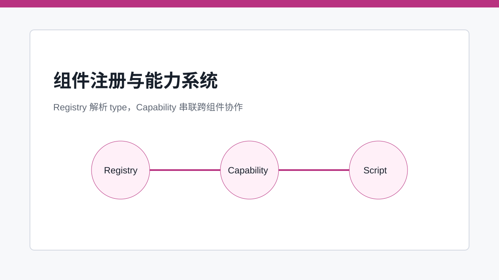
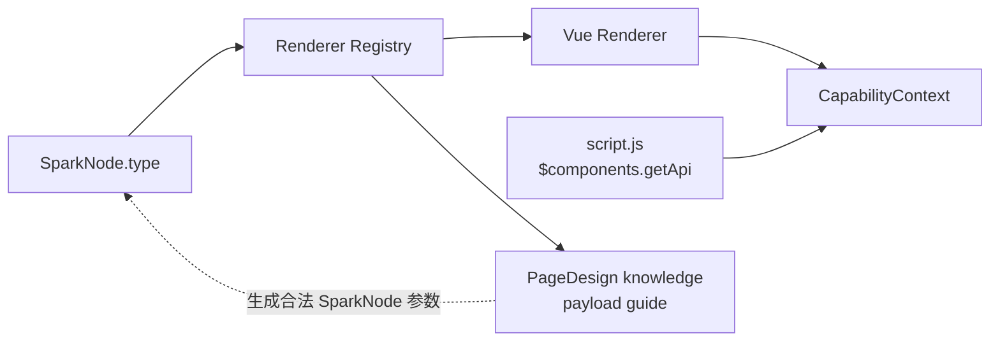

# 组件注册与能力系统：让递归组件树学会协作

> 组件注册解决“节点 type 渲染成什么”，能力系统解决“递归树里的组件如何互相协作”。

## 开篇

一个可配置页面系统不能只靠全局组件注册。表格、表单、弹窗、按钮、数据视图、AI 面板之间存在大量运行时协作：按钮要触发表格刷新，脚本要拿到组件 API，父容器要向子节点传递数据上下文，字段要知道自己属于哪个 DataView。

如果这些协作都写成全局变量，系统很快会失控。SPARK_VIEW 采用组件注册与 CapabilityContext 的组合：注册表负责把 `type` 映射到组件实现，能力系统负责让组件在递归渲染树里暴露、发现和消费能力。

## 注册表是解释器的入口

SparkNode 的 `type` 只有在注册表里有对应实现时才有意义。组件注册通常发生在 `register-renderers` 或运行时初始化阶段，核心目标是形成一份稳定的类型目录。解释器不直接 import 所有业务组件，而是通过注册结果解析节点。

这使组件系统可以被扩展。业务包可以新增 renderer，DevSystem 可以读取组件目录，AI 可以借助 PageDesign knowledge 模块查询组件参数荷载。注册表越清晰，上层工具越容易理解“当前系统到底支持哪些组件”。

## Capability 是跨组件协作协议

递归组件树天然存在上下文问题：某个按钮可能不在表格组件内部，却需要操作表格；某个表单字段需要知道当前行和字段权限；脚本运行时需要通过 `$components.getApi(id)` 找到某个组件的能力。CapabilityContext 让组件以协议形式暴露能力，而不是互相直接引用实例。

能力系统的边界也很重要。它不应该变成任意对象共享池，而应该只暴露运行时需要的、可命名的能力。例如组件 API、数据源上下文、表单操作、表格刷新、对话框开关等。这样既减少耦合，也让测试能围绕能力协议写断言。

## 组件目录也是 AI 的知识来源

在 PageDesign 这个业务样例里，AI 不能靠猜测组件名完成页面编辑。组件注册和 catalog 构成基础事实，而 PageDesign 业务模块再把这些事实投影为组件参数荷载指南。注意这里的归属：核心层只提供通用 AI 协议和注册机制；`PageDesignComponentPayloadProvider`、`queryPayloads`、`guidePayload` 属于 PageDesign 业务模块。

这条归属边界能避免 core 吸收业务语义。core 不知道 `r-table` 怎么写；PageDesign 知道当前页面设计支持哪些组件、组件 props 怎么构造、失败时应该如何修复。

## 关键链路

## 源码锚点

- [../../packages/spark-component/src/components/register-renderers.ts](../../packages/spark-component/src/components/register-renderers.ts)
- [../../packages/spark-component/src/components/useSparkComponent.ts](../../packages/spark-component/src/components/useSparkComponent.ts)
- [../../packages/spark-component/src/page/capability/capability-context.ts](../../packages/spark-component/src/page/capability/capability-context.ts)
- [../../src/spark.ts](../../src/spark.ts)

## 小结

注册表让节点能找到组件，能力系统让组件能在运行时协作。下一篇转向数据层，拆开 DataSet、DataTable、DataView 三层模型如何支撑复杂后台页面。
