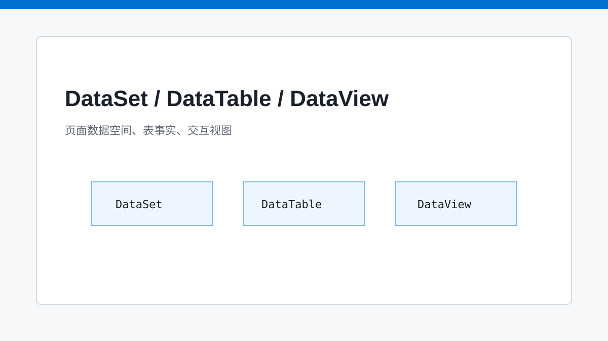
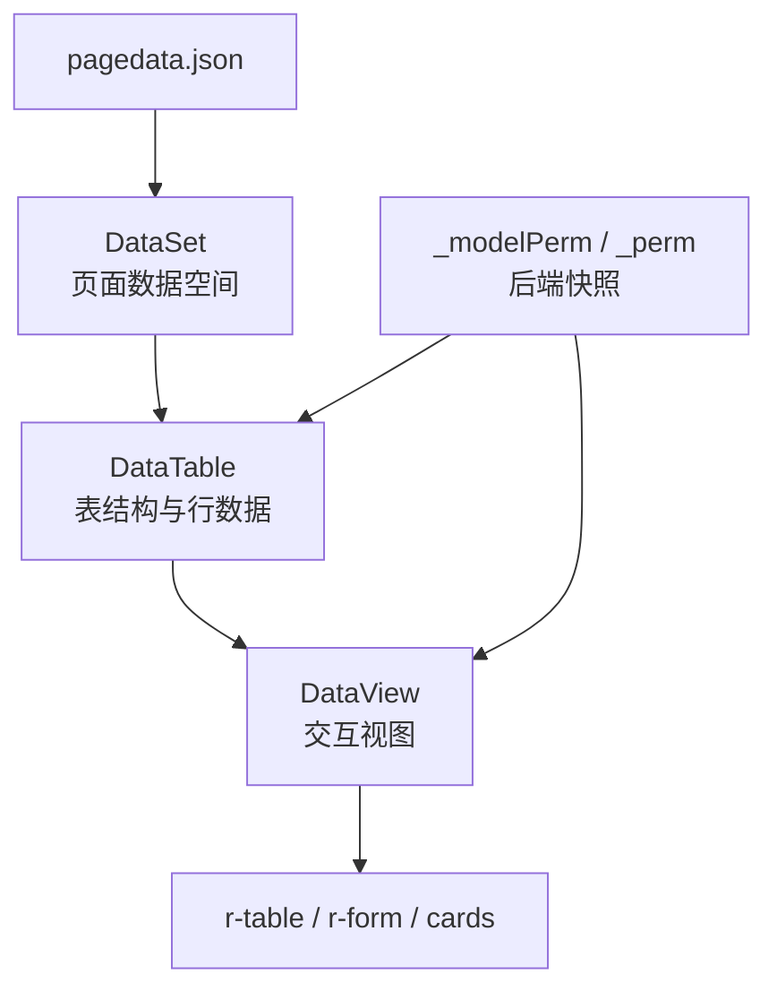

# 三层数据模型：DataSet、DataTable、DataView 的后台秩序

> SPARK_VIEW 把后台页面的数据复杂度收进 DataSet/DataTable/DataView，而不是让每个组件各自管理一份状态。

## 开篇

企业后台页面的数据状态从来不只是一个数组。它包含表结构、字段元数据、视图过滤、分页、树形关系、主从关联、聚合结果、计算列、字段权限和动作权限。若让表格、表单、筛选器分别维护状态，页面越复杂，状态越难对齐。

SPARK_VIEW 的数据层把这些复杂度拆成三层：DataSet 管数据空间，DataTable 管表与字段，DataView 管某个交互视图。组件只需要通过 DataKey 或显式绑定接入 DataView，就能复用统一的数据行为。

## DataSet 是页面数据空间

DataSet 更像页面级数据运行环境，而不是数据库。它持有多个 DataTable、DataView、关系、聚合和运行时委托。页面组件拿到的是这个数据空间里的视图，而不是自己从接口散拉数据。

这给页面设计带来一个好处：数据模型可以先于具体组件存在。AI 或 DevSystem 可以先创建表、列、视图、聚合，再让页面节点引用这些数据资产。页面结构和数据结构都成为四文件协议的一部分。

## DataTable 描述数据事实

DataTable 负责表级元数据、列定义和原始行集合。字段类型、标签、主键、默认值、关系字段等都应该尽量在这里表达，而不是写进某一个表格组件。表级权限快照 `_modelPerm` 也在数据源层作为事实进入前端。

这样做的价值是复用。一个订单表可以同时被列表、详情、统计卡片和主从表使用。只要它们读取同一 DataSet，不同组件之间就不会各自发明一套字段语义。

## DataView 面向交互场景

DataView 是组件最常消费的层。它可以表达过滤、排序、分页、树数据、聚合结果和当前视图 rows。表格需要的不是整个 DataSet，而是某个 View；表单需要的也常常是某个 View 的当前行或默认行。

DataView 还承载前端权限的消费语义。行级 `_perm` 可以影响字段显示、编辑、删除、创建子节点等 UI 表现。但这仍然只是装饰性消费，不能替代后端鉴权。前端负责把后端鉴权后的快照正确渲染出来。

## 关键链路

## 源码锚点

- [../../packages/spark-data/src/dataset.ts](../../packages/spark-data/src/dataset.ts)
- [../../packages/spark-data/src/data-table.ts](../../packages/spark-data/src/data-table.ts)
- [../../packages/spark-data/src/data-view.ts](../../packages/spark-data/src/data-view.ts)
- [../../packages/spark-component/src/page/renderer/SparkPageRenderer.vue](../../packages/spark-component/src/page/renderer/SparkPageRenderer.vue)

## 小结

三层数据模型让页面数据从组件状态升级为页面资产。下一篇继续看 DataKey：组件如何用一门轻量表达式语言定位 DataSet/DataView 中的数据。
