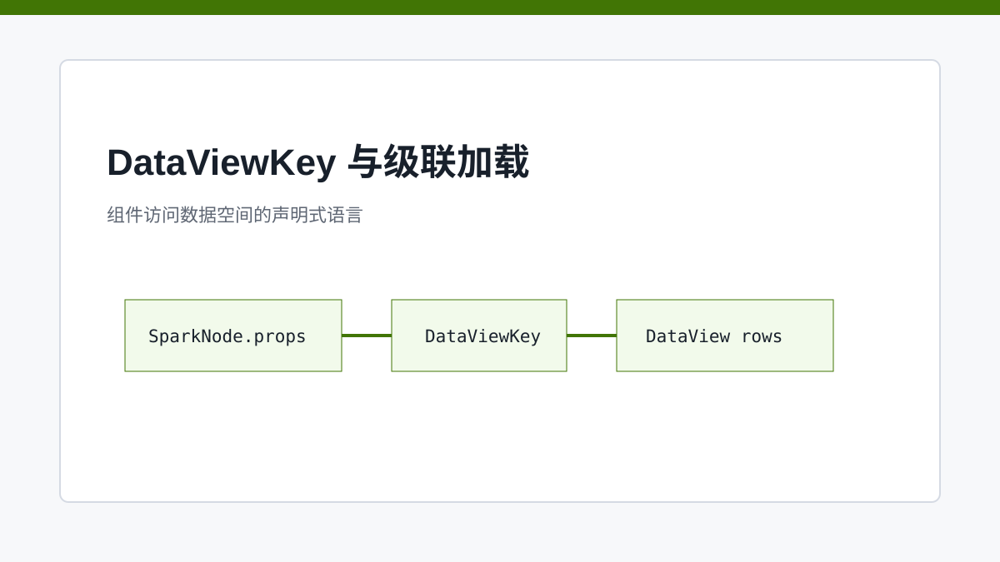
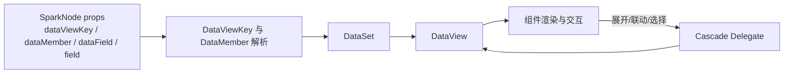

# DataViewKey：组件通往数据空间的那把钥匙

> DataViewKey 是组件访问页面数据空间的语言，也是主从表、联动和级联加载能够配置化的关键。

## 开篇

组件如果直接写死“读取某个变量”，页面配置就无法复用；如果每个组件都自己解析数据路径，系统又会出现很多不一致的边界。SPARK_VIEW 需要一种稳定方式，让组件在配置中声明“我需要哪份数据”。

DataViewKey 承担了这个角色。它让组件以字符串或结构化配置指向 DataSet 中的表、视图、字段和上下文数据。配合级联加载委托，主从表、树节点展开、筛选联动都可以从组件内部逻辑抽离到数据层协议。

## DataViewKey 让数据引用可声明

DataViewKey 的价值不是语法复杂，而是让数据绑定从代码移入配置。一个表格可以声明自己绑定某个 DataView，一个字段可以声明从当前 row 读取某个字段，一个详情区可以声明跟随选中行变化。

这让 DevSystem 能检查绑定，让 AI 能在修改页面前理解已有数据关系，也让测试可以围绕配置断言。相比“组件初始化时自己找数据”，DataViewKey 更像数据空间和组件之间的契约。

## 级联加载是数据层行为

主从关系和树节点懒加载不能只靠组件临时拼参数。级联加载需要知道父行、子表、关联字段、当前视图状态和加载结果如何合并。把这些放进数据层委托，可以让不同组件复用同一套行为。

例如树表展开时，组件触发的是“加载当前节点的子数据”，但真实逻辑应该由 DataView / delegate 决定：如何组织请求参数、如何把结果挂回树节点、如何处理权限快照、如何避免重复加载。

## DataViewKey 也服务 AI 编辑

AI 修改页面时，如果只知道组件位置，不知道数据绑定，生成的页面很容易“看起来有组件但没有数据”。DataViewKey 让 AI 可以先读取数据模型，再把新增组件绑定到正确的 DataView 或字段。它把视觉编辑和数据编辑连接起来。

这也是 PageDesign AI 要同时拥有 `nodeTree` 和 `dataset` 子模块的原因：前者负责节点，后者负责数据空间。复杂需求往往需要两者一起改，而 DataViewKey 是它们相遇的地方。

## 关键链路

## 源码锚点

- [../../packages/spark-data/src/core/data-view-key.ts](../../packages/spark-data/src/core/data-view-key.ts)
- [../../packages/spark-data/src/cascade-delegate.ts](../../packages/spark-data/src/cascade-delegate.ts)
- [../../packages/spark-data/src/data-view.ts](../../packages/spark-data/src/data-view.ts)
- [../architecture/DATAFLOW_ARCHITECTURE.md](../architecture/DATAFLOW_ARCHITECTURE.md)

## 小结

DataViewKey 让组件知道自己在数据空间中的位置。下一篇看数据层更重的能力：CRUD、聚合、计算列和树数据如何被委托与工具收口。
