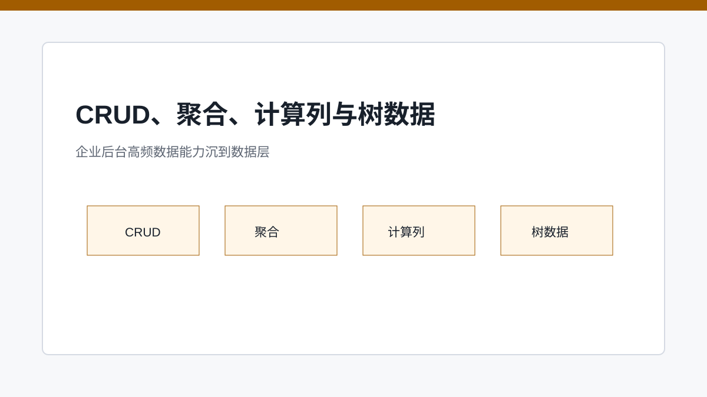
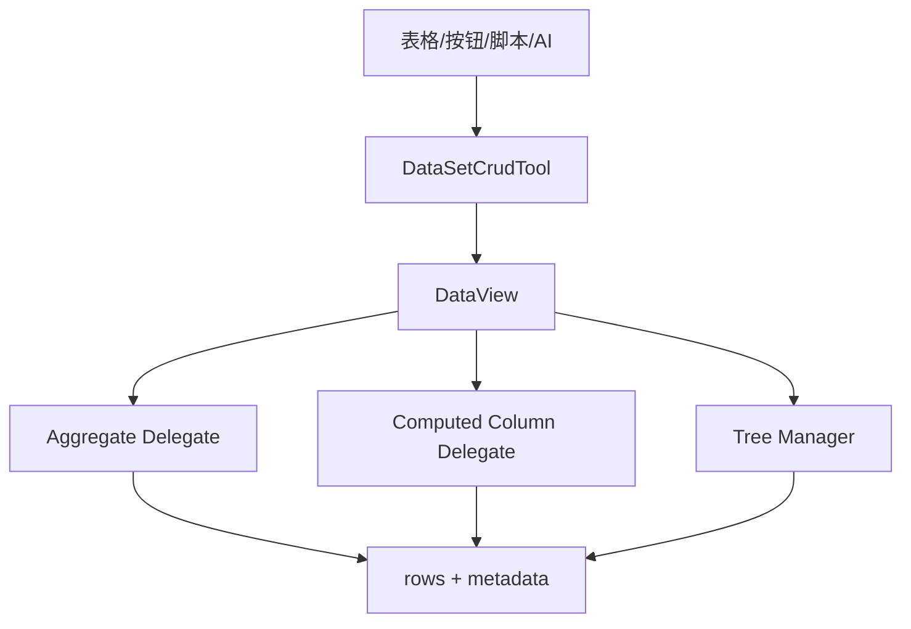

# CRUD 之外：聚合、计算列与树数据的工程化收口

> SPARK_VIEW 把企业后台高频数据能力做成数据层委托和工具，而不是让每个表格组件重复实现。

## 开篇

后台页面最常见的不是“显示一张表”，而是围绕表做大量动作：新增、编辑、删除、批量操作、汇总、计算字段、树节点展开、主从联动、导入导出、权限控制。若这些都堆在 `r-table` 内部，表格会成为巨型组件。

SPARK_VIEW 的思路是把这些能力沉到 `spark-data` 和 PageDesign dataset 工具里。组件触发交互，数据层负责一致的状态变化；AI 编辑数据模型时，也通过同一套工具，而不是直接拼 JSON。

## CRUD 是数据视图动作

CRUD 不应该只是组件内部数组操作。新增一行要考虑默认值、继承字段、主键生成、当前视图、树父节点、权限快照和后续刷新；删除一行也要考虑当前行是否允许删除。把 CRUD 放在 DataView / CrudTool 中，可以让表格、按钮、脚本和 AI 共用同一行为。

这也解释了为什么 `appendPayload`、`inheritFields`、`inheritFieldMap` 这类动作参数需要被协议化。它们不是某个按钮的小技巧，而是页面数据动作的一部分。

## 聚合和计算列属于数据模型

金额合计、数量统计、状态计数、字段拼接、派生值，这些逻辑如果分散在 UI 组件里，会让页面验证非常困难。聚合和计算列沉到 DataSet 后，组件只负责展示结果，数据层负责更新和一致性。

这种设计对 AI 也友好。用户说“增加汇总金额”时，AI 应先通过 dataset 函数检查表和字段，再添加 aggregate，而不是在脚本里临时写一段不可追踪计算。数据能力越结构化，自然语言需求越容易落到可验证变更。

## 树数据需要专门委托

树表和普通表不同。它有节点层级、父子关系、展开状态、懒加载、创建子节点和删除节点权限。若把树逻辑写成表格渲染分支，后续所有数据能力都会变复杂。树数据委托把层级操作集中处理，让表格只是消费一个已经整理好的视图。

尤其在权限语义上，树节点的 `_perm.allowCreateChild`、`_perm.allowDelete` 应该跟普通行权限一样来自后端快照，前端只是按快照展示或隐藏操作。任何真正的创建、删除仍然必须由后端再次鉴权。

## 关键链路

## 源码锚点

- [../../packages/spark-data/src/dataset-crud-tool.ts](../../packages/spark-data/src/dataset-crud-tool.ts)
- [../../packages/spark-data/src/aggregate-delegate.ts](../../packages/spark-data/src/aggregate-delegate.ts)
- [../../packages/spark-data/src/computed-column-delegate.ts](../../packages/spark-data/src/computed-column-delegate.ts)
- [../../packages/spark-data/src/tree-manager.ts](../../packages/spark-data/src/tree-manager.ts)
- [../../src/views/app/dev-system/DevDataSetDesigner.vue](../../src/views/app/dev-system/DevDataSetDesigner.vue)

## 小结

数据层工具让复杂后台动作可以复用、测试和被 AI 调用。下一篇进入权限系统，明确前端权限的真实边界：它是装饰层，不是安全边界。
