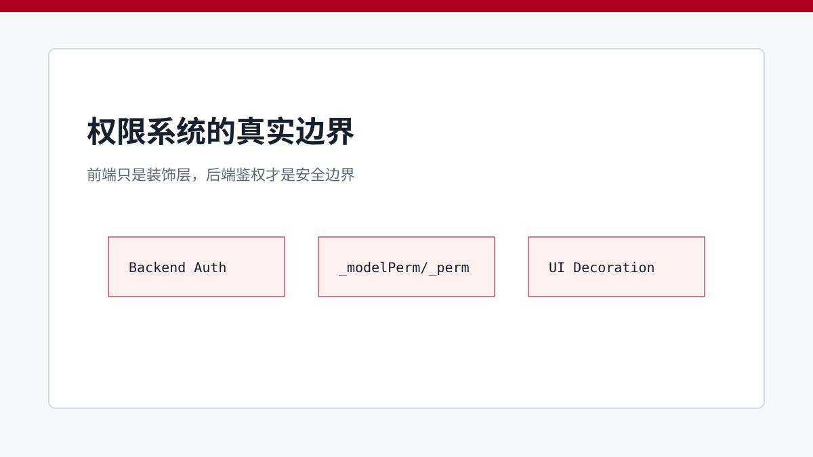
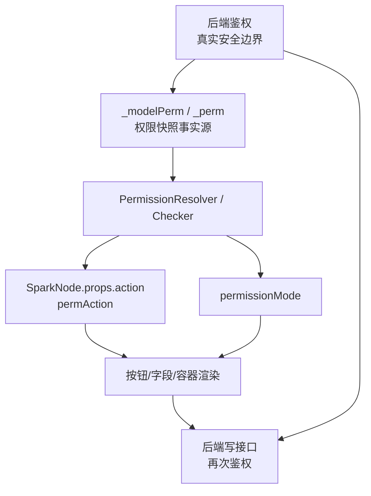

# 权限别演戏：前端只是装饰，后端鉴权才是边界

> 前端权限只能改善体验和减少误操作，真正的安全边界必须由后端鉴权保证。

## 开篇

权限系统最容易被误解。按钮隐藏了、字段禁用了、行不能删除了，看起来像“页面已经完成授权”。但 SPARK_VIEW 的口径必须更严格：前端权限是装饰层，只负责根据后端下发的权限快照调整 UI；任何真正的数据读取、写入、创建、删除、导出，都必须由后端接口再次鉴权。

因此，SPARK_VIEW 前端权限的核心不是“保安全”，而是“消费后端鉴权结果”。`_modelPerm` 和 `_perm` 是前端可见的权限事实源；`SparkNode.props.action`、`permAction`、`permissionMode`、字段渲染和按钮显隐都是消费端。

## `_modelPerm` / `_perm` 是事实源

模型级权限放在数据源或 DataView 的 `_modelPerm` 上，例如是否允许创建、导入、导出。行级权限放在每一行的 `_perm` 上，例如哪些字段可编辑、哪些字段隐藏、是否允许删除、是否允许创建子节点。

这些快照必须来自后端鉴权后的响应。前端不应自行推导“这个用户应该能不能删”，更不能把 UI 判断当作最终授权。前端只读取快照，把后端已经判断过的结果投影成可见、禁用、脱敏、隐藏等表现。

## `action` / `permAction` 是消费端

`SparkNode.props.action` 描述按钮或组件要执行的动作，`permAction` 描述这个动作需要消费哪类权限快照。比如工具栏创建按钮消费 `_modelPerm.allowCreate`，行内删除按钮消费 `row._perm.allowDelete`，字段编辑消费 `row._perm.editableFields`。

这条链路的方向不能反过来。不能因为页面上有一个 `permAction: "delete"` 就认为系统有删除权限；它只是告诉前端如何展示删除按钮。真正调用删除接口时，后端仍然必须检查当前用户、当前资源和当前业务状态。

## `permissionMode` 影响表现，不改变安全边界

页面可能有不同的权限表现模式：隐藏、禁用、只读、脱敏等。`permissionMode` 决定前端如何表达权限结果，服务的是用户体验和操作引导。它不改变权限事实，也不改变安全边界。

例如一个字段因 `_perm.hiddenFields` 被隐藏，用户体验上看不到它；但如果接口仍然返回敏感数据，或者后端允许未授权更新，这不是前端权限能补救的问题。敏感数据是否下发、写操作是否允许，必须由后端控制。

## 字段渲染是最末端消费者

内置字段组件会读取行级 `_perm`，自动处理可编辑、隐藏、脱敏等表现。容器和动作组件也可以通过 `usePermission`、`PermissionChecker`、`PermissionResolver` 读取统一解析结果。这样做的价值是让 UI 行为一致，而不是让每个组件写一套权限判断。

第三方字段组件如果没有接入这套协议，就需要桥接 `_perm`。但无论桥接是否完成，它都只是渲染问题。安全设计不能依赖某个组件是否正确隐藏按钮。

## 关键链路

## 源码锚点

- [../../packages/spark-component/src/permission/PermissionChecker.ts](../../packages/spark-component/src/permission/PermissionChecker.ts)
- [../../packages/spark-component/src/permission/PermissionResolver.ts](../../packages/spark-component/src/permission/PermissionResolver.ts)
- [../../packages/spark-component/src/permission/usePermission.ts](../../packages/spark-component/src/permission/usePermission.ts)
- [../../packages/spark-component/src/components/basic/RendererButton.vue](../../packages/spark-component/src/components/basic/RendererButton.vue)
- [../architecture/PERMISSION_SYSTEM.md](../architecture/PERMISSION_SYSTEM.md)

## 小结

SPARK_VIEW 的权限前端层要做得清晰、一致、可维护，但不能夸大成安全边界。下一篇进入 AI 架构，看看受约束 AI 如何在工具协议内行动，而不是自由改源码。
