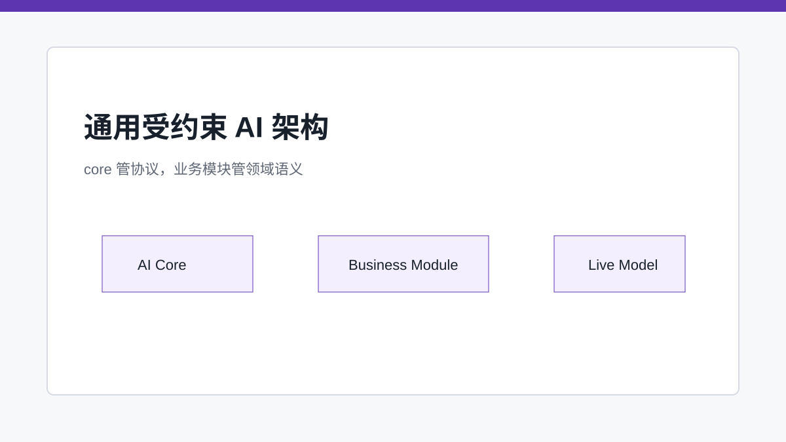
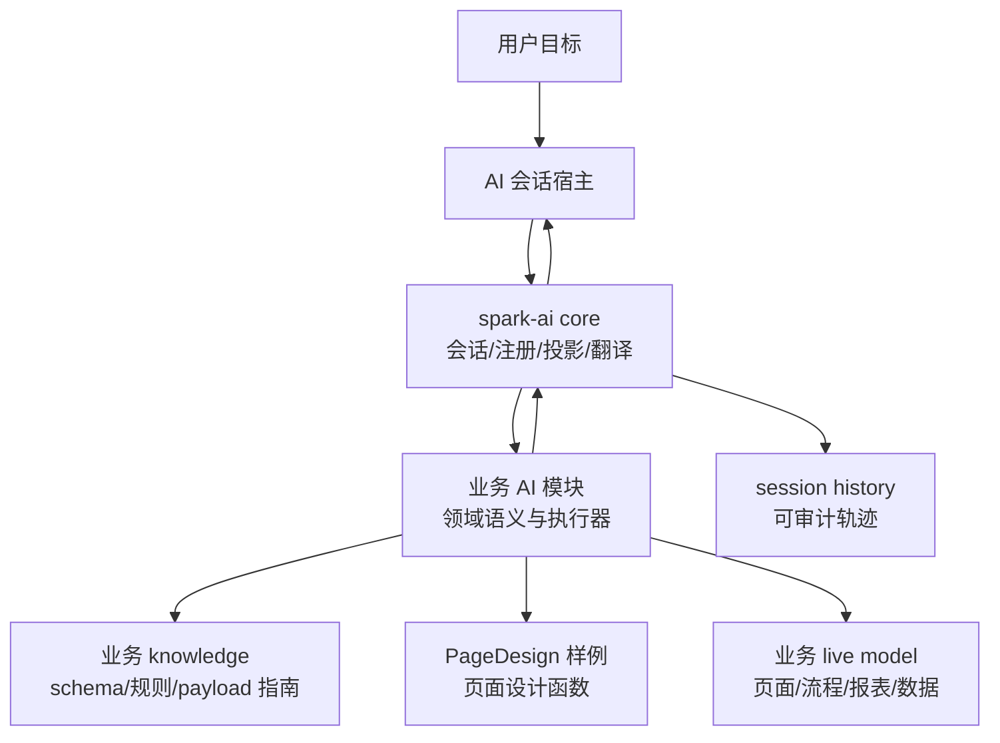

# 给 AI 上护栏：SPARK_VIEW 的通用受约束智能体架构

> SPARK_VIEW 的 AI 不是页面设计专属助手，而是在注册模块、函数协议、知识查询和会话账本内行动的通用受约束协作者。

## 开篇

如果让 AI 直接改源码、直接拼业务 JSON、直接调用任意函数，它短期看起来很聪明，长期一定难以治理。SPARK_VIEW 的 AI 架构要解决的不是某一个页面设计场景，而是所有业务域共同面对的问题：先理解当前上下文，再查询可用工具和知识，最后通过确定性函数修改业务 live model。

这就是 `spark-ai core` 的定位。它不承担任何具体业务语义，而是提供 AI 会话、模块注册、函数投影、调用翻译和历史记录。PageDesign 只是当前最完整的落地样例；后续数据治理、流程编排、报表配置、权限策略等业务域也应按同一模式接入。

## Core 管机制，不管业务语义

核心层定义 `AiModuleRegistration`、`AiFunctionRegistration`、`AiRuntimeSessionRecord` 和函数调用翻译结果。它知道如何把注册树投影给 LLM，也知道如何把模型返回的 action 翻译成注册方可执行的上下文。

但 core 不知道 `r-table`、DataSet、SparkNodeTree，也不应该知道任何具体业务对象。这个边界非常关键：一旦 core 吸收 PageDesign 语义，后续所有业务 AI 模块都会被页面设计逻辑污染。core 应该像协议层，而不是像某个业务设计器的隐藏实现。

## Business 管领域语义，PageDesign 只是样例

业务模块注册自己的子模块、函数目录、参数 schema、失败模式和执行器。PageDesign 作为样例，注册了 `lifecycle`、`knowledge`、`nodeTree`、`dataset`、`textModel`、`jsonDoc`；换成流程设计、报表设计或数据治理模块时，也应该注册各自的业务函数和知识，而不是把语义塞回 core。

组件参数荷载指南也只是 PageDesign 样例中的业务知识。准确地说，core 只提供通用的 payload provider 契约和注册表；`PageDesignComponentPayloadProvider`、`pageDesign/knowledge/queryPayloads`、`pageDesign/knowledge/guidePayload`、组件 props/schema 指南都属于 PageDesign knowledge 模块。它们不是 core 的业务能力，也不代表所有 AI 模块都必须围绕页面组件展开。

## 会话账本让 AI 可审计

AI 修改业务对象不是一次黑盒输出，而是一串可追踪事件：用户消息、模型回复、函数调用请求、参数、执行结果、失败原因、修复建议。core 会把这些写入 session history，但不读取结果替模型做下一步决策。

这种账本模型让系统可以回答几个关键问题：模型为什么做这个修改？用了哪个函数？参数是什么？失败时返回了什么 fix？最终业务状态是不是被模块确认写入？这比“模型生成了一段 JSON”更适合生产系统。

## 知识查询先于写操作

受约束 AI 的关键纪律是“知识先行，执行后置”。在 PageDesign 样例里，新增或替换组件前必须先查询组件参数指南；在其他业务域里，也应该先查询对应的业务知识、枚举、schema、规则和失败模式，再调用写函数。

这套流程不是为了让 AI 变慢，而是为了减少不可解释的猜测。AI 应当在系统允许的工具空间里行动，每一步都留下可验证结果。

## 关键链路

## 源码锚点

- [../../packages/spark-ai/src/core/protocol/business-contracts.ts](../../packages/spark-ai/src/core/protocol/business-contracts.ts)
- [../../packages/spark-ai/src/core/runtime/ai-runtime.ts](../../packages/spark-ai/src/core/runtime/ai-runtime.ts)
- [../../packages/spark-ai/src/business/page-design/page-design-business.ts](../../packages/spark-ai/src/business/page-design/page-design-business.ts)
- [../ai/AI_DETAILED_DESIGN_AND_IMPLEMENTATION_CHAIN.md](../ai/AI_DETAILED_DESIGN_AND_IMPLEMENTATION_CHAIN.md)

## 小结

受约束 AI 的核心是边界：core 管通用协议，业务模块管领域语义，工具函数管确定性执行。下一篇以 PageDesign 为例，具体展开一个业务 AI 模块如何落地。
