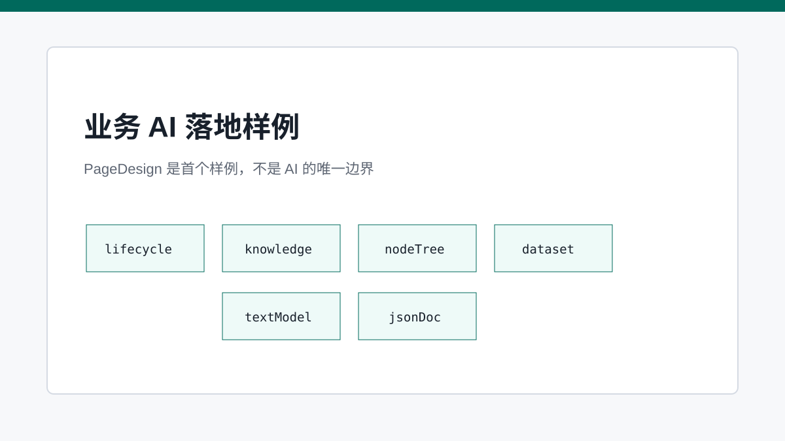
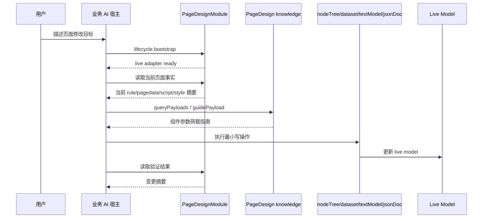

# 业务 AI 落地样例：以 Page Design 为第一块试金石

> Page Design AI 是通用 AI Runtime 的首个业务样例：它证明自然语言可以通过受约束工具落到四文件变更，但它不是 SPARK AI 的唯一形态。

## 开篇

Page Design AI 要解决的是一个具体样例问题：用户用自然语言描述页面设计目标后，系统如何把它落到 `rule.json`、`pagedata.json`、`script.js`、`style.css` 的可验证变更上。这个样例不能被写成 AI 架构的全部边界；它只是验证通用模式的一块试金石。

SPARK_VIEW 的通用实现路径是：每个业务域维护自己的子模块、函数目录、知识 provider 和执行器，再由 core 统一投影给 LLM。模型选择工具，业务模块校验并执行工具，宿主展示结果和错误。PageDesign 只是这套机制的第一份完整样例。

## 样例：六个子模块覆盖四文件编辑

`lifecycle` 负责确认当前 live adapter 是否可用，避免模型在没有页面树或数据工具时直接写操作。`nodeTree` 面向 `rule.json`，提供查找、添加、移动、替换、设置 props 等结构化动作。`dataset` 面向 `pagedata.json`，提供表、列、视图、聚合等数据模型动作。

`textModel` 读写 `script.js` 和 `style.css`，并对脚本运行时 API 做边界检查。`jsonDoc` 提供 JSON Pointer / JMESPath 级别的精确读写，适合补充结构化工具暂未覆盖的配置角落。`knowledge` 则负责只读知识查询，帮助模型构造合法 SparkNode。

## Component PayloadProvider 属于 PageDesign knowledge

这里必须明确归属：Component PayloadProvider 组件参数荷载指南不是 AI core 层能力，而是 PageDesign 模块的参数 payload 能力。core 可以定义通用 `ParameterPayloadProvider` 协议和 `ParameterPayloadRegistry`，但它不拥有组件目录语义，也不解释 `r-table`、`r-form`、`el-button` 的 props。

PageDesign 通过 `PageDesignComponentPayloadProvider` 把组件 catalog 投影成 `page-design.component` 参数荷载目录。AI 新增或替换 SparkNode 前，应调用 `pageDesign/knowledge/queryPayloads` 选择组件 type，再调用 `pageDesign/knowledge/guidePayload` 获取 paramsSchema、最小参数示例、规则和失败模式。换到其他业务模块时，对应的 payload provider 也应由该业务模块维护，而不是由 core 统一内置。

## 工具目录比 prompt 更可靠

PageDesign 函数目录由 catalog row 和注册模块生成，包括 `paramsSchema`、`usageRules`、`failureModes`、`validate`、`execute`。这也是所有业务 AI 模块应遵守的模式：prompt 负责纪律和背景，不负责维护第二套函数事实源。

这能避免一个常见问题：文案里写着某个函数可用，但运行时并没有注册；或者运行时参数已经更新，prompt 仍然描述旧字段。AI-facing tool schema 应从注册事实投影，而不是人工复制。

## 实施链路：小步读写闭环

Page Design AI 的正确执行方式是小步闭环。先 `lifecycle.bootstrap`，再读取当前页面事实；如果需要新增组件，先查 knowledge；如果需要数据模型，先查 dataset；写入后马上读取验证；最后由模型总结变更。这个 SOP 是通用 AI 架构在页面设计域的实例化，不是所有业务域的唯一 SOP。

这种链路看起来繁琐，但它让每一步都能失败、修复和审计。AI 不是一次性提交大块不可验证配置，而是在 PageDesign 允许的编辑表面上逐步推进。

## 关键链路

## 源码锚点

- [../../packages/spark-ai/src/registrations/page-design/page-design-business.ts](../../packages/spark-ai/src/registrations/page-design/page-design-business.ts)
- [../../packages/spark-ai/src/registrations/page-design/payloads/component-payload-provider.ts](../../packages/spark-ai/src/registrations/page-design/payloads/component-payload-provider.ts)
- [../../packages/spark-ai/src/registrations/page-design/functions/lifecycle/tool-catalog.ts](../../packages/spark-ai/src/registrations/page-design/functions/lifecycle/tool-catalog.ts)
- [../../packages/spark-ai/src/catalog/catalog-projections.ts](../../packages/spark-ai/src/catalog/catalog-projections.ts)
- [../../packages/spark-ai/src/catalog/json-catalog-generator.ts](../../packages/spark-ai/src/catalog/json-catalog-generator.ts)

## 小结

PageDesign 样例说明了一件事：通用 AI Runtime 只有和业务模块化、工具目录化、知识前置化、live model 闭环化结合，才会真正可用。下一篇收束到 DevSystem，看运行时能力如何变成生产工具链。
