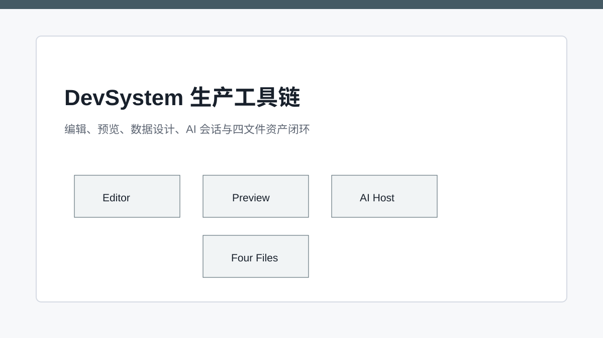
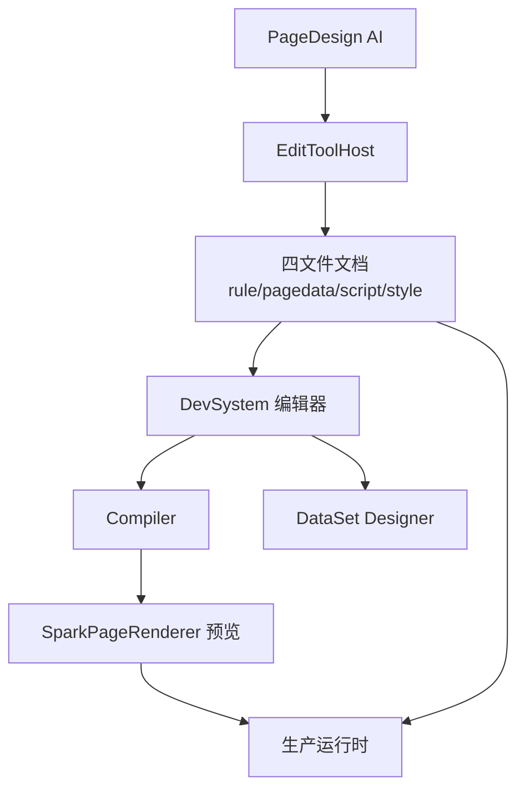

# DevSystem：把运行时框架推进生产车间

> DevSystem 把页面编辑、实时预览、数据设计、AI 会话和四文件资产连接成生产闭环。

## 开篇

一个运行时框架如果没有生产工具链，很容易停留在“能渲染 demo”的阶段。真正可落地的页面配置体系需要编辑器、预览、数据模型工具、源码视图、AI 辅助、错误反馈和保存发布流程。DevSystem 就是 SPARK_VIEW 把运行时能力产品化的关键。

它不是运行时之外的玩具，而是运行时的第一消费端。DevSystem 使用同一套 Compiler、同一套 `SparkPageRenderer`、同一套 DataSet 工具和同一套 PageDesign AI live adapter，让设计时和运行时保持一致。

## PageFileDocument 管四文件资产

DevSystem 面向的是文件级页面资产。`rule.json`、`pagedata.json`、`script.js`、`style.css` 在编辑器里以 PageFileDocument 的方式存在，既能被人工编辑，也能被 AI 工具更新。这个模型让“页面”从一次渲染结果变成一组可管理文档。

当用户修改文件或 AI 写入 live model 后，DevSystem 可以重新编译并触发预览。因为 Compiler 和 Renderer 是正式运行链路，预览不是另一套模拟器。这个一致性是调试和发布信心的来源。

## 预览复用正式运行时

DevPreviewTab 的价值在于把当前内存态配置送进正式 `SparkPageRenderer`。这样预览中出现的 DataKey、权限、脚本、组件能力和错误表现都尽量接近真实页面。开发者不用在“设计器预览”和“线上运行”之间猜差异。

这也给 AI 提供了快速反馈路径。AI 修改节点、数据或脚本后，预览立即反映结果；如果错误发生，runtime error 能回到宿主，再进入下一轮修复。

## AI 会话是生产链路的一部分

DevSystem 接入 PageDesign AI 时，需要把当前文件文档、nodeTree、DataSetCrudTool、文本读写器和 JSON 文档读写器封装成 EditToolHost。AI 看到的是受约束工具，实际变更落在当前 live document 上。

这意味着 AI 不是绕过 DevSystem 改文件，而是在 DevSystem 提供的编辑表面上协作。人类可以继续手改文件、看预览、检查 diff；AI 也可以在同一上下文里补充修改。生产工具链的目标不是替代开发者，而是让配置资产更容易被理解和维护。

## 从框架到工程资产

DevSystem 把前面 15 篇的能力串起来：四文件协议定义页面资产，Loader/Compiler 定义边界，Renderer 负责运行，组件系统负责解释，DataSet 负责数据，权限系统负责 UI 消费，AI 负责受约束协作。它们共同让 SPARK_VIEW 不只是组件库，而是一套页面生产系统。

这套系统仍可以继续演进：更好的 diff preview、更细的 AI dry-run、更完整的截图验收、更丰富的组件 payload guide、更强的运行时监控。但基础方向已经清晰：把页面从散落代码变成可治理资产。

## 关键链路

## 源码锚点

- [../../src/views/app/dev-system/DevSystem.vue](../../src/views/app/dev-system/DevSystem.vue)
- [../../src/views/app/dev-system/useDevState.ts](../../src/views/app/dev-system/useDevState.ts)
- [../../src/views/app/dev-system/page-file-documents.ts](../../src/views/app/dev-system/page-file-documents.ts)
- [../../src/views/app/dev-system/DevPreviewTab.vue](../../src/views/app/dev-system/DevPreviewTab.vue)
- [../../src/views/app/dev-system/usePageModelSessionHost.ts](../../src/views/app/dev-system/usePageModelSessionHost.ts)
- [../../src/views/app/dev-system/usePageModelEditSession.ts](../../src/views/app/dev-system/usePageModelEditSession.ts)

## 小结

16 篇文章从“不是 JSON 表单生成器”走到 DevSystem，核心线索是一致的：页面配置必须资产化、运行时必须协议化、数据与权限必须有事实源、AI 必须受约束地参与生产链路。SPARK_VIEW 的价值也在这里。
