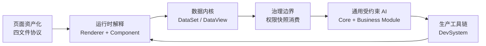

# 序篇：为什么 SPARK_VIEW 值得拆成 16 篇

> 这不是一组“低代码组件介绍”，而是一条从页面资产化、运行时解释、数据内核、权限边界走向受约束 AI 和生产工具链的工程路线。

如果一个后台页面只有几个字段、两个按钮和一次提交，JSON 表单当然够用。问题是，真实企业后台通常不会停在那里。它会长出主从表、树数据、聚合、计算列、字段权限、行级动作、跨页面导航、实时预览、版本回滚、AI 辅助修改，以及一堆必须长期维护的业务差异。

到这个阶段，页面就不再只是“写一份 Vue 代码”或“生成一段 JSON”。它变成一种生产资料：需要可治理、可审计、可预览、可测试，也需要被人和 AI 一起安全地修改。SPARK_VIEW 的核心野心正在这里。

这一组 16 篇文章试图回答一个问题：

**怎样把企业后台页面从一次性代码交付，变成可持续演进的软件资产？**

## 系列主线

SPARK_VIEW 的答案不是单点能力，而是一组互相咬合的工程边界。

第一步是资产化。页面被拆成 `rule.json`、`pagedata.json`、`script.js`、`style.css` 四类文件：结构、数据、行为、样式各司其职。这样页面才有可能被加载、编译、预览、对比、回滚和 AI 修改。

第二步是解释运行。`SparkPageRenderer` 负责把四文件装配成运行时上下文，`SparkComponentRenderer` 负责把 SparkNode 递归解释为 Vue 组件。组件注册和 Capability 系统让一棵递归组件树具备跨节点协作能力，而不是停留在静态 JSON 拼装。

第三步是数据内核。DataSet、DataTable、DataView 把复杂后台的数据状态沉到统一模型里；DataKey 让组件有稳定的数据访问语言；CRUD、聚合、计算列、树数据则通过数据层工具和委托收口。

第四步是治理边界。权限系统必须说清楚：前端只是装饰层，真正安全边界在后端鉴权。`_modelPerm` / `_perm` 是权限快照事实源，`permAction`、`permissionMode`、字段渲染和按钮显隐只是消费端。

第五步是 AI 和生产化。SPARK AI 不是 PageDesign 专属助手，而是一套通用受约束业务智能体架构：core 管会话、注册、投影、翻译和历史；业务模块管领域语义、函数目录、知识 payload 和执行器。PageDesign 只是第一个完整样例。最终，DevSystem 把编辑、预览、数据设计、版本管理和四文件资产接成生产闭环。

## 适合谁读

如果你是前端架构师，这个系列关注的是“配置系统如何不坍缩成另一套混乱代码”。你会看到组件树、运行时上下文、数据模型和能力协议如何分层。

如果你是低代码或企业平台开发者，这个系列关注的是“平台能力如何沉到稳定内核，而不是堆在页面组件里”。你会看到 DataSet、权限快照、DevSystem 和组件 catalog 如何共同支撑生产工作流。

如果你正在做 AI 工具调用或 AI 编辑器，这个系列关注的是“AI 如何在业务边界内行动”。重点不是让模型自由生成页面，而是让它通过注册函数、知识指南、结构化失败和 session history 完成可审计变更。

## 阅读顺序

| 篇章 | 标题 | 你会看到什么 |
| --- | --- | --- |
| 1 | [别再叫它 JSON 表单：SPARK_VIEW 的页面资产化野心](01-spark-view-not-json-form-generator.md) | 为什么 SPARK_VIEW 的目标不是表单生成，而是页面资产治理。 |
| 2 | [四文件协议：把一个页面拆成可治理的生产资料](02-four-file-protocol.md) | `rule`、`pagedata`、`script`、`style` 如何形成最小页面资产单元。 |
| 3 | [Monorepo 的骨架：运行时、数据层与 AI 如何各就各位](03-monorepo-layering.md) | monorepo 如何把运行时、数据、配置、AI 和应用集成分层。 |
| 4 | [从 main.ts 到首屏：SPARK_VIEW 如何点亮一个应用](04-app-startup-chain.md) | 应用启动时如何注册组件、路由和运行时能力。 |
| 5 | [导航树即路由源：菜单、页面与项目边界的一次统一](05-navigation-tree-as-route-source.md) | 导航树如何统一系统页、配置页、外链和跨项目入口。 |
| 6 | [Loader 与 Compiler：配置世界的取数边界和解释边界](06-config-loading-and-compile-boundary.md) | 为什么加载来源和编译解释必须拆开。 |
| 7 | [SparkPageRenderer：四文件落地成页面的总指挥](07-spark-page-renderer-runtime.md) | 四文件如何被装配成页面运行时上下文。 |
| 8 | [SparkComponentRenderer：一棵 SparkNode 如何长成 Vue 页面](08-spark-component-renderer-recursive-interpreter.md) | SparkNode 如何被递归解释为真实组件树。 |
| 9 | [组件注册与能力系统：让递归组件树学会协作](09-component-registry-and-capability-system.md) | Registry 与 Capability 如何支撑跨组件协作。 |
| 10 | [三层数据模型：DataSet、DataTable、DataView 的后台秩序](10-dataset-datatable-dataview.md) | 后台复杂数据状态为什么要沉到三层数据模型。 |
| 11 | [DataKey：组件通往数据空间的那把钥匙](11-datakey-and-cascade-loading.md) | 组件如何通过 DataKey 声明式访问数据空间。 |
| 12 | [CRUD 之外：聚合、计算列与树数据的工程化收口](12-crud-aggregate-computed-tree.md) | 企业后台高频数据能力如何被数据层工具收口。 |
| 13 | [权限别演戏：前端只是装饰，后端鉴权才是边界](13-permission-boundary-frontend-decoration.md) | `_modelPerm` / `_perm` 的事实源地位，以及前端权限的真实边界。 |
| 16 | [DevSystem：把运行时框架推进生产车间](16-devsystem-production-toolchain.md) | DevSystem 如何把编辑、预览、数据设计和版本管理连成闭环。 |

## 两条读法

想快速建立全局感，可以先读 1、2、7、10、13、16。这条线会把“理念、资产、运行时、数据、权限、工具链”串起来；AI 相关内容以 [SPARK AI 包使用指南](../ai/SPARK_AI_PACKAGE_USAGE_GUIDE.md) 为准。

想深入实现，可以按顺序读完 16 篇。这个顺序刻意从外到内、再从内到生产化：先建立为什么，再看页面如何启动和解释，再看数据与权限如何治理，最后看 AI 和 DevSystem 如何接入。

## 术语口径

- 四文件协议：`rule.json`、`pagedata.json`、`script.js`、`style.css`。
- SparkNode：运行时组件节点模型，结构字段是顶层 `id`、`type`、`props`、`children`。
- DataSet/DataTable/DataView：数据空间、表元数据、交互视图三层模型。
- DataKey：配置组件访问数据空间的表达式。
- Permission Snapshot：后端鉴权后下发的 `_modelPerm` / `_perm` 快照；前端只做装饰性消费。
- AI Runtime：AI 会话、知识投影、函数调用翻译和历史记录的通用协议层。
- Business AI Module：接入 AI Runtime 的业务模块，负责自己的状态、函数目录、知识 payload 和执行器。
- PageDesign Knowledge：PageDesign 业务模块维护的只读知识能力；Component PayloadProvider 组件参数荷载指南归属这里，是业务样例能力，不归属 core 层业务能力。
- PageDesign Host Adapter：PageDesign 样例里由业务宿主暴露给 AI 的 live 编辑适配层。

## 发布说明

本目录下的 16 篇文章是可继续精修发布的中文中篇初稿。每篇都包含核心论点、源码锚点、Mermaid 链路图、视觉配图和结尾串联。

当前配图使用 `docs/blog-series/assets/` 下的 SVG 技术配图卡。后续如果采集到真实运行时截图，可以替换为同主题 PNG，并批量更新图片链接。

第 13 篇权限口径不要弱化：前端权限只是装饰层，安全边界在后端鉴权。第 14、15 篇 AI 口径不要写窄：AI Runtime 是通用受约束业务智能体架构，PageDesign 只是首个完整样例。
