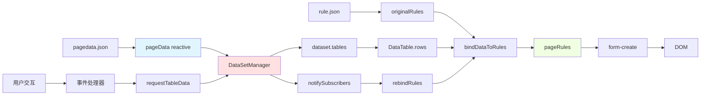
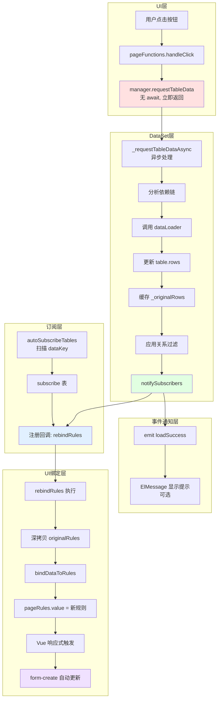
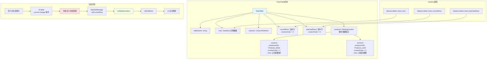
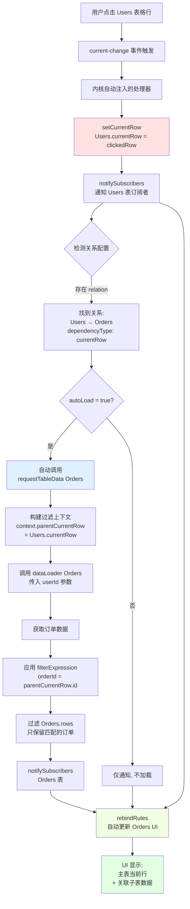
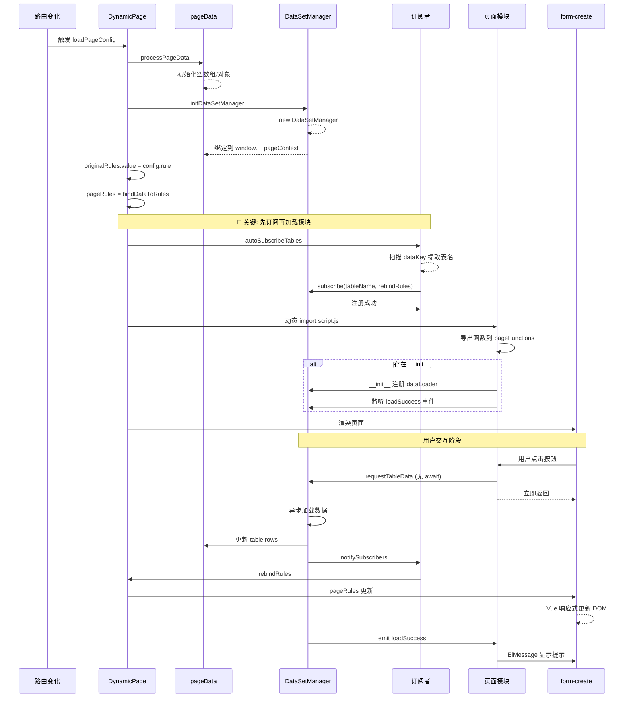

# PageData 处理流程

## 完整流程图

```mermaid
flowchart TB
    Start([路由变化/页面加载]) --> LoadConfig[加载页面配置<br/>getPageConfig]
    
    LoadConfig --> CheckPageId{检查 pageId}
    CheckPageId -->|meta.pageId| GetConfig[获取配置文件<br/>rule.json, pagedata.json, style.css]
    CheckPageId -->|route.params.id| GetConfig
    CheckPageId -->|route.name| GetConfig
    CheckPageId -->|未找到| Error([抛出错误])
    
    GetConfig --> ProcessData[处理页面数据<br/>processPageData]
    
    ProcessData --> CheckDataType{检查数据类型}
    CheckDataType -->|API 配置| LoadAPI[loadApiData<br/>fetch 远程数据]
    CheckDataType -->|静态数据| AssignData[直接赋值到 pageData]
    
    LoadAPI --> AssignData
    AssignData --> CheckDataset{pageData 包含<br/>dataset?}
    
    CheckDataset -->|是| InitDSM[initDataSetManager<br/>创建 DataSetManager]
    CheckDataset -->|否| SaveRules
    
    InitDSM --> CreateDSM[new DataSetManager<br/>传入 defaultDataLoader]
    CreateDSM --> UpdateContext[更新全局上下文<br/>window.__pageContext<br/>.$dataSetManager]
    UpdateContext --> SaveRules[保存原始 rules<br/>originalRules.value]
    
    SaveRules --> BindData[bindDataToRules<br/>数据绑定到 UI]
    
    BindData --> CheckTable{是否为<br/>el-table?}
    CheckTable -->|是| InjectEvents[自动注入事件<br/>current-change<br/>selection-change]
    CheckTable -->|否| BindNormal[普通绑定]
    
    InjectEvents --> ProcessDataKey[处理 dataKey]
    BindNormal --> ProcessDataKey
    
    ProcessDataKey --> CheckPath{dataKey 路径类型}
    CheckPath -->|.rows| BindRows[绑定完整数据]
    CheckPath -->|.currentRow| BindCurrent[绑定当前行]
    CheckPath -->|.selectedRows| BindSelected[绑定选中行]
    
    BindRows --> AutoSubscribe
    BindCurrent --> AutoSubscribe
    BindSelected --> AutoSubscribe[autoSubscribeTables<br/>扫描所有 dataKey]
    
    AutoSubscribe --> ExtractTables[提取表名<br/>dataset.tables.XXX → XXX]
    ExtractTables --> RegisterSubs[为每个表注册订阅<br/>dataSetManager.subscribe]
    
    RegisterSubs --> SubCallback[设置回调: rebindRules<br/>数据变化时自动重绑]
    
    SubCallback --> LoadModule[加载页面脚本模块<br/>src/pages-config/pageId/script.js]
    
    LoadModule --> CheckModule{模块存在?}
    CheckModule -->|否| SkipScript[跳过脚本加载]
    CheckModule -->|是| LoadScript[动态导入 ES6 模块]
    
    LoadScript --> ExtractFuncs[提取导出函数<br/>排除 __init__]
    ExtractFuncs --> CheckInit{存在 __init__?}
    
    CheckInit -->|是| CallInit[调用 __init__<br/>注册 dataLoader<br/>监听事件]
    CheckInit -->|否| LoadStyle
    
    CallInit --> RegisterLoader[dataSetManager<br/>.dataLoader = mockDataLoader]
    RegisterLoader --> ListenEvents[监听 loadSuccess<br/>loadError 事件]
    
    ListenEvents --> LoadStyle[加载页面样式<br/>scopeCSS 添加作用域]
    SkipScript --> LoadStyle
    
    LoadStyle --> RenderPage[渲染页面<br/>form-create]
    
    RenderPage --> WaitInteraction[等待用户交互]
    
    WaitInteraction --> UserAction{用户操作}
    
    UserAction -->|点击按钮| EventHandler[触发事件处理器<br/>pageFunctions.value]
    UserAction -->|选择表格行| AutoSync[自动同步事件<br/>注入的事件处理器]
    
    EventHandler --> RequestData[requestTableData<br/>非阻塞请求]
    AutoSync --> SyncState[setCurrentRow /<br/>setSelectedRows]
    
    RequestData --> CheckLoading{表正在<br/>加载?}
    CheckLoading -->|是| SkipLoad[跳过重复请求]
    CheckLoading -->|否| AnalyzeDeps[分析依赖链<br/>findRootTables]
    
    AnalyzeDeps --> LoadRoot[按依赖顺序加载<br/>先加载根表]
    LoadRoot --> CallLoader[调用 dataLoader<br/>获取数据]
    
    CallLoader --> UpdateRows[更新 table.rows]
    UpdateRows --> CacheOriginal[缓存原始数据<br/>table._originalRows]
    
    CacheOriginal --> CheckRelation{存在关系?}
    CheckRelation -->|是| ApplyRelation[applyRelation<br/>过滤子表数据]
    CheckRelation -->|否| NotifyUI
    
    ApplyRelation --> FilterData[根据 filterExpression<br/>过滤数据]
    FilterData --> CheckAutoLoad{autoLoad<br/>= true?}
    
    CheckAutoLoad -->|是| LoadChild[自动加载子表<br/>requestTableData]
    CheckAutoLoad -->|否| NotifyUI
    
    LoadChild --> NotifyUI[notifySubscribers<br/>通知所有订阅者]
    SyncState --> NotifyChild[notifySubscribers<br/>触发关联子表更新]
    
    NotifyUI --> TriggerCallback[触发回调: rebindRules]
    NotifyChild --> TriggerCallback
    
    TriggerCallback --> RebindData[深拷贝 originalRules<br/>重新 bindDataToRules]
    
    RebindData --> VueReactivity[Vue 响应式系统<br/>检测 pageRules 变化]
    
    VueReactivity --> FormCreateUpdate[form-create<br/>自动更新组件]
    
    FormCreateUpdate --> DOMUpdate[DOM 更新]
    
    DOMUpdate --> EmitEvent[emit 事件<br/>loadSuccess / loadError]
    
    EmitEvent --> ShowMessage[显示 ElMessage<br/>可选的 UI 反馈]
    
    ShowMessage --> WaitInteraction
    
    SkipLoad --> WaitInteraction

    style Start fill:#e1f5e1
    style Error fill:#ffe1e1
    style InitDSM fill:#e1f0ff
    style AutoSubscribe fill:#fff4e1
    style CallInit fill:#f0e1ff
    style NotifyUI fill:#ffe1f0
    style DOMUpdate fill:#e1ffe1
```



## 核心数据流



## 解耦机制流程



## BindingContext 架构



## Master-Detail 零代码流程



## 原始数据缓存机制

```mermaid
flowchart TB
    A[首次加载表数据] --> B[dataLoader 返回数据]
    B --> C{_originalRows<br/>存在?}
    
    C -->|否| D[缓存原始数据<br/>table._originalRows = rows]
    C -->|是| E[跳过缓存<br/>保留原始完整数据]
    
    D --> F[更新显示数据<br/>table.rows = rows]
    E --> F
    
    F --> G[应用关系过滤]
    
    G --> H[获取源数据:<br/>_originalRows || rows]
    
    H --> I[根据 parentCurrentRow<br/>过滤数据]
    
    I --> J[更新上下文 rows<br/>(context.rows = result)]
    
    J --> K[_originalRows 保持不变<br/>始终是完整数据]
    
    K --> L{用户切换父表行}
    L --> M[再次应用过滤]
    M --> H
    
    style D fill:#e1f5ff
    style H fill:#ffe1e1
    style K fill:#f0ffe1
```

## 时序关键点



## 关键设计原则

### 1. 完全解耦
- **UI 层**: 发起请求，不等待结果
- **DataSet 层**: 异步处理，完成后通知
- **订阅层**: 监听变化，触发重绑
- **UI 绑定层**: 响应式更新 DOM

### 2. 零初始化
- 内核自动检测 `dataset` 字段
- 自动创建 `DataSetManager`
- 自动扫描 `dataKey` 注册订阅
- 自动注入 `el-table` 事件

### 3. 订阅优先
- `autoSubscribeTables()` 必须在 `__init__()` **之前**
- 确保数据加载时订阅者已就绪
- 避免遗漏数据变化通知

### 4. 原始数据缓存
- 首次加载自动缓存 `_originalRows`
- 过滤操作始终基于原始完整数据
- 支持无限次切换父表行而不丢失数据

### 5. 事件驱动
- 父表变化通知子表
- 子表自主决定是否加载（`autoLoad`）
- 解除父子表的直接耦合
