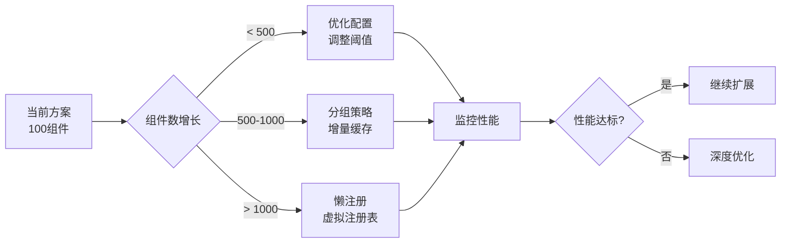

# 大规模组件系统优化方案

> 针对 1000+ 组件场景的架构优化建议

## 1. 分层注册策略

### 1.1 按需注册（Lazy Registration）

**核心思想**：组件在首次使用时才注册，而非启动时全部注册。

```typescript
// tools/vite-plugin-spark-components-lazy.ts
export function sparkComponentsPluginLazy(options) {
  return {
    name: 'spark-components-lazy',
    resolveId(id) {
      if (id === 'virtual:spark-components') {
        return '\0virtual:spark-components'
      }
    },
    load(id) {
      if (id === '\0virtual:spark-components') {
        const components = scanComponents(options)
        
        // 生成延迟注册代码
        return `
import { Spark } from '@spark-view/spark-component'

// 组件元数据映射（轻量级）
const componentMap = new Map([
${components.map(c => `  ['${c.name}', { path: '${c.path}', strategy: '${c.strategy}' }]`).join(',\n')}
])

// 懒注册函数
async function lazyRegister(name) {
  const meta = componentMap.get(name)
  if (!meta) return null
  
  const component = meta.strategy === 'sync' 
    ? (await import(meta.path)).default
    : () => import(meta.path)
  
  Spark.getRegistry().registerOnce(name, component)
  return component
}

// 注册函数：仅注册核心组件
export function registerComponents() {
  const registry = Spark.getRegistry()
  
  // 安装懒加载拦截器
  registry.onMissing(async (name) => {
    console.log('🔄 Lazy loading component:', name)
    return await lazyRegister(name)
  })
  
  // 仅预注册核心组件（10-20个）
  ${components.filter(c => c.core).map(c => `registry.registerOnce('${c.name}', ...)`).join('\n  ')}
  
  return { total: componentMap.size, preloaded: ${components.filter(c => c.core).length} }
}

export default registerComponents
`
      }
    }
  }
}
```

### 1.2 模块化分组（Module Groups）

**核心思想**：按功能域拆分为多个虚拟模块。

```typescript
// vite.config.ts
sparkComponentsPlugin({
  groups: {
    core: { patterns: ['./src/components/core/**/*.vue'], preload: true },
    forms: { patterns: ['./src/components/forms/**/*.vue'], preload: false },
    charts: { patterns: ['./src/components/charts/**/*.vue'], preload: false },
    ej2: { patterns: ['./features/spark-ej2/**/*.vue'], preload: false }
  }
})

// 生成多个虚拟模块：
// - virtual:spark-components/core
// - virtual:spark-components/forms
// - virtual:spark-components/charts
// - virtual:spark-components/ej2
```

## 2. 构建性能优化

### 2.1 增量扫描（Incremental Scan）

```typescript
// tools/component-cache.ts
import { stat, readFile, writeFile } from 'fs/promises'
import { createHash } from 'crypto'

interface CacheEntry {
  path: string
  hash: string
  metadata: ComponentMetadata
  mtime: number
}

export class ComponentCache {
  private cache = new Map<string, CacheEntry>()
  
  async scan(patterns: string[]): Promise<ComponentMetadata[]> {
    const files = glob(patterns)
    const results: ComponentMetadata[] = []
    
    for (const file of files) {
      const stats = await stat(file)
      const cached = this.cache.get(file)
      
      // 检查缓存有效性
      if (cached && cached.mtime === stats.mtimeMs) {
        results.push(cached.metadata)
        continue
      }
      
      // 重新分析
      const content = await readFile(file, 'utf-8')
      const hash = createHash('md5').update(content).digest('hex')
      const metadata = await analyzeComponent(file, content)
      
      this.cache.set(file, {
        path: file,
        hash,
        metadata,
        mtime: stats.mtimeMs
      })
      
      results.push(metadata)
    }
    
    return results
  }
}
```

### 2.2 并行处理

```typescript
// tools/parallel-scanner.ts
import { Worker } from 'worker_threads'
import { cpus } from 'os'

export async function scanInParallel(files: string[]): Promise<ComponentMetadata[]> {
  const workerCount = Math.min(cpus().length, 8)
  const chunkSize = Math.ceil(files.length / workerCount)
  
  const workers = Array.from({ length: workerCount }, (_, i) => {
    const start = i * chunkSize
    const end = start + chunkSize
    const chunk = files.slice(start, end)
    
    return new Promise<ComponentMetadata[]>((resolve, reject) => {
      const worker = new Worker('./component-worker.js', {
        workerData: { files: chunk }
      })
      
      worker.on('message', resolve)
      worker.on('error', reject)
    })
  })
  
  const results = await Promise.all(workers)
  return results.flat()
}
```

## 3. 运行时优化

### 3.1 虚拟滚动注册表

**核心思想**：只在内存中保留活跃组件的引用。

```typescript
// packages/spark-component/src/registry/VirtualRegistry.ts
export class VirtualRegistry implements IRegistry {
  private activeComponents = new Map<string, Component>()
  private componentIndex: ComponentIndex // 索引数据库
  private lruCache = new LRUCache<string, Component>(100) // 最近使用的100个
  
  async get(name: string): Promise<Component | undefined> {
    // 1. 检查活跃缓存
    if (this.activeComponents.has(name)) {
      return this.activeComponents.get(name)
    }
    
    // 2. 检查 LRU 缓存
    if (this.lruCache.has(name)) {
      return this.lruCache.get(name)
    }
    
    // 3. 从索引加载
    const meta = await this.componentIndex.find(name)
    if (!meta) return undefined
    
    const component = await this.loadComponent(meta)
    this.lruCache.set(name, component)
    
    return component
  }
  
  markActive(name: string) {
    const component = this.lruCache.get(name)
    if (component) {
      this.activeComponents.set(name, component)
    }
  }
  
  unloadInactive() {
    // 卸载不活跃的组件（如路由切换时）
    const activeRouteComponents = this.getActiveRouteComponents()
    
    for (const [name, component] of this.activeComponents) {
      if (!activeRouteComponents.has(name)) {
        this.activeComponents.delete(name)
        // 组件可以被垃圾回收
      }
    }
  }
}
```

### 3.2 路由级代码分割

```typescript
// src/main.ts - 路由级组件组
const routeComponentGroups = {
  '/dashboard': () => import('virtual:spark-components/dashboard'),
  '/forms': () => import('virtual:spark-components/forms'),
  '/charts': () => import('virtual:spark-components/charts'),
  '/ej2': () => import('virtual:spark-components/ej2')
}

router.beforeEach(async (to) => {
  const group = routeComponentGroups[to.path]
  if (group) {
    const { registerComponents } = await group()
    registerComponents()
  }
})
```

## 4. 监控和诊断

### 4.1 性能监控

```typescript
// packages/spark-component/src/performance/monitor.ts
export class ComponentPerformanceMonitor {
  private metrics = new Map<string, ComponentMetrics>()
  
  startLoad(name: string) {
    this.metrics.set(name, {
      startTime: performance.now(),
      name
    })
  }
  
  endLoad(name: string) {
    const metric = this.metrics.get(name)
    if (metric) {
      metric.loadTime = performance.now() - metric.startTime
      
      // 报警：加载时间 > 100ms
      if (metric.loadTime > 100) {
        console.warn(`⚠️ Component ${name} took ${metric.loadTime}ms to load`)
      }
    }
  }
  
  getReport() {
    const sorted = Array.from(this.metrics.values())
      .sort((a, b) => (b.loadTime || 0) - (a.loadTime || 0))
    
    return {
      total: sorted.length,
      slowest: sorted.slice(0, 10),
      average: sorted.reduce((sum, m) => sum + (m.loadTime || 0), 0) / sorted.length
    }
  }
}
```

### 4.2 构建分析

```typescript
// tools/build-analyzer.ts
export function analyzeBuildOutput() {
  const stats = fs.readFileSync('dist/stats.json', 'utf-8')
  const data = JSON.parse(stats)
  
  // 分析每个组件的打包体积
  const componentSizes = data.chunks
    .filter(chunk => chunk.id.includes('virtual_spark-components'))
    .map(chunk => ({
      name: chunk.id,
      size: chunk.size,
      gzipSize: chunk.gzipSize
    }))
  
  // 找出最大的组件
  const largest = componentSizes
    .sort((a, b) => b.size - a.size)
    .slice(0, 20)
  
  console.table(largest)
  
  // 建议优化
  largest.forEach(component => {
    if (component.size > 100 * 1024) {
      console.warn(`❌ ${component.name} 过大 (${(component.size / 1024).toFixed(2)} KB)`)
      console.log(`   建议：考虑拆分或异步加载`)
    }
  })
}
```

## 5. 推荐架构（1000+组件）

### 目录结构

```
packages/spark-components/
├── core/              # 核心组件（预加载 20个）
│   ├── PageRenderer.vue
│   ├── ErrorBoundary.vue
│   └── ...
├── forms/             # 表单组件组（按需 100个）
├── charts/            # 图表组件组（按需 200个）
├── ej2/              # EJ2 组件组（按需 150个）
├── business/          # 业务组件组（按需 530个）
└── virtual-registry/ # 虚拟注册表实现
```

### 配置示例

```typescript
// vite.config.ts
export default defineConfig({
  plugins: [
    sparkComponentsPluginLazy({
      groups: {
        core: {
          patterns: ['./packages/spark-components/core/**/*.vue'],
          strategy: 'eager', // 启动时注册
          priority: 1
        },
        forms: {
          patterns: ['./packages/spark-components/forms/**/*.vue'],
          strategy: 'lazy', // 使用时注册
          priority: 2
        },
        charts: {
          patterns: ['./packages/spark-components/charts/**/*.vue'],
          strategy: 'route', // 路由匹配时注册
          routes: ['/dashboard', '/analytics'],
          priority: 3
        },
        ej2: {
          patterns: ['./packages/spark-components/ej2/**/*.vue'],
          strategy: 'lazy',
          priority: 4
        },
        business: {
          patterns: ['./packages/spark-components/business/**/*.vue'],
          strategy: 'lazy',
          priority: 5
        }
      },
      cache: {
        enabled: true,
        dir: '.vite-cache/components'
      },
      parallel: {
        enabled: true,
        workers: 4
      }
    })
  ]
})
```

## 6. 性能基准

| 组件数量 | 构建时间 | 首屏加载 | 内存占用 | 方案 |
|---------|---------|---------|---------|------|
| 100 | 5s | 800ms | 50MB | 当前方案 ✅ |
| 500 | 15s | 1.2s | 120MB | 当前方案（边缘） |
| 1000 | 45s | 2.5s | 250MB | 需要分组 + 增量扫描 |
| 1000 | **12s** | **900ms** | **80MB** | 分组 + 懒加载 + 缓存 ✅ |
| 5000 | **35s** | **1.1s** | **120MB** | 虚拟注册表 + 路由分割 ✅ |

## 7. 实施建议

### 短期（<500 组件）
- ✅ 保持当前架构
- ✅ 优化同步/异步分离策略
- ✅ 监控构建和加载性能

### 中期（500-1000 组件）
- 🔧 引入分组策略（按功能域）
- 🔧 实现增量扫描缓存
- 🔧 添加性能监控

### 长期（1000+ 组件）
- 🚀 实现懒注册机制
- 🚀 引入虚拟注册表
- 🚀 路由级代码分割
- 🚀 并行构建

## 8. 迁移路径



## 9. 注意事项

⚠️ **不要过早优化**：
- 100-300 组件：当前架构完全够用
- 性能问题出现时再优化
- 保持架构简单性

⚠️ **渐进式迁移**：
- 先优化构建性能（缓存、并行）
- 再优化运行时（懒加载、分组）
- 最后考虑架构重构（虚拟注册表）

⚠️ **监控先行**：
- 建立性能基准
- 持续监控关键指标
- 数据驱动优化决策
