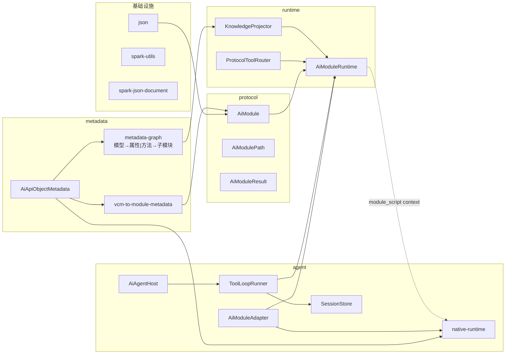
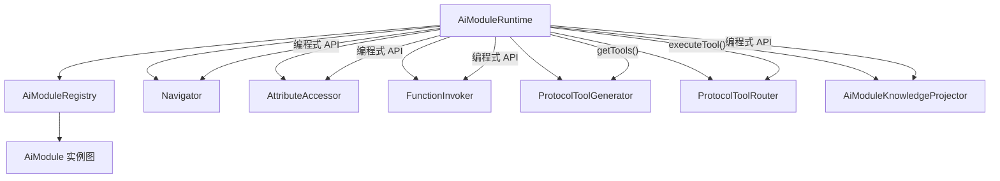
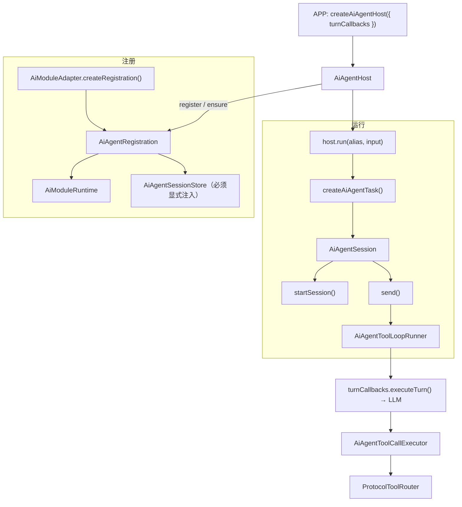
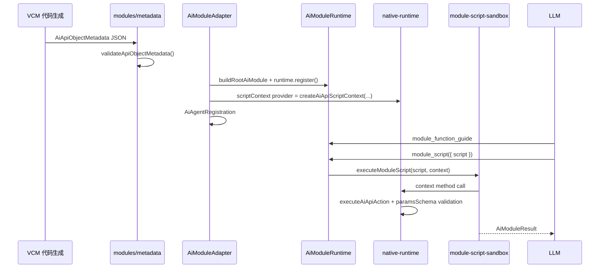
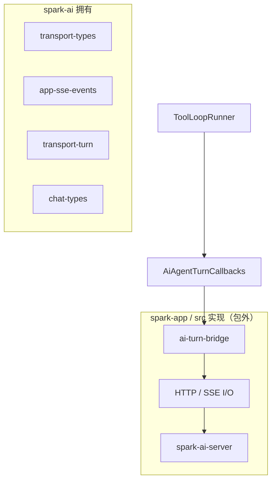
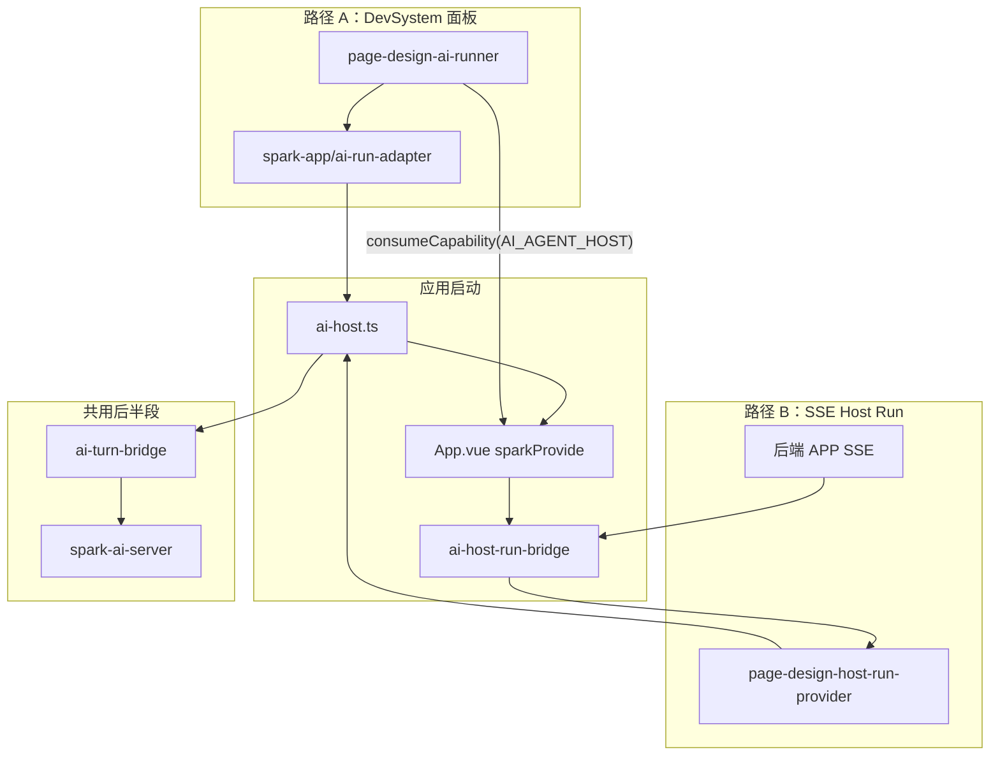
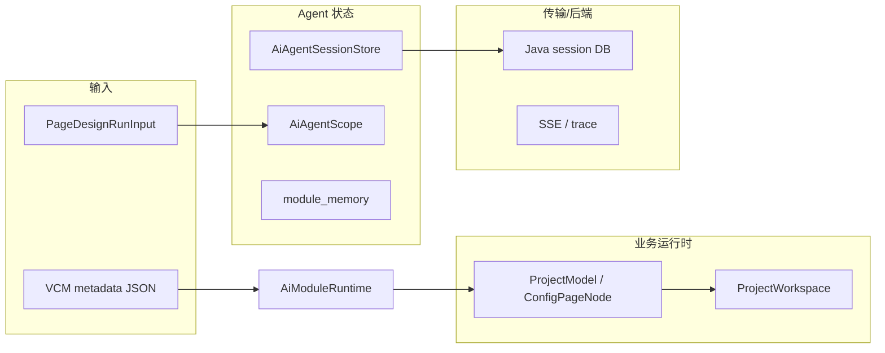

# @spark-appworks/spark-ai Architecture

> SSOT for `packages/spark-ai`。本文整合**包内原理关系**与**仓库消费方数据流向**。
> 包刻意 breaking：旧 `schema`、`module-semantic`、`host`、动态 tool 名、`$paths` 不是公共兼容面。

## Governance Priority

`spark-ai` 在理念、协议、生成代码、结构与兼容冲突时，按以下顺序决策：

```text
理念 > 逻辑 > AI 生成代码规则 > SSOT || SOLID > 该删则删 || 该合则合 || 该拆则拆 > 兼容
```

兼容是最后约束。旧公共形状若使生产线不稳定、AI 难生成或与运行时协议不一致，应收窄或删除，仅在边界保留兼容。

## Public Subpaths

`package.json` 仅暴露四个公共入口：

| 入口 | 职责 |
|------|------|
| `@spark-appworks/spark-ai` | 薄门面（常用符号快捷导出） |
| `@spark-appworks/spark-ai/json` | Schema 校验与 JSON 值规整（deprecated alias，真源 `@spark-appworks/spark-json-document`） |
| `@spark-appworks/spark-ai/modules` | 模块语义协议、元数据桥接、`AiModuleRuntime` |
| `@spark-appworks/spark-ai/agent` | Host 编排、会话、工具循环、传输契约、native-runtime |

新代码应从 `json`、`modules`、`agent` 子路径导入。

## Boundary Rules

- `spark-ai` 不得导入 `spark-project-model`、Vue、Element Plus、Router 或 app UI。
- `json`、`modules`、`agent` 保持框架无关。
- **业务 live state** 归业务服务；**Agent 会话历史** 存可恢复对话与诊断。
- 协议参数必须是标准 JSON Schema object 根。
- 业务注册唯一入口：`VCM 生成 JSON → AiModuleAdapter`（禁止 `src/services/**` 手工 `new AiModule` / `AiModuleRuntime.register()`）。

## Metadata Graph Protocol（协议真源线）

协议收敛的根不是「选 script 还是 function」，而是**废除实例 Id 寻址**，改以 VCM metadata 对象图为唯一语义：

```text
模型（AiApiObjectMetadata / rootApi）
  ├─ 属性 attributes ── attribute.api ──→ 子模块
  └─ 方法 actions ───── action.resultApis ──→ 子模块
```

| 层 | 真源 | 废弃（迁移中） |
|----|------|----------------|
| 实例钉死 | 会话 `registrationId + businessInstanceId`（`moduleInstanceId`）→ `resolveInstance` | LLM 知识中的 `/kind[id]`、`module_find`、path 寻址 |
| LLM 发现 | metadata 图遍历（[`metadata-graph.ts`](src/modules/metadata/metadata-graph.ts)） | companion 假 `AiModule` + 双向拓扑 |
| LLM 执行 | `module_script`；`this` = 根实例；子模块走对象链代理（[`native-script-context.ts`](src/agent/native-runtime/native-script-context.ts)） | direct function `{path,args}`、`module_call` |

pageDesign 示例（与 metadata 一致，非 path 语法）：

```javascript
// this = scope 钉死的 ProjectModel
const page = await this.openPageDesign({ pageId: 'orders' })  // action → resultApi 子模块 config-page
await page.editDataSet(async (ds) => { ... })                   // 链式子模块
```

实现要点：

- `collectNestedApiRecords(rootApi)`：从 root 收集「属性/方法 → 子模块」边，供 guide 投影与 Adapter 注册。
- `createAiApiScriptContext(instance, api, ctx)`：按 metadata 为每个 action/attribute 挂代理；`resultApis` / `attribute.api` 自动展开下一层子模块 API。
- 迁移期 `AiModuleAdapter` 仍为每个嵌套 kind 注册 guide-only companion（`directCallable: false`）；C0a 目标是用 metadata 图直接投影知识，删除 companion + path 层。

---

## Part 1 · 包内原理关系

### 1.1 包定位

`spark-ai` 是框架无关的 AI Agent 运行时，职责：

- JSON Schema 校验（`json/`）
- 模块语义协议（`modules/`）— VCM 元数据 → `AiModule` → 工具路由
- Agent 编排与 native runtime（`agent/`）— VCM metadata → script context / script execution，以及注册、会话、工具循环、传输契约

### 1.2 主数据流（自底向上）

```text
json
  -> modules/protocol
  -> modules/metadata (VCM 桥接)
  -> modules/runtime
  -> agent/business (Adapter wires runtime + native script context)
  -> agent/tool-loop
  -> agent/transport (契约，HTTP 在包外)

VCM metadata
  -> agent/native-runtime (metadata-first script context / executeAiNativeScript)
```

VCM 生成 module metadata 是 AI 可见业务 API 的真源。`native-runtime` 将 metadata 投影为原生链式 script context，并可直接执行 LLM 生成的脚本。Host/Task/Session/tool-loop 仍是传输与编排层；page-design 正向 metadata-first 执行迁移。



### 1.3 源码树

```text
packages/spark-ai/src/
├── index.ts
├── json/
├── modules/
│   ├── protocol/          # AiModule、路径、结果、上下文契约
│   ├── metadata/          # VCM JSON → 协议元数据桥接
│   ├── internal/          # Registry、Navigator、FunctionInvoker、ToolGenerator
│   ├── knowledge/         # LLM 可读知识投影
│   └── runtime/           # AiModuleRuntime、ToolRouter、module-script-sandbox
└── agent/
    ├── business/          # Host、Registration、Session、AiModuleAdapter
    ├── native-runtime/    # createAiApiScriptContext、executeAiNativeScript
    ├── chat/              # ChatRequest / StreamEvent DTO
    ├── session/           # SessionStore 契约与诊断
    ├── tool-loop/         # ToolLoopRunner、ToolCallExecutor
    └── transport/         # TurnCallbacks 契约、SSE 事件类型
```

### 1.4 AiModuleRuntime 组合根

`AiModuleRuntime` 不持有业务状态，只做协议编排与路由。



`AiModule` 协议中心三类职责：

1. **元数据声明** — `attributes` / `functions` / `children`
2. **运行时委托** — `attributeAccessor` / `functionRunner` / `childLister` / `instanceFinder`
3. **协议级校验** — 声明 → schema → 执行 → `AiModuleResult`

### 1.5 Agent 层编排（注册 → 运行闭环）



**Scope 身份模型**（全链贯穿）：

```text
AiAgentScope = {
  businessRegistrationId,
  businessInstanceId,
  instanceId,
  runtimeInstanceId
}
```

`business-scope.ts` 负责 scope 工厂及 `turnKey` / `streamKey` 构造。

### 1.6 工具协议三分法

| 分组 | 工具 | 说明 |
|------|------|------|
| LLM 知识协议（SSOT） | `module_query`、`module_guide`、`module_attribute_guide`、`module_function_guide`、`module_script`、`module_memory`、`human_question`、`agent_complete` | 发现、指南、脚本执行、收尾；不教授 path/实例 id |
| 运行时遗留（迁移废除） | `module_find`、`module_attr`、`module_call`、direct function `{path,args}` | 知识层已剥离；代码路径 C0a/C0b 逐步下线 |

**生产线模式**（`tool-loop-runner.ts`）：

- 每轮最多 1 个 `tool_call`
- 工具回合 `assistant.content` 必须为空
- 完成用 `agent_complete({ summary })`，不用自然语言收尾
- 目录发现工具与执行工具分阶段 nudge

### 1.7 元数据 → 模块 → 脚本桥接



`createAiApiScriptContext` 为业务实例构建 API 代理：actions 可调用、attributes 可读，参数经 `AiJsonSchemaValidator` 校验后委托真实方法。

`native-runtime` 还有一条 metadata-first 直跑入口：

```text
executeAiNativeScript({ metadata, instance, script, schemaDefs })
  → resolveModuleMetadataJson() + validateApiObjectMetadata()
  → createAiNativeScriptContext()
  → executeModuleScript()
  → AiModuleResult
```

这条路径不经过 Host、Session、ToolLoop，也不要求 LLM 使用 `/kind[id]/...` 实例 path 链；它的目标是让 LLM 直接生成原生链式代码并由运行时执行。

**展开参考**（Proxy 状态机、resultApis、pageDesign 链路、ToolLoop、recovery enricher、传输层、F8 迁移）：[`docs/NATIVE-RUNTIME-AND-AGENT-FLOW.zh-CN.md`](docs/NATIVE-RUNTIME-AND-AGENT-FLOW.zh-CN.md)。

### 1.8 会话与历史模型

```text
AiAgentSessionStore (abstract)
  └─ AiAgentSessionRecord
       ├─ AiAgentMessageHistoryEntry   (user / assistant / system)
       └─ AiAgentFunctionCallHistoryEntry (toolName / args / result)
```

- `sessionStore` 必须显式注入；registry 不隐式创建默认 store
- `startSession` 复用同一 business instance record；`send` 追加新 turn；`stopSession` 标记生命周期但不清 transcript
- 历史是诊断与再接入起点；业务层只读 transcript/summary，不维护第二份副本

### 1.9 传输层边界



`spark-ai` 定义纯契约与 key 格式；HTTP、SSE、模型调用由 APP 注入 `turnCallbacks` 完成。

**展开参考**：[`docs/TRANSPORT-AND-SESSION.zh-CN.md`](docs/TRANSPORT-AND-SESSION.zh-CN.md)（session-turn / app-sse、V4 端点、排错）。

### 1.10 包级依赖

```text
@spark-appworks/spark-ai
  ├── @spark-appworks/spark-utils
  ├── @spark-appworks/spark-json-document
  └── ajv ^8

禁止依赖：spark-project-model、vue、element-plus、router、app UI
```

---

## Part 2 · 仓库消费方与数据流向

### 2.1 消费方总览

| 消费方 | 子路径 | 角色 |
|--------|--------|------|
| `src/services/ai-host.ts` | `/agent` | 创建全局 `appAiAgent` |
| `src/App.vue` | `/agent` | `sparkProvide(AI_AGENT_HOST, appAiAgent)`；启动 Host Run 桥 |
| `src/services/ai-turn-bridge.ts` | `/agent` | 实现 `AiAgentTurnCallbacks`（HTTP → Java 后端） |
| `src/services/page-design-business.ts` | `/agent` + `/modules` | `AiModuleAdapter` 注册 pageDesign |
| `src/services/page-design-ai-runner.ts` | `/agent` + `spark-app` | DevSystem 面板内跑 AI |
| `src/services/page-design-host-run-provider.ts` | `/agent` | SSE 远程触发时的 headless 门面 |
| `src/services/ai-host-run-bridge.ts` | `/agent` + `/json` | SSE `ai-host-run-request` → 本地 `host.run()` |
| `packages/spark-app/src/ai/ai-run-adapter.ts` | `/agent` | UI 无关 headless run 封装 |
| `packages/spark-app/src/ai/tool-approval-bridge.ts` | `/agent` | 工具审批 → `beforeFunctionCall` |
| `packages/spark-component/src/ai/types.ts` | `/agent` | UI 展示 DTO（transcript / summary） |
| `packages/vite-plugin-spark-catalog` | `/modules` | VCM 生成 metadata 供 `AiModuleAdapter` 消费 |
| `tests/*` | 各子路径 | 契约与 pageDesign 行为测试 |

**不消费 spark-ai 的核心包**：`spark-project-model`、`spark-data`、`spark-component` 渲染主路径（仅 `ai/types.ts` 引用展示类型）。

### 2.2 两条主入口



| 路径 | 触发方 | ProjectWorkspace | 落盘 |
|------|--------|------------------|------|
| A DevSystem | UI 面板 | 共用当前编辑 scope 的 `editor.project` | runner 可选 `saveDirtyFilesAfterRun` |
| B Host Run | 后端 SSE | 每次 run 创建 headless 独立 workspace | `preparePageDesignHostRun` finally 中 `saveDirtyPageFiles()` |

### 2.3 pageDesign 端到端数据流

#### 阶段 0：元数据（构建期）

```text
VCM 组件源码
  → vite-plugin-spark-catalog (module-metadata-generator)
  → page-design-module-metadata.*.generated.json
  → page-design-business.ts: resolveModuleMetadataJson()
```

#### 阶段 1：Host 初始化（应用启动一次）

```typescript
// src/services/ai-host.ts
export const appAiAgent = createAiAgentHost({
  turnCallbacks: createAiAgentTurnCallbacks({ transport: 'session-turn' }),
  maxToolRounds: 16,
})

// src/App.vue
sparkProvide(AI_AGENT_HOST, appAiAgent)
```

此时 Host 仅有 `turnCallbacks` 与 `maxToolRounds`，**尚无业务注册**。

#### 阶段 2：业务注册（首次 run 前懒加载）

```typescript
// src/services/page-design-business.ts
host.ensure('pageDesign', {
  create: () => AiModuleAdapter.createRegistration({
    moduleClass: ProjectModel,
    metadata: readPageDesignProjectMetadata(),
    options: { inputContract, resolveInstance, beforeFunctionCall, jsonSchemaDefs, ... },
  }),
})
```

`AiModuleAdapter.createRegistration` 内部：

```text
VCM metadata
  → validateApiObjectMetadata + toModuleFunctionMetadata
  → buildRootAiModule(ProjectModel)
  → new AiModuleRuntime() + runtime.register(each kind)
  → AiAgentRegistration { runtime, sessionStore, hooks }
  → host.ensure → AiAgentRegistry
```

| 字段 | 来源 | 用途 |
|------|------|------|
| `inputContract` | `createSimpleInputContract<PageDesignRunInput>` | `host.run` 校验输入、生成 scope、拼 systemPrompt |
| `resolveInstance` | `getPageDesignEditor → ProjectModel` | 工具执行时解析真实业务对象 |
| `beforeFunctionCall` | `evaluatePageDesignMutationToolGate` | 写操作门禁 |
| `runtime` | `AiModuleRuntime` | LLM 工具发现 + 执行 |

#### 阶段 3：触发 run

**DevSystem**（`page-design-ai-runner.ts`）：

```text
consumeCapability(AI_AGENT_HOST)
  → ensurePageDesignBusiness({ host, getPageDesignEditor })
  → createAiRunAdapter().run({ host, alias: 'pageDesign', input, userMessage })
  → host.run(alias, input, { onStreamEvent, onDelta, onToolCall, signal })
```

**SSE Host Run**（`ai-host-run-bridge.ts`）：

```text
SSE: ai-host-run-request { alias, args }
  → preparePageDesignHostRun() // headless ProjectWorkspace
  → ensurePageDesignBusiness()
  → host.run(alias, args)
  → createAiAgentRunTrace()
  → POST /api/ai/host-run/result
```

#### 阶段 4：Host 内部编排（spark-ai 包内）

```text
host.run('pageDesign', input)
  ├─ createAiAgentTask()
  │    ├─ inputContract: schema 校验 + normalize
  │    ├─ toScope() → AiAgentScope
  │    └─ toOrchestration() → userMessage + systemPrompt
  ├─ new AiAgentSession()
  ├─ session.start()
  │    ├─ sessionStore.startSession()
  │    ├─ runtime.getTools()
  │    └─ turnCallbacks.prepareSession() → POST /api/ai/sessions
  └─ session.send()
       └─ AiAgentToolLoopRunner.runToolLoop()
```

#### 阶段 5：工具循环

```mermaid
sequenceDiagram
  participant Loop as ToolLoopRunner
  participant Bridge as ai-turn-bridge
  participant Java as spark-ai-server
  participant Exec as ToolCallExecutor
  participant RT as AiModuleRuntime
  participant PM as ProjectModel

  Loop->>Bridge: executeTurn({ tools, messages, systemPrompt })
  Bridge->>Java: POST /api/ai/sessions/{id}/turn
  Java-->>Loop: text + tool_calls

  loop 每个 tool_call
    Loop->>Exec: execute(tool_call)
    Exec->>Exec: beforeFunctionCall (pageDesign gate)
    Exec->>RT: executeTool(name, args, hostContext)
    alt module_script
      RT->>RT: module-script-sandbox
      RT->>PM: native context → openPageDesign / editDataSet / editNodeTree
    else module_function_guide
      RT->>RT: KnowledgeProjector
    else 业务 direct tool
      RT->>PM: FunctionInvoker.invoke({ path, args })
    end
    Exec->>Exec: sessionStore.appendFunctionCall()
  end

  Loop->>Bridge: appendMessages
  Note over Loop: continue → 下一轮；complete/abort → stopSession
```

#### 典型 `module_script` 一次调用

```text
1. LLM: tool_call { name: "module_script", arguments: '{"script":"..."}' }
2. ToolCallExecutor: parseArgs → beforeFunctionCall(gate) → runtime.executeTool()
3. ProtocolToolRouter → module-script-sandbox
4. createAiApiScriptContext(ProjectModel, apiMetadata, ctx)
5. script: await this.openPageDesign({ pageId }) → editDataSet → editNodeTree → return 四文件
6. AiModuleResult → sessionStore.appendFunctionCall() → tool message 回 LLM
7. LLM: agent_complete({ summary }) → stopSession
```

**落盘不在 spark-ai**：`ProjectWorkspace.saveDirtyPageFiles()` 由 runner 或 host-run-provider 在外层处理。

### 2.4 三类数据归属



### 2.5 子路径「谁用 / 怎么用」速查

#### `/json`

| 消费方 | 用法 |
|--------|------|
| spark-ai 内部 | `AiModule` 参数校验、`ToolCallExecutor` 解析 arguments |
| `page-design-business` | `createSimpleInputContract` 的 `paramsSchema` |
| `ai-host-run-bridge` | `coerceStrictJsonValue` 规范化 SSE 载荷 |

#### `/modules`

| 消费方 | 用法 |
|--------|------|
| `AiModuleAdapter` | `new AiModuleRuntime()` + `resolveModuleMetadataJson` |
| `page-design-business` | 读 VCM metadata、`AiModulePathContext` |
| `vite-plugin-spark-catalog` | 生成 `ModuleMetadataRuntimeDocument` |

APP 业务运行不直接调 `runtime.executeTool()`；现有交互统一走 Host 工具循环。测试和底层协议验证可直接调 runtime；metadata-first 脚本执行可走 `/agent` 的 `executeAiNativeScript()`，不经过 Host/Session/ToolLoop。

#### `/agent`

| 导出 | 消费方 | 用法 |
|------|--------|------|
| `createAiAgentHost` | `ai-host.ts` | 全局单例 |
| `AI_AGENT_HOST` | `App.vue`、`page-design-ai-runner` | capability 注入/消费 |
| `AiModuleAdapter` | `page-design-business` | 业务注册唯一入口 |
| `createAiApiScriptContext` / `createAiNativeScriptContext` | `AiModuleAdapter`、native script caller、测试 | 从 VCM metadata + 实例构建原生链式 API 上下文 |
| `executeAiNativeScript` | metadata-first runner、测试 | 直接执行 LLM 生成的 script body，返回 `AiModuleResult`，不走 Host 会话 |
| `createAiAgentRunTrace` | `ai-host-run-bridge` | SSE run 诊断回执 |
| `createTurnEventCollector` | `ai-turn-bridge`（app-sse 模式） | 聚合 SSE 事件 |
| `AiAgentSessionSummary` 等 | `spark-component/ai/types` | UI 诊断展示 |

### 2.6 排障索引

| 问题 | 先看 |
|------|------|
| Host 怎么创建、挂到哪 | `src/services/ai-host.ts` + `src/App.vue` `sparkProvide` |
| HTTP/LLM 谁发请求 | `src/services/ai-turn-bridge.ts`（不在 spark-ai 包内） |
| 业务怎么注册 | `src/services/page-design-business.ts` → `AiModuleAdapter` |
| UI 面板怎么跑 | `src/services/page-design-ai-runner.ts` → `ai-run-adapter` |
| 远程/自动化怎么跑 | `ai-host-run-bridge.ts` + `page-design-host-run-provider.ts` |
| 工具如何落到 ProjectModel | `tool-call-executor` → `AiModuleRuntime` → `module-script-sandbox` → `native-script-context` |
| 元数据从哪来 | `vite-plugin-spark-catalog` → `page-design-module-metadata.runtime.ts` |
| VCM 元数据边界 | `src/modules/DM-VCM-MODULE-METADATA-SCOPE.md` |

---

## 一句话总结

**spark-ai 不负责业务和 HTTP**。它提供两层能力：一层是「VCM metadata → native script context → LLM 生成代码执行」，另一层是「注册 → 会话 → 工具循环 → 传输契约」。APP 用 `createAiAgentHost` + `ai-turn-bridge` 接后端，用 `AiModuleAdapter` + VCM metadata 把业务对象（如 `ProjectModel`）暴露给 LLM，用 `ai-run-adapter` 或 `ai-host-run-bridge` 触发 `host.run()`；metadata-first 场景可直接用 `executeAiNativeScript()` 执行原生链式脚本。
