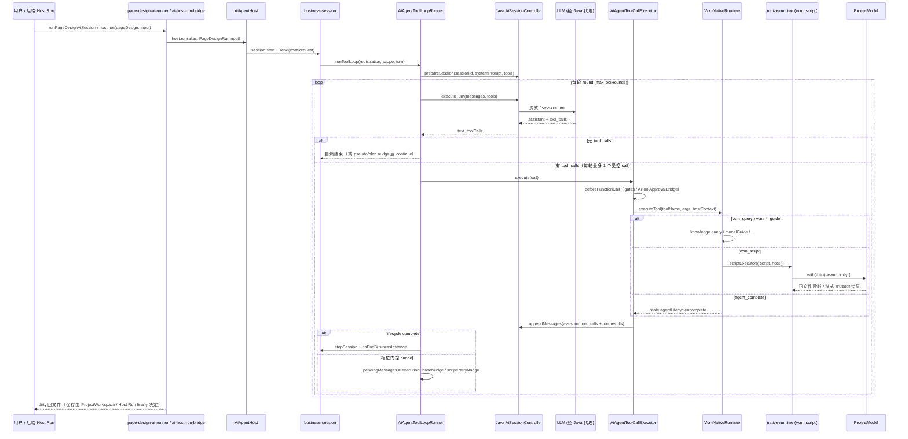
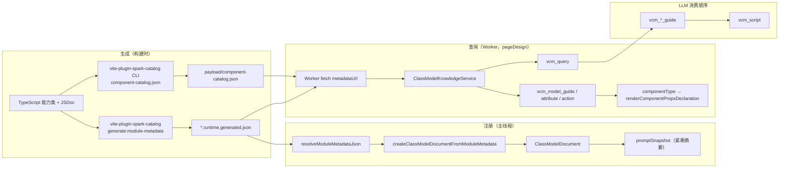

# spark-ai 架构

> 状态：有效（2026-06）。以代码为准；旧 `src/modules` / `module_*` 工具面已物理删除，无兼容层。
>
> 断代方案背景见 [`.cursor/plans/全面解决方案.md`](../../.cursor/plans/全面解决方案.md)（planning-only，实施进度以本文与源码为准）。

## Overview

spark-ai 是 SPARK AppWorks 的 **VCM-native AI 运行时**：把 TypeScript 能力类 metadata 投影为 LLM 可查询的 ClassModel，通过 **7 工具闭集** 驱动「查知识 → 读 guide → 执行脚本 → 收尾」的生产线，并在 Host 层完成多轮 tool loop 与 Java 后端会话同步。

**一句话主线：**

```text
VCM metadata + component catalog
  → ClassModelDocument / Worker 知识
  → VcmNativeAgentAdapter.register()
  → AiAgentHost.run()
  → ToolLoop（LLM ↔ 7 tools）
  → vcm_script → native-runtime → 业务实例（如 ProjectModel）
  → agent_complete
```

**公共入口（package exports）：**

| 子路径 | 职责 |
|--------|------|
| `@spark-appworks/spark-ai` | 根门面，常用稳定符号 |
| `@spark-appworks/spark-ai/json` | JSON Schema、参数校验 |
| `@spark-appworks/spark-ai/vcm-native` | ClassModel、guide 投影、7 工具 runtime、Worker 知识协议 |
| `@spark-appworks/spark-ai/agent` | Host、注册、会话、ToolLoop、传输契约、native-script 执行 |

`@spark-appworks/spark-ai/modules` **不存在**，也不应再出现在 alias / tsconfig / Vite 配置中。

---

## Layer Map

```text
┌─────────────────────────────────────────────────────────────────────────┐
│ spark-ai-server (Java, :8180)                                           │
│   AiSessionController / AiTurnController — 会话持久化、LLM 代理、SSE     │
│   Host Run SSE — 下发 ai-host-run-request，回收 trace 回执               │
└───────────────────────────────┬─────────────────────────────────────────┘
                                │ HTTP / SSE
┌───────────────────────────────▼─────────────────────────────────────────┐
│ APP 壳层 (src/services/)                                                │
│   ai-host.ts              createAiAgentHost + turnCallbacks             │
│   ai-turn-bridge.ts       prepareSession / executeTurn / appendMessages │
│   ai-host-run-bridge.ts   SSE Host Run 桥接（不理解业务语义）            │
│   page-design-business.ts ensurePageDesignBusiness + gates              │
│   page-design-ai-runner.ts DevSystem 面板内 run                         │
│   page-design-host-run-provider.ts 隔离式 headless Host Run             │
└───────────────────────────────┬─────────────────────────────────────────┘
                                │
┌───────────────────────────────▼─────────────────────────────────────────┐
│ packages/spark-ai/src/agent/                                            │
│   ai-host.ts              register / run 门面                           │
│   business-session.ts     session.start → send → ToolLoop               │
│   tool-loop-runner.ts     多轮 LLM ↔ tool_call 编排 + 相位门控          │
│   tool-call-executor.ts   单次 tool_call → runtime.executeTool          │
│   native-runtime/         vcm_script 沙箱与链式 API 代理                  │
└───────────────────────────────┬─────────────────────────────────────────┘
                                │ AiAgentToolRuntime
┌───────────────────────────────▼─────────────────────────────────────────┐
│ VcmNativeAgentAdapter → VcmNativeRuntime (vcm-native/runtime/)          │
│   7 tools: vcm_query | vcm_*_guide | vcm_script | human_question |     │
│            agent_complete                                               │
└───────────────┬─────────────────────────────┬───────────────────────────┘
                │ knowledge provider          │ scriptExecutor
┌───────────────▼──────────────┐  ┌───────────▼──────────────────────────┐
│ Worker 知识（pageDesign）     │  │ executeAiNativeScript                  │
│ ClassModelKnowledgeService   │  │ → createAiApiScriptContext (this 链)   │
│ + component-catalog.json     │  │ → ProjectModel / ConfigPageNode 变更   │
└──────────────────────────────┘  └────────────────────────────────────────┘
```

| 层 | 关键文件 | 职责 |
|----|----------|------|
| Java 后端 | `spark-ai-server/.../AiSessionController.java` | V4 协议 session/turn/append；LLM 流式或 session-turn 聚合 |
| Host | `agent/business/ai-host.ts` | `register` / `run`；委托 `business-session` |
| ToolLoop | `agent/tool-loop/tool-loop-runner.ts` | 系统提示词拼接、多轮 tool_call、相位 nudge、生命周期终止 |
| VCM Runtime | `vcm-native/runtime/vcm-native-runtime.ts` | 工具闭集校验、`executeTool` 路由 |
| 知识 | `vcm-native/knowledge/*` | ClassModel 查询与 d.ts-like guide；可 Worker 化 |
| pageDesign 业务 | `src/services/page-design-business.ts` | 注册 ProjectModel、systemPrompt、implGate 闸门 |
| projectPlanning 业务 | `src/services/project-planning-business.ts` | 注册 ProjectModel（project-model 面）、策划 gate |
| headless runner | `src/services/project-planning-ai-runner.ts` | 无 UI：`runProjectPlanningAiSession` → `host.run` |
| Metadata 生成 | `packages/vite-plugin-spark-catalog/` | `generate:module-metadata`、component-catalog CLI |

---

## Turn Lifecycle

一次 **turn** = 用户发一条消息后，ToolLoop 在 `maxToolRounds` 内反复「LLM 推理 → 执行 tool_call → 回填 tool 结果」，直到自然结束、`agent_complete` / `human_question` 触发生命周期、或达到轮次上限。

### 时序（DevSystem / Host Run 共用 Agent 内核）



### 入口差异

| 入口 | 文件 | 特点 |
|------|------|------|
| DevSystem 面板 | `src/services/page-design-ai-runner.ts` | 共用当前 `ProjectWorkspace`；默认**不**自动 save |
| Host Run / SSE | `src/services/page-design-host-run-provider.ts` + `ai-host-run-bridge.ts` | 每次 run 创建 headless editor；`finally` 中 `saveDirtyPageFiles()` |
| 传输 | `src/services/ai-turn-bridge.ts` | 默认 `app-sse`；APP 生产用 `session-turn`（`ai-host.ts`） |

### 系统提示词拼接顺序

`tool-loop-runner.ts` 按序拼接：

1. `registration.systemPrompt(context)` — 业务场景（pageDesign 含 pageId、effectiveDescription、vcm_script 形状示例）
2. `request.systemPrompt` — 本轮编排
3. `TOOL_PRODUCTION_LINE_PROMPT` — 强制真实 tool_call、禁止正文伪调用
4. `registration.runtime.projectKnowledge().promptSnapshot` — VCM-native 工具闭集与根 kind 摘要

---

## Tool Surface

SSOT：`vcm-native/tools/tool-names.ts` → `VCM_NATIVE_TOOL_NAMES`。

| 工具 | 用途 | 关键参数 |
|------|------|----------|
| `vcm_query` | 查 ClassModel 目录，定位 kind / member | `kind?`, `keyword?`, `includeMembers?` |
| `vcm_model_guide` | 单模型 d.ts-like 声明 | `kind` |
| `vcm_attribute_guide` | 单属性声明 + JSDoc | `kind`, `attributeName` |
| `vcm_action_guide` | 单 action 声明；可合并组件 props | `kind`, `actionName`, `componentType?` |
| `vcm_script` | 执行业务脚本，`this` = 根实例 | `script`（**不是** `code`） |
| `human_question` | 缺事实或需人工判断 | `context`, `reason`, … |
| `agent_complete` | 结束生产线 | `summary` |

**Fail-fast 约束（`VcmNativeRuntime.executeTool`）：**

- 未知工具名 → `UNKNOWN_VCM_NATIVE_TOOL`（**不**映射旧 `module_*`）
- 多余参数 → `INVALID_VCM_NATIVE_TOOL_ARGS`（**不**接受 `path` / `functionName` / `code` 等旧字段）

---

## Knowledge Pipeline

知识 **双轨**：API 面来自 module metadata runtime JSON；组件 props 面来自独立的 `component-catalog.json`。二者均在查询时 **lazy 按需** 投影，不做全量 prompt 注入。

双轨是当前架构选择，不是旧体系残留：API metadata 描述 `ProjectModel / ConfigPageNode / DataSetCrudTool / SparkNodeTree` 的方法图；组件 catalog 描述各 `SparkNode.type` 对应的 props 字段。`SparkNode.props` 在运行时契约中保持 `Record<string, unknown>`，因此 props 知识不能静态塞进 `SparkNode` schema，只能在 `vcm_action_guide({ componentType })` 时按需合并。



### 推荐消费顺序

1. **`vcm_query`** — 列出 rootKind、models、可选 `includeMembers: true` 看 action/attribute 摘要
2. **`vcm_model_guide` / `vcm_attribute_guide`** — 读模型或属性契约
3. **`vcm_action_guide`** — 读 action 的 `paramsSchema` / JSDoc；组装 UI 节点时对 `addNode` 等传 `componentType: "r-table"` 合并 props catalog
4. **`vcm_script`** — 在 `this` 绑定根实例上沿原生链调用（如 `openPageDesign` → `editDataSet` / `editNodeTree`）

### Worker 路径（pageDesign）

```text
createPageDesignVcmKnowledgeProvider()
  → Worker(page-design-vcm-knowledge.worker.ts)
  → exposeVcmNativeKnowledgeWorker()
  → fetch metadataUrl + componentCatalogUrl
  → createClassModelDocumentFromRuntimeDocument
  → ClassModelKnowledgeService
```

主线程 **不** import 大 JSON；`VcmNativeAgentAdapter` 注册时仍用 `pageDesignRuntimeMetadataDocument` 生成主线程 `ClassModelDocument`（供 `promptSnapshot` / inspect）。

---

## 相位门控（ToolLoop）

`tool-loop-runner.ts` 除 prompt 文案外，还有 **按工具名的状态机 nudge**（SSOT：`VCM_NATIVE_TOOL_NAMES`）：

| 集合 | 工具名 |
|------|--------|
| 目录/指南阶段 | `vcm_query`, `vcm_model_guide`, `vcm_attribute_guide`, `vcm_action_guide` |
| 执行阶段 | `vcm_script`, `openPageDesign`, `readPlanningProjection` |

| 门控 | 触发条件 | 行为 |
|------|----------|------|
| 执行相位 nudge | 会话历史已有成功的 `vcm_action_guide`，且尚无执行阶段工具；本轮又只调用了目录工具 | 注入「禁止重复查目录，直接 vcm_script」用户消息（最多 3 次） |
| 脚本失败重试 nudge | 最近一次 `vcm_script` 为 `failed` | 注入 RECOVERY_HINT + 脚本形状提醒（最多 3 次） |
| 伪 tool_call nudge | assistant 正文含 `<tool_call>` 等 | 要求改用 OpenAI tool_calls（最多 2 次） |
| 只计划不执行 nudge | 正文描述将调用工具但无 tool_calls | 强制下一回合 tool_call（最多 3 次） |

失败恢复：`function-call-recovery-enricher.ts` 把 `code/msg/fix` 映射为 VCM-native 重试提示（**已删除** 旧 `module_find` / path 教学）。

---

## pageDesign Flow

### 注册

```text
ensurePageDesignBusiness({ host, getPageDesignEditor })
  → VcmNativeAgentAdapter.createRegistration({
       moduleClass: ProjectModel,
       metadata: pageDesignRuntimeMetadataDocument (project root),
       knowledge: createPageDesignVcmKnowledgeProvider(),
       resolveInstance: ctx → editor.project,
       beforeFunctionCall: implGate / planning 闸门,
       inputContract: PageDesignRunInput,
     })
  → host.ensure('pageDesign', registration)
```

### vcm_script 典型形状（systemPrompt 与门控 nudge 一致）

```javascript
const page = await this.openPageDesign({ pageId: "<pageId>" });
await page.editDataSet(async (ds) => {
  ds.createTable({ tableName: "<TableName>", columns: [{ name, type, label }] });
});
await page.editNodeTree(async (tree) => {
  tree.addNode({
    parentComponentId: null,
    node: {
      type: "r-table",
      id: "...",
      props: { dataViewKey: "<table@viewId>", dataMember: "rows" },
    },
  });
});
return {
  ruleJson: page.getFileText("rule.json"),
  pageDataJson: page.getFileText("pagedata.json"),
  script: page.getFileText("script.js"),
  style: page.getFileText("style.css"),
};
```

### 闸门与审批

| 机制 | 文件 | 说明 |
|------|------|------|
| implGate / planningStatus | `page-design-gates.ts` | `beforeFunctionCall` 拒绝 `vcm_script` 等 mutation 工具 |
| UI 审批 | `packages/spark-app/src/ai/tool-approval-bridge.ts` | 请求级 `beforeFunctionCall` 挂起/拒绝/abort |

AI 默认只改 **内存** 四文件；DevSystem runner 需显式 `saveDirtyFilesAfterRun`；Host Run provider 在 `finally` 自动保存。

### 运行时数据流（页面渲染，简述）

遵循仓库 `AGENTS.md`：`pagedata.json` → `parsePageData()` → `DataSet` → `usePageDataSet()` → `dataViewKey` + `dataMember` + `dataField` → `DataView` → UI。AI 写入的是 ConfigPageNode 内存模型中的四文件，不旁路 DataSet 管线。

---

## Metadata Artifacts

| 产物 | 生成命令 | 路径 | 消费者 |
|------|----------|------|--------|
| runtime metadata | `pnpm run generate:vcm-metadata` | `generated/vcm/<target-id>/` | `VcmNativeAgentAdapter`、Worker `manifestUrl` |
| VCM bundle 分片 | 同上 | `generated/vcm/<target-id>/manifest.json`、`kinds/*.json`、`$defs.json` | Worker 按需 fetch |
| JSDoc todo log | 同上 | `generated/vcm/<target-id>/*.jsdoc-todo.generated.json` | 人工补源码 JSDoc / schema description |
| component catalog | `pnpm run generate:component-catalog` | `generated/vcm/component-catalog.json` | pageDesign Worker lazy fetch |
| runtime TS 入口 | 生成器写入 | `generated/vcm/<target-id>/*.runtime.ts` | 业务层 import（类型断言） |

Registry 配置：`config/vcm/registry.json`（`spark-appworks.vcm.registry`）。**VCM target 只按能力面命名**（如 `project-model`、`project-page-surface`），不声明 `pageDesign` / `projectPlanning` 等 AI business alias。`componentCatalogOutput` 在 registry 根级声明，不挂在 metadata target 上。

AI business 在各自 app-layer service 中选择要消费的 VCM artifact URL；这层映射不写回 VCM registry，避免构建期知识协议反向承载业务编排语义。

**无 UI 运行（与 DevSystem 无关）：**

```text
runProjectPlanningAiSession({ editor, host | consumeCapability })
  → buildProjectPlanningAgentInput(project)
  → ensureProjectPlanningBusiness
  → createAiRunAdapter().run('projectPlanning', input)
```

SSE Host Run 见 `project-planning-host-run-provider.ts`（与 `page-design-host-run-provider.ts` 并列）。

**投影链：**

```text
*.runtime.generated.json
  → resolveModuleMetadataJson / createClassModelDocumentFromRuntimeDocument
  → ClassModelDocument
  → ClassModelKnowledgeService + dts-renderer
  → vcm_query / vcm_*_guide 文本
```

---

## 与旧架构差异

| 旧（已删除） | 新（当前） |
|--------------|------------|
| `module_query` / `module_function_guide` / `module_script` … | `vcm_query` / `vcm_action_guide` / `vcm_script` 等 7 工具 |
| `/kind[id]` path、`module_find` / `module_attr` / `module_call` | `vcm_script` + `this` 原生对象链 |
| `Navigator` / `AiModulePath` / direct function tools | `VcmNativeRuntime` + `native-script-context` 代理 |
| `@spark-appworks/spark-ai/modules` | `@spark-appworks/spark-ai/vcm-native` + `/agent` |
| 工具名 silent alias 到 `vcm_*` | `UNKNOWN_VCM_NATIVE_TOOL` fail-fast |
| `code` 参数 | `script` |
| `functionName` / `methodName` | `actionName`（仅 guide 工具） |

---

## 待实现 / 规划项（代码尚未具备）

以下在 [`.cursor/plans/全面解决方案.md`](../../.cursor/plans/全面解决方案.md) 与 [`docs/vcm-generator-and-callbackapis-zh-cn.md`](docs/vcm-generator-and-callbackapis-zh-cn.md) 中讨论，**当前源码未落地**：

| 项 | 现状 |
|----|------|
| **`callbackApis` metadata 字段** | schema / generator 仍用 `resultApis` 描述 callback 子模型；guide 输出 **不** 暴露 `callbackApis` 字样 |
| **`verifyPageDesignModelEdit`** | 未实现；四文件仍通过 script 内多次 `getFileText` + return 投影 |
| **`vcm_query({ includePayloads })`** | 未实现；组件 props 通过 `vcm_action_guide({ componentType })` 查询 |
| **callback 参数 runtime 代理校验** | `editDataSet` / `editNodeTree` 的 `run` 回调参数为裸业务对象，无独立 callback proxy |

---

## Verification

```bash
pnpm run typecheck
pnpm --filter @spark-appworks/spark-ai test:run
pnpm run test
pnpm run verify:rules   # 触及架构边界 / 公共 export 时
```

架构守卫：

- `tools/verify-architecture.mjs` — public subpath 仅为根、`json`、`agent`、`vcm-native`
- `tools/verify-ai-codegen-rules.mjs` — `VcmNativeRuntime` 公共方法面防漂移

Metadata 一致性：

```bash
pnpm run generate:module-metadata
pnpm run generate:module-metadata -- --verify-build-consistency
```

---

## Related Docs

| 文档 | 说明 |
|------|------|
| [`docs/README.md`](docs/README.md) | spark-ai 文档索引 |
| [`docs/native-runtime-and-agent-flow-zh-cn.md`](docs/native-runtime-and-agent-flow-zh-cn.md) | native-runtime 与注册细节 |
| [`docs/transport-and-session-zh-cn.md`](docs/transport-and-session-zh-cn.md) | V4 传输、session-turn / app-sse |
| [`docs/pagedesign-devsystem-zh-cn.md`](docs/pagedesign-devsystem-zh-cn.md) | DevSystem 接线与排错 |
| [`docs/vcm-generator-and-callbackapis-zh-cn.md`](docs/vcm-generator-and-callbackapis-zh-cn.md) | Generator 与 callbackApis 方向 |
| [`../../docs/ai/spark-ai-workflow.md`](../../docs/ai/spark-ai-workflow.md) | 精简 SOP（本架构的速查版） |
| [`../../AGENTS.md`](../../AGENTS.md) | 仓库全局规则与 DataSet 管线 |

---

## 物理目录（packages/spark-ai/src）

```text
json/                 # 框架无关 JSON/Schema
vcm-native/
  metadata/           # runtime JSON schema / resolve / validate
  class-model/        # ClassModel 投影
  projection/         # d.ts-like guide 渲染 + component catalog 合并
  knowledge/          # ClassModelKnowledgeService + Worker 协议
  runtime/            # VcmNativeRuntime
  tools/              # VCM_NATIVE_TOOL_NAMES
agent/
  business/           # Host、VcmNativeAgentAdapter、session、task
  native-runtime/     # vcm_script 上下文、沙箱、执行
  tool-runtime/       # AiAgentToolRuntime 抽象
  tool-loop/          # ToolLoop、executor、recovery
  session/            # sessionStore、trace
  transport/          # turn 契约、app-sse 类型
```
