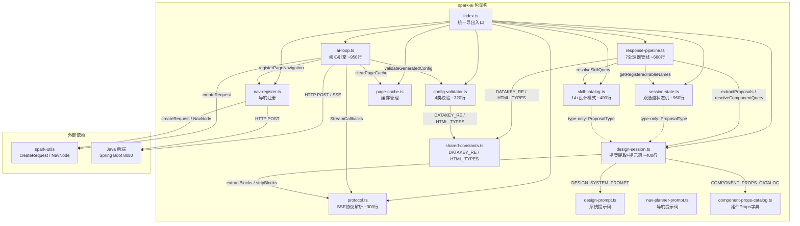
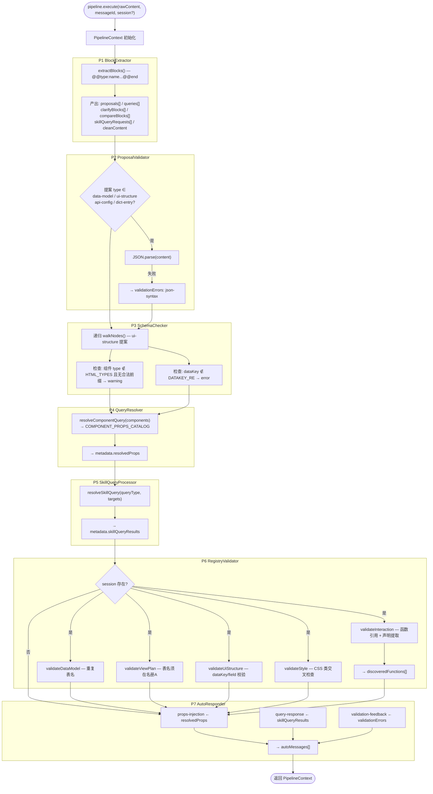
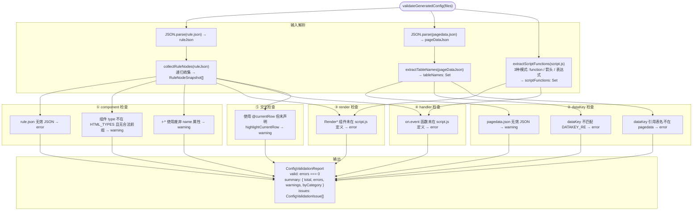
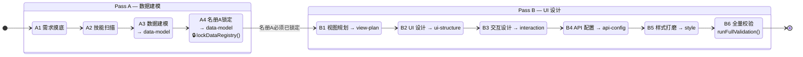
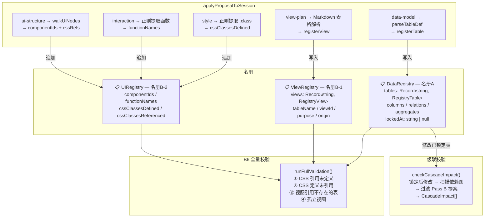
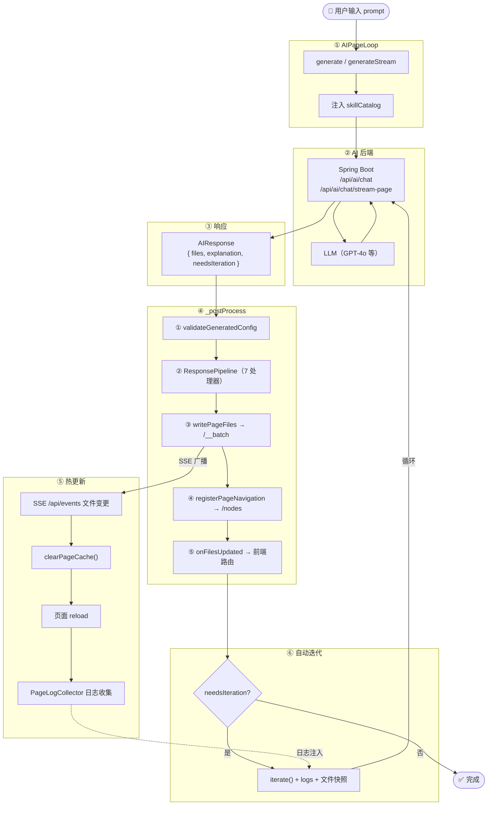

# spark-ai 架构全景

> 自动生成于 2026-03-22，基于 14 个源文件（~4500+ 行）的完整代码审计。

---

## 目录

- [1. 模块依赖关系](#1-模块依赖关系)
- [2. AIPageLoop 主循环](#2-aipageloop-主循环)
- [3. SSE 流式处理](#3-sse-流式处理)
- [4. Response Pipeline（7 处理器）](#4-response-pipeline7-处理器)
- [5. Config Validation 校验](#5-config-validation-校验)
- [6. Design Session 状态机](#6-design-session-状态机)
- [7. 端到端数据流](#7-端到端数据流)

---

## 1. 模块依赖关系

14 个源文件的 import 方向 + 外部依赖一览。



### 依赖规则

| 层级 | 模块 | 可依赖 |
|------|------|--------|
| **零依赖** | `protocol.ts`, `page-cache.ts`, `shared-constants.ts`, `design-prompt.ts`, `nav-planner-prompt.ts`, `component-props-catalog.ts` | 无内部依赖 |
| **基础层** | `design-session.ts` | protocol, component-props-catalog, design-prompt |
| **基础层** | `session-state.ts`, `skill-catalog.ts` | design-session (type-only) |
| **管线层** | `response-pipeline.ts` | design-session, skill-catalog, session-state, shared-constants |
| **管线层** | `config-validator.ts` | shared-constants |
| **引擎层** | `ai-loop.ts` | config-validator, page-cache, nav-register, protocol, spark-utils |

---

## 2. AIPageLoop 主循环

4 个入口点 → `_callAI` / `_callAIStream` → 统一 `_postProcess` 后处理 → 自动迭代守卫。


### 构造器选项

| 选项 | 类型 | 说明 |
|------|------|------|
| `aiEndpoint` | `string` | AI 后端地址 |
| `onFilesUpdated` | `(resp) => void` | 文件写入后回调 |
| `onError` | `(err) => void` | 错误回调（始终触发，不受 DEV 守卫） |
| `logCollectDelay` | `number` | 日志收集延迟 ms |
| `skillCatalog` | `string` | 技能目录文本 |
| `includeGlobalDiagnostics` | `boolean` | 是否包含全局诊断 |
| `autoRegisterNav` | `boolean` | generate 后自动注册导航 |
| `onNavigationRegistered` | `(pageId) => void` | 导航注册成功回调 |
| `autoIterateTimeout` | `number` | 自动迭代超时 ms |
| `onResponseProcessed` | `(resp) => void` | Pipeline 挂接点 |

### 全局配置

```typescript
configureAILoopHttp({
  getHeaders: () => ({ Authorization, 'X-Tenant-Id', 'X-Project-Id' }),
  getPageApiUrl: (pageId) => `/api/tenants/.../pages-config/${pageId}`,
  getNavApiUrl: () => `/api/tenants/.../navigation/nodes`,
})
```

---

## 3. SSE 流式处理

`_callAIStream` 替换端点为 `/chat/stream-page`，通过 `consumeSSEStream` 逐块解析。

```mermaid
sequenceDiagram
    participant UI as 前端 UI
    participant Loop as AIPageLoop
    participant BE as Java 后端
    participant SSE as consumeSSEStream

    UI->>Loop: generateStream(prompt, pageId, callbacks)
    Loop->>Loop: 替换 /chat → /chat/stream-page
    Loop->>BE: fetch(POST, ReadableStream)
    BE-->>Loop: Response.body

    Loop->>SSE: consumeSSEStream(reader, callbacks)
    activate SSE

    loop 每个 SSE 事件
        SSE->>SSE: TextDecoder 解析 event: / data:

        alt event: delta
            SSE-->>UI: onDelta(text) — 实时文本
        else event: reasoning
            SSE-->>UI: onReasoning(text) — 推理过程
        else event: phase
            SSE-->>UI: onPhase(name) — 阶段标识
        else event: usage
            SSE-->>UI: onUsage(tokenUsage) — Token统计
        else event: result
            SSE->>SSE: JSON.parse → 暂存 finalResult
        else event: error
            SSE-->>UI: onError(msg)
            SSE->>SSE: throw Error
        else event: done
            SSE->>SSE: 结束读取
        end
    end

    deactivate SSE

    alt finalResult 存在
        SSE-->>Loop: return AIResponse
    else 无 result
        SSE-->>Loop: throw "Stream ended without result"
    end

    Loop->>Loop: _postProcess(response)
    Loop-->>UI: 完成
```

### StreamCallbacks

| 回调 | 触发时机 |
|------|---------|
| `onDelta(text)` | 每个 delta 文本片段 |
| `onReasoning(text)` | 推理 token |
| `onPhase(name)` | 阶段切换 |
| `onUsage(usage)` | Token 用量 |
| `onError(msg)` | 错误事件 |

---

## 4. Response Pipeline（7 处理器）

`createStandardPipeline()` 创建标准管线，处理器按顺序串行执行。



### PipelineContext 字段

| 字段 | 来源 | 说明 |
|------|------|------|
| `rawContent` | 输入 | AI 原始回复 |
| `messageId` | 输入 | 消息 ID |
| `cleanContent` | P1 | 去除 @@ 块后的纯文本 |
| `proposals` | P1 | 结构化提案列表 |
| `queries` | P1 | 组件 Props 查询请求 |
| `clarifyBlocks` | P1 | 追问块 |
| `compareBlocks` | P1 | 方案对比块 |
| `skillQueryRequests` | P1 | 技能查询请求 |
| `discoveredFunctions` | P6 | interaction 中发现的函数名 |
| `validationErrors` | P2-P6 | 累积校验错误 |
| `autoMessages` | P7 | 待发送自动回复 |
| `metadata` | P4-P5 | 中间数据 |
| `session?` | 注入 | 设计会话状态 |

---

## 5. Config Validation 校验

`validateGeneratedConfig(files)` 在 `_postProcess` 第一步执行，返回 `ConfigValidationReport`。



### 检查清单速查

| 类别 | 检查项 | 级别 |
|------|--------|------|
| component | rule.json 无效 JSON | error |
| component | 未知组件 type | warning |
| component | r-* 使用废弃 `name`（应为 `field`） | warning |
| component | @currentRow 缺少 highlightCurrentRow | warning |
| dataKey | pagedata.json 无效 JSON | warning |
| dataKey | dataKey 格式不匹配 | error |
| dataKey | dataKey 引用不存在的表 | error |
| render | Render* 函数未定义 | error |
| handler | 事件处理函数未定义 | error |

---

## 6. Design Session 状态机

### 双通道步骤推进（A1→A4→B1→B6）



### 三大名册 + 提案写入



### PersistedDesignSession 结构

```typescript
interface PersistedDesignSession {
  version: 1
  currentPass: 'A' | 'B'
  currentStep: DesignStep          // A1 | A2 | ... | B6
  dataRegistry: DataRegistry       // 名册A
  viewRegistry: ViewRegistry       // 名册B-1
  uiRegistry: UIRegistry           // 名册B-2
  acceptedProposals: AcceptedProposalSnapshot[]
  dependencyGraph: Record<string, string[]>  // 'Table.col' → [proposalId]
}
```

### 步骤推进规则

- `advanceStep(session)` — 沿 A1→…→B6 顺序前进，最后一步返回 `null`
- `canAdvanceTo(session, target)` — 不允许倒退；进入 Pass B 需名册 A 已锁定
- `serializeSession / deserializeSession` — JSON 持久化 + 版本/结构校验
- `buildSessionContextPrompt(session)` — 动态 Markdown 摘要注入 AI 系统提示词尾部

---

## 7. 端到端数据流

从用户 prompt 到页面渲染再到自动迭代的完整闭环。



### 关键集成点

| 集成点 | API | 用途 |
|--------|-----|------|
| `configureAILoopHttp()` | 应用启动 | 注入 auth headers + 多租户 URL 工厂 |
| `setConfigLoader(loader)` | page-cache | 注入 FileLoader 清缓存 |
| `onResponseProcessed` | 构造器 | 挂接 ResponsePipeline |
| `onFilesUpdated` | 构造器 | 路由导航到新页面 |
| `onNavigationRegistered` | 构造器 | 刷新侧边栏导航 |
| `setupHotReload()` | 应用层 | SSE → clearPageCache → reload |
| `PageLogCollector` | 全局 | 收集运行时日志 → 下次迭代注入 |

---

## 协议格式参考

### 通用块协议

```
@@type:name
payload content
@@end
```

正则: `BLOCK_RE = /^@@(\w+):([\w-]+)\s*$([\s\S]*?)^@@end\s*$/gm`

### 工具块协议

```
@@type:action#id
payload content
@@end
```

正则: `TOOL_BLOCK_RE = /@@(\w+):([\w.]+)#([\w-]+)\n([\s\S]*?)\n@@end/g`

### ProposalType 枚举（10 种）

`data-model` · `view-plan` · `ui-structure` · `interaction` · `style` · `api-config` · `db-schema` · `dict-entry` · `function-plan` · `navigation`

---

## 文件索引

| 文件 | 行数 | 职责 |
|------|------|------|
| `ai-loop.ts` | ~950 | 核心引擎：4 入口 + `_postProcess` + 自动迭代 + 全局配置 |
| `response-pipeline.ts` | ~660 | 7 处理器管线 + `createStandardPipeline()` |
| `session-state.ts` | ~960 | 双通道状态机 + 三名册 + 级联校验 + 序列化 |
| `design-session.ts` | ~400 | 提案提取 + 组件查询 + 追问/对比块 + 提示词构建 |
| `skill-catalog.ts` | ~400 | 14+ 设计模式目录 + `resolveSkillQuery` |
| `config-validator.ts` | ~320 | 4 类校验 + highlightCurrentRow 交叉检查 |
| `protocol.ts` | ~300 | SSE 协议解析 + `extractFirstJsonObject` 括号深度匹配 |
| `shared-constants.ts` | ~30 | `DATAKEY_RE` / `HTML_TYPES`(48) / `VALID_TYPE_PREFIXES` |
| `nav-register.ts` | ~80 | 导航注册 + `configureNavRegister` |
| `page-cache.ts` | ~60 | `setConfigLoader` / `clearPageCache` / `clearAllCache` |
| `design-prompt.ts` | — | `DESIGN_SYSTEM_PROMPT` 常量 |
| `nav-planner-prompt.ts` | — | `NAV_PLANNER_SYSTEM_PROMPT` 常量 |
| `component-props-catalog.ts` | — | `COMPONENT_PROPS_CATALOG` 字典 |
| `index.ts` | ~200 | 统一公共 API 导出 |
