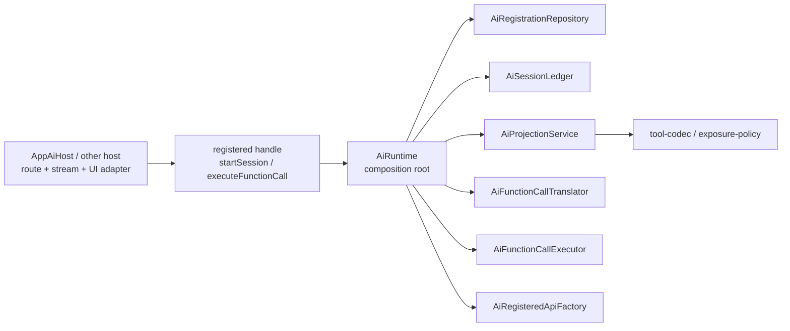

# spark-ai 架构

`spark-ai` 是 SPARK 的 AI 核心包。当前原则是“重核心、轻宿主”：凡是与前端框架无关、可被 Vue/React/后端宿主复用的协议、投影、工具编码、工具暴露策略、会话账本和函数调用执行链路，都放进 core；宿主只做业务选择、模型传输和 UI/面板适配。



## Core 边界

`src/core` 是模块实现与 LLM 宿主之间的确定性协议层：

- 定义统一的 module/business/function 注册契约。
- 将递归注册树投影为 LLM 可见的 `promptSnapshot`、`availableFunctions` 和 tool schema。
- 统一解析 `rootInstanceId[/childInstanceId]@moduleId@functionId` action。
- 将 LLM args 校验、上下文参数注入/剥离、activePath 合并为可执行上下文。
- 保存 AI session record、UI/LLM 消息和函数调用历史。
- 串起 translate -> requested -> run -> normalize -> completed/failed。
- 序列化函数结果，并提供无框架 tool codec 与 staged tool exposure policy。

core 明确不做：

- 不调用大模型，不管理 SSE 或 UI。
- 不创建、恢复、暂停、销毁业务服务实例。
- 不保存页面、数据集、节点树等业务运行状态。
- 不依据业务返回值决定是否完成/中止业务流程。

## Handle-First API

`AiRuntime` 现在只做组合根和注册入口：

```ts
const runtime = new AiRuntime()
const moduleApi = runtime.registerModule(registration)

const projection = await moduleApi.startSession({
  moduleInstanceId: 'page-1',
  instanceId: 'ai:page-1',
})

await moduleApi.executeFunctionCall({
  moduleInstanceId: 'page-1',
  instanceId: 'ai:page-1',
  runtimeInstanceId: 'ai:page-1',
  action: 'page-1@textModel@writeScript',
  args: { content: 'export default {}' },
  projection,
  run: ({ functionRegistration, args, context }) => {
    return bindAndRun(functionRegistration, args, context)
  },
})
```

裸 `AiRuntime.startInstance/stopInstance/projectModule/appendMessage/translateFunctionCall/executeFunctionCall/getSession/getSessionHistory` 已删除。调用方只能通过 `registerModule()` / `registerBusiness()` 返回的绑定 handle 操作 session、history、projection 和 function call。

## 内部拆分

- `AiRegistrationRepository`：注册数据唯一事实源，持有 module/business 注册、纯数据快照、store snapshot、business/module 互转和 payload provider 注册。
- `AiSessionLedger`：AI 会话账本唯一事实源，持有 session、alias index、history seq、start/stop、append/record/complete、session 查询和 clone。
- `AiProjectionService`：唯一负责 `projectKnowledge()` 和 knowledge projection 更新。
- `AiFunctionCallTranslator`：唯一负责 action 解析、scope 校验、函数定位、activePath 合并、上下文参数准备和 schema 校验。
- `AiFunctionCallExecutor`：唯一负责函数调用执行链路和结果回填。
- `AiRegisteredApiFactory`：唯一负责创建 module/business 绑定 handle。
- `AiRuntime`：只负责装配以上服务并暴露注册入口。

## 会话语义

AI 会话隔离键固定为 `moduleId + moduleInstanceId`，对应“模块注册 ID + 根模块实例 ID”。`instanceId` 是传输 envelope/alias；同一根模块实例重新 `startSession` 可以更新 alias，但不能把一个技术 alias 绑定到另一个根业务实体。

`startSession` / `stopSession` 只表示 AI session 生命周期，不释放业务服务实例。比如 PageDesign 的页面编辑状态仍由 `PageDesignService` 按 `moduleInstanceId` 管理；释放页面编辑状态必须由业务 runtime 显式调用自身的 release 方法。

## 宿主关系

AppAiHost 现在是轻 facade：

- `business-selector`：负责 latest user input、routing、scope 创建、session start。
- `tool-loop`：负责 streamTurn、多轮 tool calls、pending messages 和生命周期收尾。
- `diagnostics`：负责 `llm-request`、`llm-append`、`tool-result` SSE envelope。
- `tool-codec` / `tool-exposure-policy`：应用层只保留薄适配，实际策略来自 `spark-ai core`。

这让未来 React、Web Component、Node server 或移动端宿主可以复用同一套 core 协议，只替换 UI、模型传输和业务实例解析。

## 验证

```bash
pnpm --filter @spark-view/spark-ai run typecheck
pnpm run test:run -- --config vitest.spark-ai.config.ts tests/ai-runtime-business.test.ts tests/app-ai-host.test.ts tests/protocol-parser-json-extract.test.ts tests/page-design-business-definition.test.ts
```
