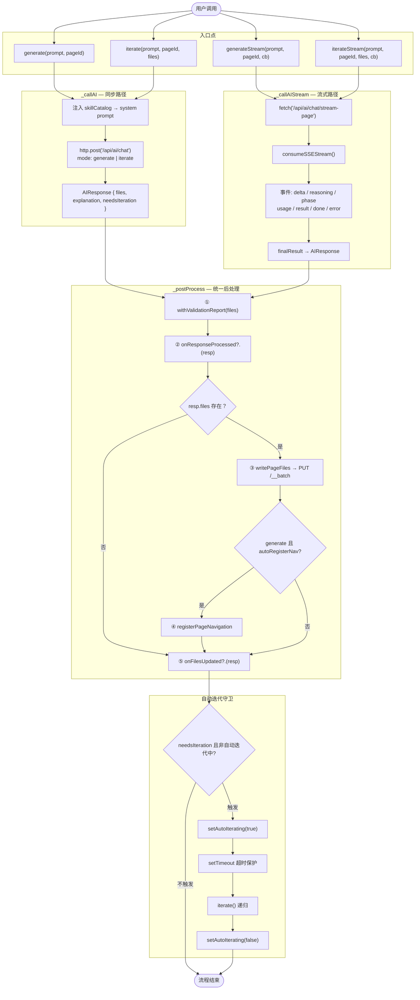
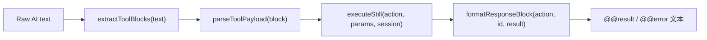

# spark-ai 架构全景

> 更新于 2026-04-03，基于 19 个源文件的代码审计。

---

## 目录

- [1. 模块依赖关系](#1-模块依赖关系)
- [2. AIPageLoop 主循环](#2-aipageloop-主循环)
- [3. SSE 流式处理](#3-sse-流式处理)
- [4. Stills 动作引擎](#4-stills-动作引擎)
- [5. SAP Runtime 桥接](#5-sap-runtime-桥接)
- [6. Config Validation 校验](#6-config-validation-校验)

---

## 1. 模块依赖关系

19 个源文件的 import 方向 + 外部依赖一览。

```mermaid
graph TB
    subgraph "spark-ai 包架构"
        IDX["index.ts<br/>统一导出入口"]

        subgraph "runtime/ — 页面循环引擎"
            LOOP["ai-loop.ts<br/>核心引擎 ~950行"]
            NAV["nav-register.ts<br/>导航自动注册"]
            PC["page-cache.ts<br/>缓存管理"]
        end

        subgraph "stills/ — SAP 动作引擎"
            DISP["dispatcher.ts<br/>注册表+分发管线"]
            DOM["domain.ts<br/>域注册+会话工厂"]
            DS_DOM["dataset-domain.ts<br/>DataSet 域 24 stills"]
            BP["blueprint-methods.ts<br/>蓝图编排 4 stills"]
            META["meta-methods.ts<br/>自省层 3 stills"]
            TYPES["types.ts<br/>类型定义"]
        end

        subgraph "protocol/ — 协议解析"
            PROTO["protocol.ts<br/>@@ 块解析 ~270行"]
            SAP["sap-runtime.ts<br/>协议→stills 桥接"]
        end

        subgraph "validation/ — 配置校验"
            VALID["config-validator.ts<br/>4类校验 ~320行"]
            SC["shared-constants.ts<br/>DATAKEY_RE / HTML_TYPES"]
        end

        subgraph "catalog/ — 组件元数据"
            CPC["component-props-catalog.ts<br/>组件 Props 字典"]
            CT["types.ts<br/>Catalog 类型"]
            CJ["component-catalog.json<br/>静态 JSON"]
        end

        subgraph "prompts/"
            NP["nav-planner-prompt.ts<br/>导航提示词"]
        end
    end

    subgraph "外部依赖"
        SU["spark-utils<br/>createRequest / NavNode"]
        SD["spark-data<br/>IDataSetMetadata / meta*"]
        BE["Java 后端<br/>Spring Boot 8080"]
    end

    IDX --> LOOP & DISP & SAP & VALID & PROTO & NAV & PC & CPC & NP

    LOOP -->|"validateGeneratedConfig"| VALID
    LOOP -->|"clearPageCache"| PC
    LOOP -->|"registerPageNavigation"| NAV
    LOOP -->|"consumeSSEStream"| PROTO
    VALID -->|"DATAKEY_RE"| SC
    SAP -->|"extractToolBlocks"| PROTO
    SAP -->|"executeStill"| DISP
    DOM -->|"registerStill"| DISP
    DS_DOM -->|"registerDomain"| DOM
    DS_DOM -->|"meta*"| SD
    BP -->|"registerStill"| DISP
    META -->|"getAllStills"| DISP

    LOOP --> SU
    NAV --> SU
    DS_DOM --> SD
```



### 依赖规则

| 层 | 文件 | 内部依赖 |
|---|---|---|
| **零依赖** | `protocol.ts`, `page-cache.ts`, `shared-constants.ts`, `nav-planner-prompt.ts`, `component-props-catalog.ts`, `types.ts`(stills) | 无 |
| **基础层** | `config-validator.ts` | shared-constants |
| **基础层** | `dispatcher.ts` | types |
| **基础层** | `domain.ts` | dispatcher, types |
| **域层** | `dataset-domain.ts` | domain, dispatcher, types + spark-data |
| **域层** | `blueprint-methods.ts`, `meta-methods.ts` | dispatcher, types |
| **桥接层** | `sap-runtime.ts` | protocol, dispatcher, types |
| **引擎层** | `ai-loop.ts` | config-validator, page-cache, nav-register, protocol + spark-utils |

---

## 2. AIPageLoop 主循环

4 个入口点 → `_callAI` / `_callAIStream` → 统一 `_postProcess` 后处理 → 自动迭代守卫。



### 构造器选项

| 选项 | 类型 | 说明 |
|------|------|------|
| `aiEndpoint` | `string` | AI 后端地址 |
| `onFilesUpdated` | `(pageId, files) => void` | 文件写入后回调 |
| `onError` | `(err) => void` | 错误回调 |
| `logCollectDelay` | `number` | 日志收集延迟 ms |
| `skillCatalog` | `string` | 技能目录文本（注入到每个请求） |
| `includeGlobalDiagnostics` | `boolean` | 是否包含全局诊断 |
| `autoRegisterNav` | `boolean` | generate 后自动注册导航 |
| `onNavigationRegistered` | `(pageId, result) => void` | 导航注册成功回调 |
| `autoIterateTimeout` | `number` | 自动迭代超时 ms |
| `catalogValidator` | `(files) => Report` | 可选增强校验器（基于 ComponentCatalog） |
| `onResponseProcessed` | `(resp, pageId) => resp` | AI 响应后处理钩子 |

### 全局配置

```typescript
configureAILoopHttp({
  getHeaders: () => ({ Authorization, 'X-Tenant-Id', 'X-Project-Id' }),
  getPageApiUrl: (pageId) => `/api/tenants/.../pages-config/${pageId}`,
  getNavApiUrl: () => `/api/tenants/.../navigation/nodes`,
})
```

---

## 3. SSE 流式处理

`_callAIStream` 替换端点为 `/chat/stream-page`，通过 `consumeSSEStream` 逐块解析。

```mermaid
sequenceDiagram
    participant UI as 前端 UI
    participant Loop as AIPageLoop
    participant BE as Java 后端
    participant SSE as consumeSSEStream

    UI->>Loop: generateStream(prompt, pageId, callbacks)
    Loop->>Loop: 替换 /chat → /chat/stream-page
    Loop->>BE: fetch(POST, ReadableStream)
    BE-->>Loop: Response.body

    Loop->>SSE: consumeSSEStream(reader, callbacks)
    activate SSE

    loop 每个 SSE 事件
        SSE->>SSE: TextDecoder 解析 event: / data:

        alt event: delta
            SSE-->>UI: onDelta(text) — 实时文本
        else event: reasoning
            SSE-->>UI: onReasoning(text) — 推理过程
        else event: phase
            SSE-->>UI: onPhase(name) — 阶段标识
        else event: usage
            SSE-->>UI: onUsage(tokenUsage) — Token统计
        else event: result
            SSE->>SSE: JSON.parse → 暂存 finalResult
        else event: error
            SSE-->>UI: onError(msg)
            SSE->>SSE: throw Error
        else event: done
            SSE->>SSE: 结束读取
        end
    end

    deactivate SSE

    alt finalResult 存在
        SSE-->>Loop: return AIResponse
    else 无 result
        SSE-->>Loop: throw "Stream ended without result"
    end

    Loop->>Loop: _postProcess(response)
    Loop-->>UI: 完成
```

### StreamCallbacks

| 回调 | 触发时机 |
|------|---------|
| `onDelta(text)` | 每个 delta 文本片段 |
| `onReasoning(text)` | 推理 token |
| `onPhase(name)` | 阶段切换 |
| `onUsage(usage)` | Token 用量 |
| `onError(msg)` | 错误事件 |

---

## 4. Stills 动作引擎

Stills 是 SAP 协议驱动的**原子动作系统**。

### 核心概念

| 概念 | 说明 |
|------|------|
| **Still** | 原子动作单元（`StillDefinition`），含 guard / validate / execute 三阶段 |
| **Session** | 域无关容器（`IStillSession`），持有 blueprint + patchLog + 各域 slot |
| **Domain** | 领域提供者（`DomainProvider`），注册一组 stills 并管理域 slot |
| **Blueprint** | 执行蓝图（`ExecutionBlueprint`），由检查点序列驱动多步任务编排 |
| **PatchLog** | 操作日志（`PatchEntry[]`），记录每次 request 类型 still 的执行摘要 |

### 执行管线（dispatcher.ts）

`executeStill(action, params, session, requestId)` 是唯一执行入口：

```
1. 查找 → _registry.get(action)       → 未知: UNKNOWN_ACTION
2. Guard → still.guard(session)        → 不通过: 返回 guard 错误
3. Validate → still.validate(params)   → 不通过: INVALID_PARAMS
4. Execute → still.execute(session, params) → StillResult
5. PatchLog → 仅 ok + type=request 才写日志（describe 不产生变更记录）
```

### 域体系（domain.ts + dataset-domain.ts）

**域注册**：`registerDomain(provider)` 双写——①写入域注册表；②把域内 stills 批量注册到 dispatcher。

**会话工厂**：`createSession()` 创建空 `IStillSession`，遍历所有已注册域调用 `createSlot()` 初始化各域 slot。

**DataSet 域**（24 stills，6 命名空间）：

| 命名空间 | stills | 说明 |
|----------|--------|------|
| `dataset.*` | init, describe, validate, export, reset | 整体初始化/查询/校验/导出/重置 |
| `datatable.*` | create, describe, addColumns, updateColumn, removeColumn, setApi, addRows | 表结构操作 |
| `relation.*` | add, remove, list | DataRelation 管理 |
| `schema.*` | lock, unlock | 结构锁定/解锁 |
| `dataview.*` | create, describe, configure, setAggregates, setTreeConfig | 视图配置 |
| `dependency.*` | add, remove | ViewDependency 管理 |

**Guard 分级**（组合式，实现阶段约束）：

| Guard | 场景 |
|-------|------|
| `noGuard` | 无约束 |
| `requireBlueprint` | 需要蓝图存在 |
| `guardDatasetOnly` | 需要 dataset slot 已初始化 |
| `guardBlueprintAndDataset` | 需要蓝图 + dataset |
| `guardSchemaUnlocked` | 结构编辑（建表/改列） |
| `guardSchemaLocked` | 后置配置（视图/API/依赖） |

### 蓝图编排（blueprint-methods.ts）

| Still | 类型 | 说明 |
|-------|------|------|
| `blueprint.create` | request | 生成蓝图 + checkpoints 序列 |
| `blueprint.describe` | describe | 查询蓝图进度 |
| `blueprint.advance` | request | 标记当前 checkpoint 完成，推进到下一个 |
| `blueprint.revise` | request | 增删 checkpoint + 更新 openQuestions |

### 自省层（meta-methods.ts）

| Still | 类型 | 说明 |
|-------|------|------|
| `stills.capabilities` | describe | 枚举全部已注册 action + params + example |
| `stills.actionSpec` | describe | 查询单个 action 的详细规格 |
| `session.describe` | describe | 汇总当前 step/lock/dataset/blueprint/patchCount |

### 31 Stills 一览

```
# 框架级（7）
stills.capabilities    stills.actionSpec    session.describe
blueprint.create       blueprint.describe   blueprint.advance   blueprint.revise

# DataSet 域（24）
dataset.init           dataset.describe     dataset.validate    dataset.export      dataset.reset
datatable.create       datatable.describe   datatable.addColumns datatable.updateColumn
datatable.removeColumn datatable.setApi     datatable.addRows
relation.add           relation.remove      relation.list
schema.lock            schema.unlock
dataview.create        dataview.describe    dataview.configure  dataview.setAggregates dataview.setTreeConfig
dependency.add         dependency.remove
```

---

## 5. SAP Runtime 桥接

`sap-runtime.ts` 是纯函数管道，将 SAP 协议文本路由到 Stills 引擎。



### processSapBlocks(text, session, options?)

批量处理入口，返回三部分：

| 字段 | 说明 |
|------|------|
| `dispatched` | `SapDispatchResult[]` — 每个块的调度结果 |
| `naturalText` | 去除协议块后的自然语言文本 |
| `fullResponse` | 所有 `@@result/@@error` 拼接 |

**关键设计**：
- 默认 `maxBlocks=1`，只处理第一个协议块
- 完整错误链：块类型非法 → `INVALID_BLOCK_TYPE`；JSON 解析失败 → `INVALID_JSON`；后续进入 dispatcher 管线

---

## 6. Config Validation 校验

`validateGeneratedConfig(files)` 对 AI 生成的页面配置文件做 4 类结构化检查。


### 检查清单速查

| 类别 | 检查项 | 级别 |
|------|--------|------|
| component | rule.json 无效 JSON | error |
| component | 未知组件 type | warning |
| component | r-* 使用废弃 `name`（应为 `field`） | warning |
| component | @currentRow 缺少 highlightCurrentRow | warning |
| dataKey | pagedata.json 无效 JSON | warning |
| dataKey | dataKey 格式不匹配 | error |
| dataKey | dataKey 引用不存在的表 | error |
| render | Render* 函数未定义 | error |
| handler | 事件处理函数未定义 | error |
