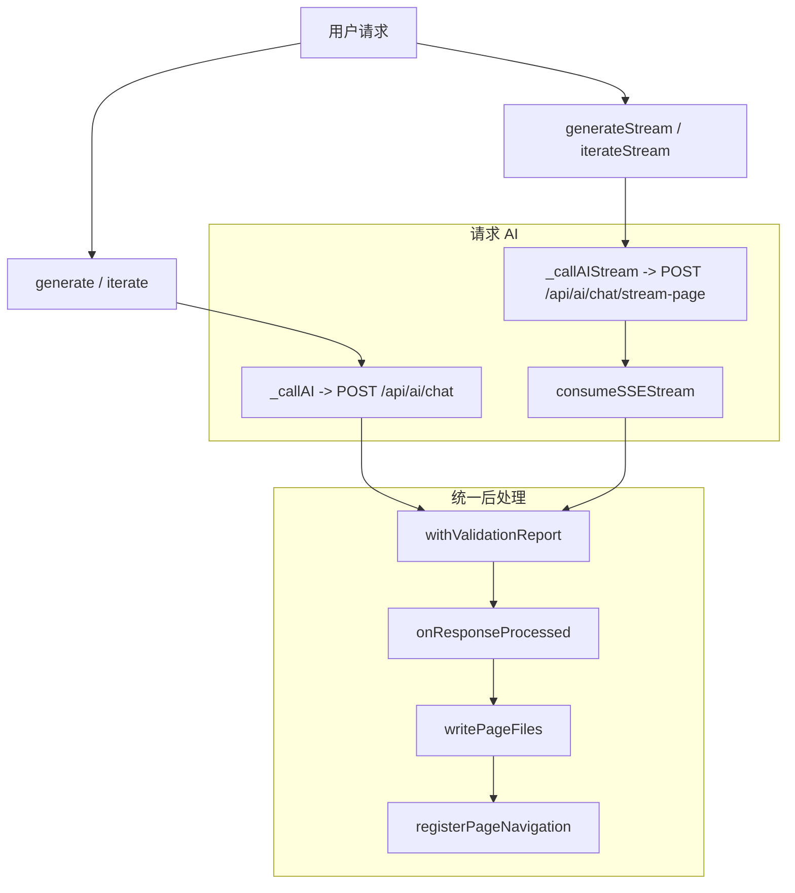
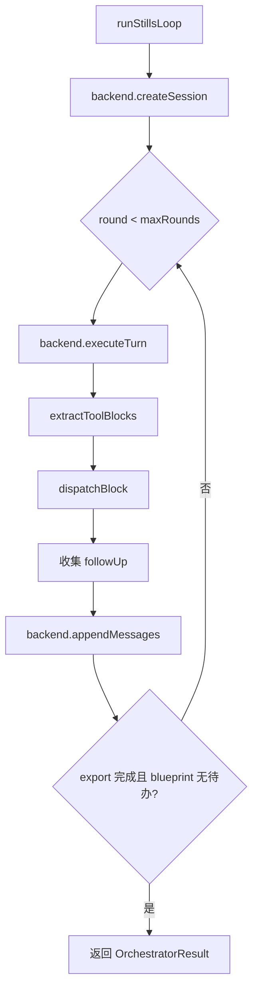

# spark-ai 架构全景

> 更新于 2026-04-07，基于当前 packages/spark-ai 源码、主应用接入方式与 spark-ai-server 后端接口核对。

---

## 目录

- [1. 包定位](#1-包定位)
- [2. 当前模块图](#2-当前模块图)
- [3. 页面生成闭环](#3-页面生成闭环)
- [4. Stills 动作引擎](#4-stills-动作引擎)
- [5. 会话编排器](#5-会话编排器)
- [6. 提示词、目录与校验](#6-提示词目录与校验)
- [7. 与主应用和后端的边界](#7-与主应用和后端的边界)
- [8. 当前事实基线](#8-当前事实基线)
- [9. 当前风险](#9-当前风险)

---

## 1. 包定位

@spark-view/spark-ai 当前不是一个“通用 AI SDK”，也不是“直接接管代码仓库的 agent 框架”。

它在 SPARK 里的真实定位是一个 AI 运行时协调层，承担四类职责：

1. 页面配置生成闭环。
2. Stills 动作引擎。
3. 提示词、组件目录、配置校验的知识层。
4. 页面缓存刷新、导航自动注册、日志诊断采样等运行时支撑。

它依赖但不替代以下层次：

- @spark-view/spark-data：真实数据模型和 DataSet 运行时。
- @spark-view/spark-component：SparkNode、组件树、页面渲染契约。
- @spark-view/spark-utils：HTTP、日志、SSE 事件桥、导航类型等基础设施。
- spark-ai-server：LLM 调用、页面文件持久化、导航树存储、版本管理、SSE 广播、Stills 会话存储。

---

## 2. 当前模块图

```mermaid
graph TB
    subgraph APP[主应用层]
        MAIN[src/main.ts]
        AIPANEL[AiChatPanel.vue]
        AIPROTO[src/services/ai-protocol.ts]
    end

    subgraph PKG[spark-ai 包内]
        IDX[index.ts]

        subgraph RUNTIME[runtime/]
            LOOP[ai-loop.ts]
            CACHE[page-cache.ts]
            NAV[nav-register.ts]
            ORCH[session-orchestrator.ts]
            MON[monitors/*]
        end

        subgraph STILLS[stills/]
            DISP[dispatcher.ts]
            DOM[domain.ts]
            DS[dataset-domain.ts]
            BP[blueprint-domain.ts]
            PCFG[pageconfig-domain.ts]
            META[meta-methods.ts]
            TYPES[types.ts]
        end

        subgraph CORE[协议层]
            PROTO[protocol.ts]
        end

        subgraph KNOWLEDGE[知识层]
            PROMPTS[prompts/*]
            CATALOG[catalog/*]
            VALID[validation/*]
        end
    end

    subgraph SERVER[spark-ai-server]
        AICTRL[AiChatController]
        PAGECTRL[PageConfigController]
        NAVCTRL[NavigationController]
        STILLS_EP[Stills 会话端点]
        AIPS[AiPageService]
        PAGESVC[PageConfigService]
        SSE[SseService]
        STS[StillsSessionService]
    end

    IDX --> LOOP & CACHE & NAV & ORCH & DISP & DOM & DS & BP & PCFG & META & PROTO & PROMPTS & CATALOG & VALID

    MAIN --> LOOP
    MAIN --> CACHE
    MAIN --> NAV
    AIPANEL --> LOOP
    AIPROTO --> PROTO

    LOOP --> VALID
    LOOP --> CACHE
    LOOP --> NAV
    ORCH --> PROTO
    ORCH --> MON
    DOM --> DISP

    LOOP --> AICTRL
    LOOP --> PAGECTRL
    LOOP --> NAVCTRL
    LOOP --> SSE
    ORCH -. 目标接入 .-> STILLS_EP
    AICTRL --> AIPS
    PAGECTRL --> PAGESVC
    PAGECTRL --> SSE
    STILLS_EP --> STS
```



### 分层原则

| 层 | 代表文件 | 主要职责 |
|---|---|---|
| 协议原语层 | protocol.ts | @@ 块提取、JSON 体解析、SSE 回调类型 |
| 动作层 | stills/* | 原子动作、域状态、guard/validate/execute |
| 运行时层 | runtime/* | 页面闭环、缓存、导航、编排器、监控器 |
| 知识层 | prompts/*、catalog/*、validation/* | 提示词、组件知识、结构化质量门 |

---

## 3. 页面生成闭环

页面生成闭环由 src/runtime/ai-loop.ts 驱动，是当前包内最成熟、也已真正接入主应用的能力。

### 3.1 入口能力

- generate(pageId, prompt)
- iterate(pageId, feedback)
- generateStream(pageId, prompt, callbacks)
- iterateStream(pageId, feedback, callbacks)

### 3.2 主流程



### 3.3 关键组成

#### configureAILoopHttp

负责从应用层注入三类环境信息：

- 认证头。
- 页面配置 API 基础路径。
- 导航 API 基础路径。

#### PageLogCollector

负责缓存页面运行日志，并生成去重后的诊断摘要，供 iterate 调用发回 AI。

#### consumeSSEStream

消费 chat/stream-page 的以下事件：

- phase
- delta
- reasoning
- usage
- result
- done
- error

实现上遵循 fail-fast：

- 流结束但没拿到 result 会报错。
- 收到 error 事件会抛异常。

### 3.4 当前已知设计特点

- 支持租户 / 项目作用域 API 注入。
- 支持自动迭代期间跳过页面 reload，避免整页刷新杀死面板状态。
- 文件读写完全走后端页面 API，不直接操作工作区磁盘。

### 3.5 当前设计缺口

- getPageApiUrl() 未注入时仍回退 /api/pages-config。
- 导航注册未注入作用域路径时仍回退 /api/navigation。
- writePageFiles() 出错只回调 onError，不会阻断主返回值。

这三点都偏“软失败”，与仓库当前更偏好的 fail-fast 风格不完全一致。

---

## 4. Stills 动作引擎

Stills 是 spark-ai 的第二条核心主线：把“AI 可调用能力”收敛为受守卫、可验证、可记录的原子动作。

### 4.1 执行管线

src/stills/dispatcher.ts 中，executeStill(action, params, session, requestId) 是唯一执行入口：

```text
1. lookup still
2. guard
3. validate
4. execute
5. postValidate
6. request 成功后写 patchLog
```

### 4.2 域注册与会话工厂

src/stills/domain.ts 做两件事：

1. registerDomain()：把 domain 写入 domain registry，并把动作批量注册到 dispatcher。
2. createSession()：为每个已注册 domain 初始化 state；蓝图统一存放在 domains.blueprint.data。

### 4.3 当前动作基线

| 域 | 动作数 | 当前说明 |
|---|---:|---|
| DataSet | 24 | DataSet、表、关系、视图、依赖、schema lock |
| Blueprint | 8 | 蓝图创建、推进、修订、覆盖检查、自检 |
| PageConfig | 18 | 组件树、脚本、样式、页面导出与校验 |
| Meta | 3 | 能力目录、自省、session.describe |
| 合计 | 53 | 当前源码真实动作总数 |

### 4.4 DataSet 域

src/stills/dataset-domain.ts 的 24 个动作分为 6 组：

- dataset.*
- datatable.*
- relation.*
- schema.*
- dataview.*
- dependency.*

它不替代 spark-data，而是把 spark-data 暴露给 AI 的可变更面包装成 still 动作。

### 4.5 Blueprint 域

src/stills/blueprint-domain.ts 当前包含：

- blueprint.create
- blueprint.describe
- blueprint.advance
- blueprint.item.advance
- blueprint.revise
- blueprint.validateCoverage
- blueprint.selfCheck

以及状态工厂与域注册。

Blueprint 域负责“多步任务流程骨架”，不负责业务数据本身。

### 4.6 PageConfig 域

src/stills/pageconfig-domain.ts 管理四份页面记忆体：

- rule
- scriptMap
- scriptVars
- styleMap

它把页面配置拆成三块受控变更面：

- rule.*：组件树结构。
- script.*：页面脚本。
- style.*：页面样式。

最终由 pageconfig.export 导出为 4 文件。

### 4.7 Meta 动作

src/stills/meta-methods.ts 当前提供：

- stills.capabilities
- stills.actionSpec
- session.describe

这 3 个动作构成了 stills 运行时的“自我说明层”。

---

## 5. 会话编排器

src/runtime/session-orchestrator.ts 是当前包里最有潜力、但还未完全接入主应用的能力。

### 5.1 设计目标

编排器通过 SessionBackend 接口把职责切成两半：

- 后端负责：会话存储、滑动窗口、LLM 调用。
- 前端 / 本地负责：块提取、still 执行、follow-up 注入、终止判断。

### 5.2 主循环



### 5.3 当前监控器

- repeat-detection-monitor
- blueprint-orchestration-monitor
- terminal-actions-monitor

这些监控器通过 SessionMonitor 接口接入，不要求改动编排器主体。

### 5.4 当前落地状态

当前状态必须明确区分：

- runStillsLoop、SessionBackend、SessionMonitor 已导出。
- 主应用里目前没有任何地方真正实例化 SessionBackend 并接入 runStillsLoop。

因此它现在属于“实现完成但未接线”的能力，不应误记为“已形成默认业务路径”。

---

## 6. 提示词、目录与校验

### 6.1 提示词层

src/prompts/prompt-builder.ts 已经把后端 AiPageService.buildSystemPrompt() 的主要拼接策略迁入前端，包括：

- 从 prompt / feedback / currentFiles / logs 检测相关 skill 类型。
- 优先拼装 Skill Index + 定向 skill 详情。
- 其次使用 compact prompt。
- 最后回退到 skillCatalog 字符串。

但当前仍有双轨并存现象：

- 前端有 buildPageSystemPrompt()。
- 后端 AiPageService.buildSystemPrompt() 仍是页面生成链路实际使用者。

### 6.2 组件目录层

src/catalog/component-props-catalog.ts 和 component-catalog.json 提供组件知识，用于：

- 提示词补充。
- 目录查询。
- 可选的 catalog 驱动校验。

### 6.3 结构化校验层

src/validation/config-validator.ts 当前主要负责：

- 组件类型检查。
- dataKey 格式与表引用检查。
- Render* 函数存在性检查。
- handler 存在性检查。
- style/class 顶层误写提示。
- aggregates 配置检查。

这层已被仓库根测试覆盖，是页面生成闭环最关键的 fail-fast 质量门之一。

---

## 7. 与主应用和后端的边界

### 7.1 主应用接入

当前主应用里，spark-ai 的接入主要集中在：

- src/main.ts：统一初始化 AI loop、注入 headers / page API / nav API、设置 configLoader、接 page refresh。
- src/components/AiChatPanel.vue：页面生成、调试、日志采样、自动迭代 UX。
- src/services/ai-protocol.ts：复用协议解析并封装 /api/ai/chat/stream 的 SSE 传输。

### 7.2 后端关联

当前包与 spark-ai-server 的主要对接关系如下：

| 前端 / 包内入口 | 后端接口 | 对应控制器 |
|---|---|---|
| AIPageLoop.generate/iterate | POST /api/ai/chat | AiChatController |
| AIPageLoop.generateStream/iterateStream | POST /api/ai/chat/stream-page | AiChatController |
| readPageFile(s) / writePageFiles | /api/tenants/{tenantId}/projects/{projectId}/pages-config/** | PageConfigController |
| registerPageNavigation | /api/tenants/{tenantId}/projects/{projectId}/navigation/nodes | NavigationController |
| 热更新与调试桥 | GET /api/events | PageConfigController + SseService |
| SessionBackend 目标适配 | POST /api/stills/* | Stills 会话端点（后端 StillsController） |

### 7.3 明确不由本包负责的事情

- 页面文件持久化、版本链和磁盘命名规则。
- 导航树的真实存储与冲突判定。
- LLM 远端调用。
- stills 会话窗口裁剪与过期清理。
- 多租户 / 项目作用域的真实路由与认证体系。

---

## 8. 当前事实基线

以下信息已按当前源码核对：

- packages/spark-ai/tests/ 目录当前为空。
- 包能力主要由仓库根测试覆盖，例如：
  - tests/prompt-builder.test.ts
  - tests/nav-register.test.ts
  - tests/config-validation-report.test.ts
- runStillsLoop 当前只在包内导出，尚未被主应用引用。
- StillsSessionService 当前以 sessionId -> Session 存储会话，不是更复杂的 userId 嵌套模型。
- SseService 当前是全局 emitter 广播，不按 tenant / project / user 分桶。

---

## 9. 当前风险

### 9.1 文档漂移

旧版架构文档长期停留在 31 stills 和旧文件数量口径，容易让后续设计评审低估当前包复杂度。

### 9.2 端点回退过软

页面 API 和导航 API 都还存在默认兜底路径，容易让作用域配置缺失延后到运行期才暴露。

### 9.3 文件写入语义偏软

writePageFiles() 当前是逐文件 PUT，失败时只回调 onError，不会阻断整个主流程返回。

### 9.4 编排器尚未形成业务主路径

SessionBackend 适配层还没在主应用落地，导致 stills 编排能力仍停留在“已实现、未接线”的阶段。

### 9.5 Prompt 仍是双轨并存

前后端都具备系统提示词拼接能力，但当前页面生成链路的最终拼装仍在后端，不是单一来源。

---

## 相关文档

- ../../docs/architecture/SPARK_AI_PACKAGE_FULL_DESIGN.md
- ../../docs/ai/README.md
