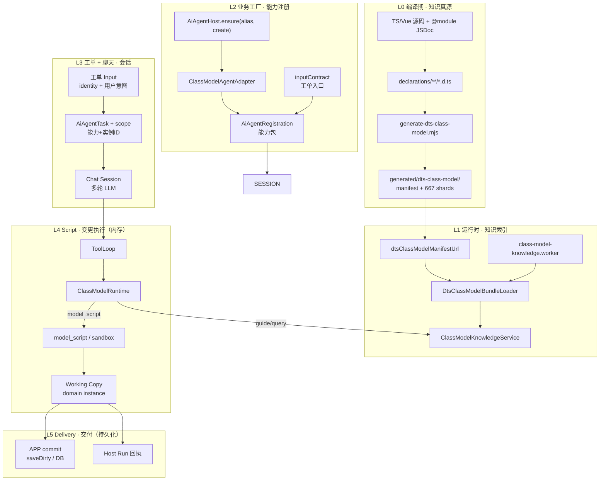

# SPARK AI 端到端平台方案

> 从 `.d.ts` 声明 → ClassModel JSON → LLM 知识体系 → **业务工厂（能力包）** → **工单 + 聊天** → **Script 变更执行** → **交付**。  
> 状态：2026-06，以 **main** 已落地代码为准；旧 `module_*` / path 直调已移除。

---

## 1. 一句话定位

**声明即知识、工厂注册能力、工单驱动会话、Script 改工作副本、交付才落盘。**

- **Script ≠ 交付**：Script 只在内存里改领域对象；交付是持久化 + 回执。
- **订单（orders）≠ 业务**：`orders` 只是某个业务实例 ID 的示例值，不是第二个「订单业务」。

---

## 2. 业务抽象：五个概念（先读这一节）

平台里最容易混的是 **业务能力**、**业务实例**、**工单**、**聊天**。用抽象名对照代码：

| 抽象 | 是什么 | 代码/类型 | 生命周期 |
|------|--------|-----------|----------|
| **业务能力** | 一类 AI 可操作的领域能力（「页面设计」「项目规划」） | `AiAgentRegistration`、`moduleId`、`Host.ensure(alias)` | 应用启动时注册，长期存在 |
| **领域实例** | 内存里的业务根对象，Script 的 `this` | `registration.instance`（如 `ProjectModel`） | 跟编辑器/Workspace 同生共死 |
| **业务实例 ID** | 在同能力下区分「正在改哪一份」 | `scope.businessInstanceId`（来自 `inputContract.identityField`） | 一次 run 内固定 |
| **工单（作业请求）** | 用户这次要做什么（描述、模式、约束） | `normalizedInput` + `orchestration.userMessage` | 一次 `Host.run` 一份 |
| **聊天会话** | 完成该工单的多轮 LLM 对话 | `AiAgentSession` + 后端 sessionId | run 开始到 `agent_complete` |

```text
业务能力 (pageDesign)          ← 业务工厂 ensure 注册，与具体 pageId 无关
    │
    ├── 领域实例 ProjectModel   ← APP 注入的 editor.project（工作副本容器）
    │
    └── 某次 run：
            工单 input { pageId:'orders', description:'…' }
                 │
                 ├─ businessInstanceId = 'orders'   ← 只是 ID，不是新业务
                 ├─ userMessage = description      ← 工单意图进聊天
                 └─ Session 多轮 tool_call …
```

### 2.1 业务工厂到底是什么

**工厂不生产「订单」，生产「业务能力包」**——一份可重复使用的 `AiAgentRegistration`：

```text
Host.ensure('pageDesign', { create })
        │
        ▼
AiAgentRegistration = {
  moduleId, name, description,           // 能力身份（给 LLM 的系统提示）
  inputContract,                           // 工单怎么校验、怎么变成 scope + 首条 userMessage
  runtime: ClassModelAgentAdapter,         // 7 工具 + knowledge + scriptExecutor
  sessionStore, gates, nudge, lifecycle,   // 会话存储与治理
}
```

| 工厂组装件 | 抽象职责 |
|------------|----------|
| `inputContract` | **工单入口**：paramsSchema、`identityField` → `businessInstanceId`、`messageField` → 首条聊天内容 |
| `instance` | **工作副本根**：Script 执行时 `this` 指向谁 |
| `knowledge` + manifest | **能力说明书**：LLM 如何查 API（与哪张 orders 无关） |
| `beforeFunctionCall` | **变更门禁**：哪些 mutation 允许执行 |
| `sessionStore` | **聊天持久化**：多轮 history 存哪 |

**pageDesign 与 orders 的关系：**

- `pageDesign` = 业务能力（alias / moduleId）
- `orders` = 某次工单上的 `pageId` → 变成 `businessInstanceId`
- 换 `pageId: 'dashboard'` 仍是 **同一能力、不同实例**，无需新工厂

### 2.2 Script 运行时 vs 交付：两阶段提交

```text
┌─────────────────────────────────────────────────────────────┐
│ 阶段 A · 变更执行（Script Runtime）                          │
│   model_script → executeDtsNativeScript → this.openXxx()…   │
│   改动的对象：registration.instance（内存 Working Copy）       │
│   特点：可多次 script、可 gate 拦截、会话内可撤销（未 save）   │
└─────────────────────────────────────────────────────────────┘
                              │
                              │  业务/App 显式 commit
                              ▼
┌─────────────────────────────────────────────────────────────┐
│ 阶段 B · 交付（Delivery）                                    │
│   ① 持久化：saveDirtyPageFiles() → 磁盘四文件 / DB           │
│   ② 回执：Host Run POST result（trace、status、instanceId）  │
│   特点：对外可见、不可由 spark-ai 单独完成（需 APP 策略）    │
└─────────────────────────────────────────────────────────────┘
```

| 维度 | Script Runtime | Delivery |
|------|----------------|----------|
| **触发** | LLM `model_script` tool_call | APP 在 run 结束或用户点保存 |
| **操作对象** | 领域实例 public API | 持久化层 / HTTP 回执 |
| **是否 durable** | 否（内存） | 是 |
| **spark-ai 边界** | sandbox + gates | 不内置；由 APP 接 Workspace |

pageDesign 映射：

| 抽象 | pageDesign 落地 |
|------|-----------------|
| Working Copy | `ProjectModel` + 当前 `pageId` 下的 nodeTree/dataSet/script/style |
| Script | `await this.openPageDesign({ pageId }).editDataSet(t => …)` |
| Delivery | `editor.saveDirtyPageFiles()` 或 Host Run 结束后自动 save |

### 2.3 三轴坐标（任意业务都适用）

定位一次 AI 运行，需要三个独立坐标：

```text
轴 1 · 能力轴   businessRegistrationId / alias   （哪种业务：pageDesign）
轴 2 · 实例轴   businessInstanceId / identityField （哪一份：pageId=orders）
轴 3 · 会话轴   sessionId / runId                  （哪一轮聊天完成这个工单）
```

`createSimpleInputContract` 只做 **轴 1 + 轴 2** 的绑定；**轴 3** 由 `AiAgentSession.start()` 创建。

---

## 3. 总览架构



---

### 3.1 分层职责表

| 层 | 名称 | 输入 | 输出 | 核心模块 |
|----|------|------|------|----------|
| **L0** | 声明投影 | `.ts` 源码 | `manifest.json` + per-file JSON | `project-from-declarations.ts`, `build-dts-class-model-bundle.ts` |
| **L1** | 知识索引 | manifest URL + rootClassName | query / guide 文本 | `DtsClassModelBundleLoader`, `ClassModelKnowledgeService`, Worker |
| **L2** | 业务工厂 | APP 上下文（editor、manifest） | **业务能力包** Registration | `AiAgentHost.ensure`, `ClassModelAgentAdapter` |
| **L3** | 工单 + 聊天 | 工单 Input | Task + Session | `createAiAgentTask`, `AiAgentSession` |
| **L4** | Script 变更执行 | tool_call | **Working Copy 变更** | `ClassModelRuntime`, `native-runtime` |
| **L5** | 交付 | Working Copy dirty 状态 | 持久化 + 回执 | APP `saveDirty*`, `ai-host-run-bridge` |

---

## 4. L0：`.d.ts` → JSON

### 4.1 流水线

```text
pnpm run generate:declarations          # vue-tsc → declarations/**
pnpm run generate:class-model-surface     # AST 投影 → generated/dts-class-model/
```

| 步骤 | 说明 |
|------|------|
| **JSDoc 真源** | 模块级 `@module`（职责/边界/AI用途）、成员 JSDoc、`@param`/`@returns` |
| **AST 投影** | `project-from-declarations.ts`：class/interface/enum、attributes、methods、**TypeDoc 式 type 树**（optional/reflection/tuple/rest） |
| **Bundle 落盘** | 每 DTS 文件 → 一个 JSON shard；`classIndex[className]` → shard 路径 |
| **语义审计** | `semantic-gaps.json`：弱 JSDoc、断链 relation（不阻断生成） |

### 4.2 JSON shard 契约（MethodMeta SSOT）

改造后（见 [`TYPEDOC-SIGNATURE-ALIGNMENT.zh-CN.md`](../src/class-model/docs/TYPEDOC-SIGNATURE-ALIGNMENT.zh-CN.md)）：

```json
{
  "name": "get",
  "jsdoc": "...",
  "parameterStyle": "positional",
  "parameters": [{ "name": "moduleId", "type": { "type": "intrinsic", "name": "string" } }],
  "type": { "type": "optional", "elementType": { "type": "reference", "name": "AiAgentRegistration" } }
}
```

- **`type`**：返回类型 SSOT（对齐 TypeDoc `SignatureReflection.type`）
- **`signatureText`**：读侧从 type 树 **派生**，bundle 内可不持久化
- **`reflection`**：mutator 回调 `(tool: DataSetCrudTool) => void` 的结构化签名，供 ref 闭包与 guide 渲染

### 4.3 编译期命令速查

| 命令 | 用途 |
|------|------|
| `generate:class-model-surface` | 日常重建 bundle |
| `generate:class-model-surface:delete-dts` | 生成后删除临时 declarations |
| `verify:class-model:full` | rebuild + lint + typecheck + 关键测试 |

---

## 5. L1：JSON → LLM 知识体系

### 5.1 加载策略

主线程 **不** 加载全量 667 shard。浏览器 **Worker** 内：

1. `fetch(manifestUrl)` → `DtsClassModelBundleManifest`
2. `ensureReachableClosure(rootClassName)` → 按 type 树 ref **按需** load shard
3. `buildLoadedSurface()` → 内存 `DtsClassModelSurfaceDocument`

`rootClassName` 由业务注册决定：

| 业务 | rootClassName |
|------|---------------|
| pageDesign | `ProjectModel` |
| projectPlanning | `ProjectRootModel`（按注册） |

### 5.2 七工具 → 知识投影

| 工具 | 知识来源 | LLM 看到什么 |
|------|----------|--------------|
| `model_query` | `ClassModelKnowledgeService.query()` | kind 列表 + member 摘要 JSON |
| `model_class_guide` | `modelGuide()` | 类级 guide（JSDoc + 成员签名） |
| `model_attribute_guide` | `attributeGuide()` | 属性类型 + 嵌套 kind 提示 |
| `model_action_guide` | `methodGuide()` | 方法 JSDoc + **从 type 树渲染的签名** |
| `model_script` | — | 执行 sandbox script（见 L4） |
| `human_question` | — | 结构化追问用户 |
| `agent_complete` | — | 结束回合 |

签名渲染 SSOT：`renderMethodSignatureFromMeta()` ← `parameters` + `type` 树（非 AST 文本缓存）。

### 5.3 知识闭包规则

`visitDtsTypeMeta` 递归：`reference` / `optional` / `reflection` 内嵌 ref 均参与闭包。  
示例：`ConfigPage.editDataSet(run: (tool: DataSetCrudTool) => …)` → 闭包自动加载 `DataSetCrudTool` shard。

---

## 6. L2：业务工厂

### 6.1 工厂模式 = `Host.ensure`

不是独立 Factory 类，而是 **幂等注册工厂**：

```typescript
host.ensure('pageDesign', {
  moduleId: 'pageDesign',
  create: () => ClassModelAgentAdapter.createRegistration({
    moduleId: 'pageDesign',
    instance: projectModel,
    rootClassName: 'ProjectModel',
    dtsClassModelManifestUrl,
    knowledge: createPageDesignClassModelKnowledgeProvider(),
    beforeFunctionCall: evaluatePageDesignMutationToolGate,
    buildToolLoopNudge: buildPageDesignToolLoopNudge,
  }),
})
```

| 组件 | 职责 |
|------|------|
| `AiAgentHost` | alias ↔ moduleId、`register` / `ensure` / `run` / `dryRun` |
| `AiAgentRegistry` | moduleId → registration 索引 |
| `ClassModelAgentAdapter` | 绑定 instance + knowledge + `ClassModelRuntime` + script executor |
| `createSimpleInputContract` | 把业务 args 归一化为 `AiAgentInputContract` |

### 6.2 已注册生产业务

| alias | moduleId | rootClass | APP 入口 |
|-------|----------|-----------|----------|
| `pageDesign` | `pageDesign` | `ProjectModel` | `ensurePageDesignBusiness()` |
| `projectPlanning` | `projectPlanning` | `ProjectRootModel` | `ensureProjectPlanningBusiness()` |

### 6.3 扩展新业务

完整分阶段清单见 **[§15 新业务能力接入清单](#15-新业务能力接入清单抽象)**，速查版 [`BUSINESS-CAPABILITY-ONBOARDING.zh-CN.md`](BUSINESS-CAPABILITY-ONBOARDING.zh-CN.md)。

---

## 7. L3：工单 + 聊天

### 7.1 工单 vs 聊天 vs 能力

| 抽象 | 一次 run 里是什么 | 谁创建 |
|------|-------------------|--------|
| **工单** | `normalizedInput`：identity + 用户意图（description、mode…） | 用户 / 调度方调用 `Host.run(alias, input)` |
| **scope** | `(businessRegistrationId, businessInstanceId)` 双坐标 | `inputContract.toScope(normalizedInput)` |
| **聊天** | 围绕该 scope 的多轮 LLM + tool 历史 | `AiAgentSession` + 后端 session API |

**没有独立的「订单业务模块」。** 电商「订单页」只是 pageDesign 能力下 `pageId='orders'` 的一个实例 ID。

```typescript
// 工单：在同能力 pageDesign 下，指定实例 orders，描述本次要做什么
host.run('pageDesign', {
  pageId: 'orders',              // → businessInstanceId（实例轴）
  description: '做列表+详情…',    // → orchestration.userMessage（工单意图）
  effectiveDescription: '…',
  mode: 'create',
}, chatHistory)                   // 聊天轴：可选带入历史
```

### 7.2 从工单到聊天

```text
inputContract.normalize(input)
  → normalizedInput
  → toScope()     → { businessRegistrationId: pageDesign, businessInstanceId: orders }
  → toOrchestration() → { userMessage, systemPrompt, readonlySteps? }
  → AiAgentTask.toChatRequest() → 首条 user 消息 + 多层 systemPrompt
  → Session.start(scope) → 后端按 moduleId+instanceId 建 session
```

聊天负责 **怎么对话**；工单负责 **这次要干什么、作用在哪个实例上**。

### 7.3 会话生命周期

```text
Host.run(alias, input, chat?)
  → createAiAgentTask(input, registration)
  → task.toChatRequest()        # systemPrompt = 注册信息 + 业务 prompt + nudge
  → AiAgentSession.start()      # POST /api/ai/sessions（tools + scope）
  → session.send(userMessage)
  → AiAgentToolLoopRunner       # 多轮 LLM ↔ tool_call
  → agent_complete → lifecycle.onComplete
```

### 7.4 传输层

| 模式 | 实现 | 典型场景 |
|------|------|----------|
| **app-sse** | `ai-turn-bridge` + 后端 SSE | DevSystem 面板、当前生产默认 |
| **session-turn** | 按 turn 请求/响应 | 文档中的备选形态 |

spark-ai **不发 HTTP**；传输由 APP `src/services/ai-turn-bridge.ts` 注入。

---

## 8. L4：Script 变更执行（≠ 交付）

Script 层只做 **Working Copy 变更**；不负责落盘。

### 8.1 执行链

```text
LLM tool_call
  → AiAgentToolCallExecutor
  → registration.runtime.executeTool()
  → ClassModelRuntime
       ├─ model_query / model_*_guide → knowledge provider
       └─ model_script → scriptExecutor
            → executeDtsNativeScript({ instance, manifestUrl, rootClassName, script })
            → createAiApiScriptContext()  // this.* = 业务公开 API
            → native-script-sandbox
```

### 8.2 抽象边界

| 概念 | Script 层 | 不在 Script 层 |
|------|-----------|----------------|
| 操作对象 | `registration.instance` 公开 API | 文件系统、HTTP、DB |
| 状态 | 内存 dirty | 持久化 committed |
| 失败 | tool 结果返回 LLM | 不回滚已写磁盘（因未写） |

**Gates** 在 Script 执行前拦截非法 mutation（pageDesign 按 nodeTree/dataSet 等维度）。

### 8.3 Script 执行边界

| 允许 | 禁止 |
|------|------|
| `this.openPageDesign(...)` 等 **公开方法** | 私有字段、path 字符串直调 |
| 链式 mutator + 回调 `(tool) => { … }` | 外部回调边表字段 |
| DTS 签名约束参数形状 | 绕过 gates 的 silent mutation |

**Gates**（pageDesign）：`beforeFunctionCall` 在 `model_script` 执行前校验 mutation 范围（nodeTree/dataSet/script/style/navigation）。

### 8.4 双轨说明（metadata vs DTS）

| 路径 | 条件 | 执行器 |
|------|------|--------|
| **DTS 主线（生产）** | 仅 `dtsClassModelManifestUrl` + Worker knowledge | `executeDtsNativeScript` |
| **Metadata 辅线** | 传入 `AiModuleMetadataJson` | `executeAiNativeScript` |

pageDesign / projectPlanning 均走 **DTS 主线**。

---

## 9. L5：交付（Commit + Receipt）

交付 = **把 Working Copy 提交到外部世界** + **（可选）运行回执**。spark-ai 定义 Script；**Delivery 策略在 APP**。

### 9.1 交付的两半

| 一半 | 含义 | pageDesign 示例 |
|------|------|-----------------|
| **Commit** | 持久化领域变更 | `editor.saveDirtyPageFiles()` → 四文件写盘 |
| **Receipt** | 告诉调用方 run 结果 | `POST /api/ai/host-run/result`（trace、status、businessInstanceId） |

Script 跑完时 Working Copy 已变，但 **磁盘可能仍未变**（DevSystem 默认手动 save）。

### 9.2 两种 APP 交付策略

| 通道 | 入口 | 行为 |
|------|------|------|
| **DevSystem 内联** | `runPageDesignAiSession()` | 复用当前 `editor.project`；默认 **不 auto-save**，用户手动保存 |
| **Host Run 隔离** | `preparePageDesignHostRun()` | headless `ProjectWorkspace`；run 结束 `saveDirtyPageFiles()` + 丢弃 editor |

### 9.3 四文件模型（pageDesign 示例）

pageDesign mutation 落盘到 ProjectWorkspace 的 **四文件**：

| 文件 | 内容 |
|------|------|
| `nodeTree` | 页面组件树 |
| `dataSet` | 数据集 / CRUD 绑定 |
| `script` | 页面脚本 |
| `style` | 样式 |

`model_script` 改的是 **内存实例**；交付 = dirty 标记 → 持久化。

### 9.4 分布式回执

Host Run 场景：

```text
createAiHostRunBridge()
  → 监听 ai-host-run-request
  → appAiAgent.run(...)
  → POST /api/ai/host-run/result（trace + 摘要）
```

---

## 10. 端到端示例（用抽象名读 pageDesign）

| 步骤 | 抽象 | pageDesign 实例 |
|------|------|-----------------|
| 0 | 应用启动注册 **能力** | `ensurePageDesignBusiness()` |
| 1 | 用户提交 **工单** | `{ pageId:'orders', description:'做订单页' }` |
| 2 | 绑定 **实例轴** | `scope.businessInstanceId = 'orders'` |
| 3 | 开启 **聊天** | Session + 多轮 guide / script |
| 4 | **Script** 改 Working Copy | `ProjectModel.openPageDesign({ pageId:'orders' }).edit…` |
| 5 | **Delivery** | 用户保存 或 Host Run `saveDirtyPageFiles()` |

```text
[能力] pageDesign 已注册（工厂 ensure，与 orders 无关）
    ↓
[工单] run('pageDesign', { pageId:'orders', description })
    ↓ scope.instanceId = orders
[聊天] model_class_guide → model_script × N
    ↓ 仅内存
[Script] ProjectModel 上 orders 页的 nodeTree/dataSet/… 已 dirty
    ↓ APP 策略
[交付] saveDirty → 四文件落盘；或 Host Run 回执 trace
```

---

## 11. 数据契约边界（集成检查清单）

| 边界 | 上游 | 下游 | 必检字段 |
|------|------|------|----------|
| 源码 → DTS | `.ts` | `.d.ts` | `@module` 三行、公开 API 完整 |
| DTS → JSON | AST | shard | `type` 树、parameters、jsdoc |
| JSON → Surface | manifest | Worker | `rootClassName` ∈ classIndex |
| Surface → Guide | ClassModel | LLM | 签名与 type 树一致 |
| Input → Task | APP args | AiAgentTask | pageId / effectiveDescription |
| Task → Session | contract | scope | businessInstanceId |
| Script → Instance | model_script | ProjectModel | gates 通过 |
| Instance → 磁盘 | workspace | 四文件 | dirty 标记正确 |

---

## 12. 现状缺口与演进

| 项 | 现状 | 建议 |
|----|------|------|
| 统一 Delivery 抽象 | 无；DevSystem / Host Run 各自 save | 可选 `DeliveryPort` 接口 |
| 第三业务 | 仅 pageDesign + projectPlanning | 复制 ensure 模板 |
| semantic-gaps | 2 条弱 JSDoc | 补 JSDoc 后 regen |
| orders 独立业务 | 无；仅为 pageId 示例 | 若需独立 SOP，新 alias + Model |
| Worker 依赖 | 浏览器 Worker 必须 | Node 侧可直载 loader（测试已覆盖） |
| signatureText CI diff | 可选 warn | golden 对比派生签名 vs 旧 AST 文本 |

---

## 13. 文档与代码索引

| 主题 | 路径 |
|------|------|
| **端到端 + 接入清单** | 本文 §2、§15 · [`BUSINESS-CAPABILITY-ONBOARDING.zh-CN.md`](BUSINESS-CAPABILITY-ONBOARDING.zh-CN.md) |
| 包架构 SSOT | [`../ARCHITECTURE.md`](../ARCHITECTURE.md) |
| Agent / native-runtime 深潜 | [`native-runtime-and-agent-flow-zh-cn.md`](native-runtime-and-agent-flow-zh-cn.md) |
| 传输 / Session | [`transport-and-session-zh-cn.md`](transport-and-session-zh-cn.md) |
| pageDesign × DevSystem | [`pagedesign-devsystem-zh-cn.md`](pagedesign-devsystem-zh-cn.md) |
| TypeDoc 签名对齐 | [`../src/class-model/docs/TYPEDOC-SIGNATURE-ALIGNMENT.zh-CN.md`](../src/class-model/docs/TYPEDOC-SIGNATURE-ALIGNMENT.zh-CN.md) |
| 业务注册 | [`../src/agent/business/README.md`](../src/agent/business/README.md) |
| APP pageDesign | [`../../../src/services/page-design-business.ts`](../../../src/services/page-design-business.ts) |
| Host Run 桥 | [`../../../src/services/ai-host-run-bridge.ts`](../../../src/services/ai-host-run-bridge.ts) |

---

## 14. 实施路线图（建议）

```text
Phase 0 ✅  DTS ClassModel + TypeDoc type 树 + bundle regen
Phase 1 ✅  pageDesign / projectPlanning 生产注册 + DevSystem + Host Run
Phase 2 🔲  统一 DeliveryPort（save / trace / rollback）
Phase 3 🔲  第三 **业务能力**（新 alias + 新 inputContract + 新 Delivery 策略）
Phase 4 🔲  CI：signature 派生 golden + semantic-gaps 归零门禁
Phase 5 🔲  多租户 Host Run 规模化 + session 诊断面板
```

---

## 15. 新业务能力接入清单（抽象）

接入一个新的 **业务能力**（新 alias），需要五层各答一道题；**换实例 ID 或换工单描述不算新业务**。  
可打印版 checklist：[`BUSINESS-CAPABILITY-ONBOARDING.zh-CN.md`](BUSINESS-CAPABILITY-ONBOARDING.zh-CN.md)。

| 层 | 必答题 | 产出物 |
|----|--------|--------|
| **领域** | 根 class 是谁？公开 mutator 有哪些？ | `spark-*/src` 源码 + JSDoc |
| **知识** | LLM 从哪份 manifest 学 API？rootClassName？ | `generated/dts-class-model` shard 可达 |
| **能力包** | Registration 怎么组装？工单字段是什么？ | `ensureXxxBusiness()` |
| **运行** | 谁调用 `Host.run`？聊天从哪进？ | UI / Runner / Host Run prepare |
| **交付** | Working Copy 何时 commit？要不要回执？ | save 策略 + optional Host Run result |

### 15.1 阶段 A · 领域建模（`spark-*` 包）

```text
□ 定义根领域 class（AI 的 this 类型）
□ @module 写清：职责 / 边界 / AI用途
□ 只暴露 public 方法与 public 属性；子 model 经属性链可达
□ mutator 用链式 API + reflection 回调参数（.d.ts 可投影）
□ 决定 identity 语义：businessInstanceId 对应哪个字段（pageId、draftId、tenantId…）
```

**验收：** `classIndex[RootClass]` 存在；method `type` 树无 mutator 失真。

### 15.2 阶段 B · 编译期知识

```text
□ pnpm run generate:class-model-surface
□ 检查 semantic-gaps.json
□ ensureReachableClosure(rootClassName) 含 mutator 依赖 class
□ pnpm run verify:class-model
```

### 15.3 阶段 C · 业务能力包（APP `ensure*`）

```typescript
export function ensureXxxBusiness(options: {
  host: AiAgentHost
  getInstance: () => RootDomainModel
}): AiAgentHost {
  return options.host.ensure('xxxAlias', {
    moduleId: 'xxxModuleId',
    create: () => ClassModelAgentAdapter.createRegistration({
      moduleId: 'xxxModuleId',
      name: '…',
      description: '…',
      instance: options.getInstance(),
      rootClassName: 'RootDomainModel',
      dtsClassModelManifestUrl,
      knowledge: createXxxKnowledgeProvider(),
      inputContract: createSimpleInputContract({
        businessId: 'xxxModuleId',
        paramsSchema: { /* 工单 schema */ },
        identityField: 'instanceId',
        messageField: 'description',
        systemPrompt: '…',
      }),
      sessionStore: …,
      beforeFunctionCall: evaluateXxxGate,
    }),
  })
}
```

**验收：** `host.dryRun('xxxAlias', sampleInput)` → `ok: true`。

### 15.4–15.6 运行 / 交付 / 验收

见 [`BUSINESS-CAPABILITY-ONBOARDING.zh-CN.md`](BUSINESS-CAPABILITY-ONBOARDING.zh-CN.md) 阶段 D–F。

### 15.7 与现有能力对照

| 抽象项 | pageDesign | projectPlanning |
|--------|------------|-----------------|
| alias | `pageDesign` | `projectPlanning` |
| rootClassName | `ProjectModel` | `ProjectRootModel` |
| identityField | `pageId` | 见 `project-planning-business.ts` |
| Delivery | `saveDirtyPageFiles` | navigation 保存等 |

### 15.8 常见误接

| 误区 | 正确理解 |
|------|----------|
| 每个 pageId 一个工厂 | 一个 **能力** 一个 ensure |
| Script 完 = 交付 | 内存变更 ≠ 落盘 |
| orders 是新 alias | orders 是 **instanceId** |

---

**结论：** 平台闭环是 **能力工厂注册 → 工单定实例与意图 → 聊天编排 → Script 改 Working Copy → APP 交付**。扩展新业务 = 新 **业务能力** + 新 **Delivery 策略**；换 `pageId` 或换用户描述 **不需要** 新工厂。
