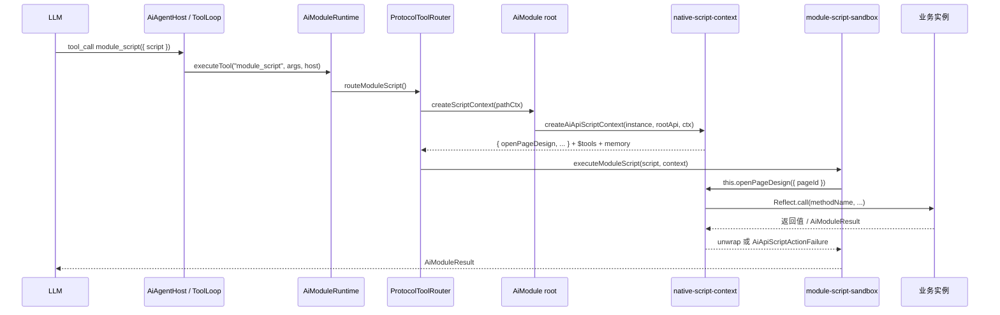
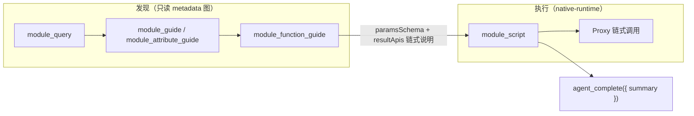
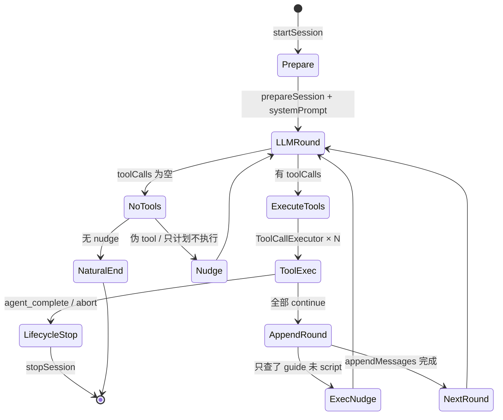

# Native Runtime 与 Agent 全链路深度说明

> 状态：有效（2026-06）。本文是 `native-runtime`、`AiModuleAdapter`、ToolLoop、传输层与 pageDesign 消费方的**展开参考**；协议 SSOT 仍以 [`ARCHITECTURE.md`](../ARCHITECTURE.md) 与 [`DM-VCM-MODULE-METADATA-SCOPE.md`](../src/modules/DM-VCM-MODULE-METADATA-SCOPE.md) 为准。

## 目录

1. [架构位置与文件分层](#1-架构位置与文件分层)
2. [两条执行入口](#2-两条执行入口)
3. [native-script-context：Proxy 与 Action 执行](#3-native-script-contextproxy-与-action-执行)
4. [Proxy 状态机：未决 ↔ 已决](#4-proxy-状态机未决--已决)
5. [resultApis 路径匹配](#5-resultapis-路径匹配)
6. [AiModuleAdapter 注册拓扑](#6-aimoduleadapter-注册拓扑)
7. [pageDesign 端到端链路](#7-pagedesign-端到端链路)
8. [VCM 对象图与 Generator 规则](#8-vcm-对象图与-generator-规则)
9. [ToolLoop 与单次 tool_call](#9-toolloop-与单次-tool_call)
10. [Recovery Enricher 闭环](#10-recovery-enricher-闭环)
11. [UI 审批桥（DevSystem）](#11-ui-审批桥devsystem)
12. [传输层：ai-turn-bridge](#12-传输层ai-turn-bridge)
13. [path 协议废弃与 F8 迁移清单](#13-path-协议废弃与-f8-迁移清单)
14. [关键文件索引](#14-关键文件索引)
15. [LLM 推荐工作流](#15-llm-推荐工作流)
16. [ToolLoop 状态机](#16-toolloop-状态机)
17. [pageDesign 常见脚本错误](#17-pagedesign-常见脚本错误)
18. [公共 API 速查](#18-公共-api-速查)

---

## 1. 架构位置与文件分层

```text
VCM 代码生成
  └─ AiModuleMetadataJson (rootApi + 嵌套 attributes/resultApis)
       │
       ├─ AiModuleAdapter.register()          ← 业务注册唯一入口
       │    ├─ buildRootAiModule()
       │    │    ├─ scriptContext → createAiApiScriptContext()
       │    │    └─ runner       → executeAiApiAction()
       │    └─ AiModuleRuntime.register()
       │
       └─ LLM 执行路径（两条）
            ├─ [会话路径] Host → module_script → executeModuleScript(context)
            └─ [直跑路径] executeAiNativeScript() → 不经过 Host/Session/ToolLoop
```

| 层级 | 文件 | 职责 |
|------|------|------|
| **上层运行器** | `src/agent/native-runtime/native-script-runner.ts` | 解析元数据 → 构建上下文 → 调沙箱 |
| **底层上下文** | `src/agent/native-runtime/native-script-context.ts` | Proxy 构建、参数归一化、action 反射调用 |
| **沙箱** | `src/modules/runtime/module-script-sandbox.ts` | `with(this){ script }` 执行、错误投影 |
| **注册桥接** | `src/agent/business/ai-module-adapter.ts` | VCM metadata → runtime + scriptContext |

公共导出见 `src/agent/native-runtime/index.ts`：`createAiApiScriptContext`、`executeAiApiAction`、`createAiNativeScriptContext`、`executeAiNativeScript`。

---

## 2. 两条执行入口

### 2.1 路径 A：Host 会话（生产主路径）

LLM 通过 `module_script` 写 async function body，在会话 scope 钉死的根实例上执行。



### 2.2 路径 B：Metadata-first 直跑（测试 / 无会话）

```text
executeAiNativeScript({ metadata, instance, script, schemaDefs })
  → resolveModuleMetadataJson() + validateApiObjectMetadata()
  → createAiNativeScriptContext()
  → executeModuleScript()
  → AiModuleResult
```

---

## 3. native-script-context：Proxy 与 Action 执行

`createAiApiScriptContext(instance, api, ctx)` 将 VCM 的 `AiApiObjectMetadata` 映射为脚本侧 `this`：

- `api.actions` → 顶层可调用函数
- `api.attributes` → getter 惰性属性
- 底层通过 **三层 Proxy**：API Surface、Result Path、顶层 context 摊平对象

**单次 Action 流程：**

```text
脚本调用
  → normalizeScriptActionArgs（function→{run}、单参包装、位置参映射）
  → AiJsonSchemaValidator.validateDeserializedParams
  → callApiMethod（mutator / takesContext / positional）
  → wrapRawActionResult → unwrapActionResult（脚本侧得裸值，失败抛 AiApiScriptActionFailure）
  → wrapResultApis（action.resultApis 挂载子 API）
```

**沙箱**（`module-script-sandbox.ts`）：

```text
context = { ...apiActions, $tools, memory, ctx: self }
new Function('__ctx', 'return (async function(){ with(this){ script }}).call(__ctx)')(context)
```

返回值经 `coerceJsonValue` 规整；捕获 `AiApiScriptActionFailure` 时保留原始 checks + 脚本行号。

---

## 4. Proxy 状态机：未决 ↔ 已决

`ApiProxyState` 追踪 `Promise<unknown>` 与 `resolved.settled`。

| 模式 | 实现 | 行为 |
|------|------|------|
| **未决** | `createApiSurface` | Promise 未兑现；action/属性访问链式 async |
| **已决** | `createResolvedApiSurface` | 值已落定；同步调用 |
| **awaitable** | `true` 暴露 then/catch/finally | 支持 `await this.openPageDesign(...)` |
| **awaitable: false** | 隐藏 then | 防止 Promise 递归 adopt |

典型路径：`const page = await this.openPageDesign(...)` → `wrapResultApis` → Result Path Proxy → await 切换到 Resolved config-page Surface。

---

## 5. resultApis 路径匹配

VCM 声明：

```typescript
resultApis: [
  { resultPath: [],           api: configPageApi },      // 返回值即子 API
  { resultPath: ['directory'], api: directoryApi },      // 返回值.directory
]
```

**匹配算法**：属性访问维护 `path: string[]`，`samePath(ref.resultPath, nextPath)` 精确匹配后切换到子 `AiApiObjectMetadata` Surface。

| 模式 | 脚本示例 |
|------|---------|
| `resultPath: []` | `await this.getDirectory().search({ keyword })` |
| `resultPath: ['directory']` | `await this.listDirectory().directory.search({ keyword })` |
| `attribute.api` | `this.activePage.editDataSet(...)` |

metadata 图三条边：`attribute.api`、`action.resultApis[path=[]]`、`action.resultApis[path=['x']]`（见 `metadata-graph.ts`）。

---

## 6. AiModuleAdapter 注册拓扑

一次 `createRegistration()` 注册：

1. **root AiModule**（kind=project）— 可执行：`scriptContext` + `runner` + `directCallable: false`
2. **N 个 guide-only companion** — `collectNestedApiRecords(rootApi)`；runner 永远 `VCM_RESULT_API_DIRECT_CALL_NOT_SUPPORTED`

`mergeCompanionChildDeclarations` 将 `parentKind` 反向合并为父模块 `children[]`，满足 `runtime.inspect()` 拓扑校验；guide-only 的 `list` 返回 `DIRECT_CHILD_LIST_NOT_SUPPORTED`。

---

## 7. pageDesign 端到端链路

```text
ProjectModel / ConfigPageNode JSDoc
  → module-metadata-cli → page-design-module-metadata.runtime.generated.json
  → readPageDesignProjectMetadata() → AiModuleAdapter
  → ensurePageDesignBusiness({ getPageDesignEditor })
```

**实例钉死**：`ctx.host.moduleInstanceId = pageId` → `resolvePageDesignProject` → `getPageDesignEditor({ moduleInstanceId })` → 同一 `ProjectWorkspace.project`。

**典型脚本**（systemPrompt 模板）：

```javascript
const page = await this.openPageDesign({ pageId: 'orders-page' })
await page.editDataSet(async (ds) => {
  ds.createTable({ tableName: 'Orders', columns: [...] })
})
await page.editNodeTree(async (tree) => { ... })
return {
  ruleJson: page.getFileText('rule.json'),
  pageDataJson: page.getFileText('pagedata.json'),
  script: page.getFileText('script.js'),
  style: page.getFileText('style.css'),
}
```

**pageDesign 消费方**（DevSystem 接线、审批、Editor 策略）：[`docs/PAGEDESIGN-DEVSYSTEM.zh-CN.md`](docs/PAGEDESIGN-DEVSYSTEM.zh-CN.md)。
- DevSystem：`runPageDesignAiSession` + `aiToolApprovals.beforeFunctionCall`；默认不 auto-save。

**Editor 选用**（`page-design-editor-provider.ts`）：

| 场景 | 实例 |
|------|------|
| DevSystem 面板 | 与手动编辑同一 `editor.project` |
| Host Run / E2E | headless `ProjectWorkspace` registry |

---

## 8. VCM 对象图与 Generator 规则

`module-metadata-generator.ts` 中 `createApiActionMetadata` 决策：

```text
返回类型 void / @vcmNoResultApis
  → 若 @vcmScriptOnly 或 paramsSchema.run
    → discoverMutatorCallbackResultApis（读 run 回调首参类型）
  → 否则 discoverResultApis（unwrap AiModuleResult<T>，递归属性 path）

Runtime audit：createRuntimeMethodChildModels
  → run 回调 → source: 'callback-param'（editDataSet → dataset, editNodeTree → node-tree）
  → 返回值   → source: 'return'（openPageDesign → config-page）
```

物理存储仍用 `resultApis` 数组；语义层已区分 return / callback-param（ClassModel 测试断言）。

**callbackApis 迁移**（void + run 回调类 action 的子模型应从 `resultApis` 迁出）：详见 [`docs/VCM-GENERATOR-AND-CALLBACKAPIS.zh-CN.md`](VCM-GENERATOR-AND-CALLBACKAPIS.zh-CN.md)。

---

## 9. ToolLoop 与单次 tool_call

### 9.1 ToolLoop 状态

`AiAgentToolLoopRunner.runToolLoop`：拼接 systemPrompt（业务 + TOOL_PRODUCTION_LINE + promptSnapshot）→ `executeTurn` → 本地执行 tool_calls → `appendMessages` → 下一轮或 lifecycle 终止。

**Nudge**：伪 tool 调用、只计划不执行、catalog 后强制 execution、`module_script` 失败后 retry。

### 9.2 单次 tool_call（ToolCallExecutor）

```text
1. resolveToolName + parseToolArgs
2. request.beforeFunctionCall（UI 桥，优先）
3. registration.beforeFunctionCall（pageDesign gate）
4. runtime.executeTool
5. toFunctionCallResult + enrichFunctionCallResult（失败）
6. sessionStore.appendFunctionCall
7. afterFunctionCall / agent_complete → lifecycle complete
```

**beforeFunctionCall 三态**：`allow` | `reject`（回灌失败 tool result，turn 继续）| `abort`（stopSession）。

**pageDesign mutation gate**（`page-design-gates.ts`）：仅 `module_script`、`writePageFile`、`openPageDesign`；检查 `planningStatus`、`implGate`、`upstreamContractsSatisfied`。

---

## 10. Recovery Enricher 闭环

`function-call-recovery-enricher.ts`：失败 tool result → `RECOVERY_HINT` checks 回灌 LLM。

| 层 | 来源 |
|----|------|
| VCM 指南 | `guideKnowledgeFunction` → directoryLookupStep、recoveryHints、failureMode.fix |
| 协议/消息 | `module_script` + `SCRIPT_EXECUTION_FAILED` msg 子串（toJSON、.call、editDataSet 等） |
| 全局模板 | `GLOBAL_ERROR_RECOVERY[code]` |

**局限**：`module_script` 失败时常无 `path` → `kind`/`functionName` 为空，guide 反查跳过，依赖 protocol + global 脚本 hint。

FC → 修复闭环：`module_function_guide` → 修正 `module_script` → enricher + sandbox 双写 hint → ToolLoop retry nudge。

---

## 11. UI 审批桥（DevSystem）

```text
useDevState
  aiToolApprovals = createAiToolApprovalBridge()
  runPageDesignAi → beforeFunctionCall: aiToolApprovals.beforeFunctionCall

AiToolApprovalBridge.beforeFunctionCall → Promise 挂起 → DevSystem AiToolApprovalPanel
  allow  → registration gate → runtime.executeTool
  reject → AI_TOOL_REJECTED_BEFORE_EXECUTION + enricher
  abort  → lifecycle stopSession

会话结束 → cancelPending()
```

文件：`packages/spark-app/src/ai/tool-approval-bridge.ts`、`src/views/app/dev-system/useDevState.ts`、`packages/spark-component/.../AiToolApprovalPanel.vue`。

---

## 12. 传输层：ai-turn-bridge

展开说明（序列图、两种 transport、排错）：[`docs/TRANSPORT-AND-SESSION.zh-CN.md`](TRANSPORT-AND-SESSION.zh-CN.md)。

```text
spark-ai：transport-types、turn-event-collector、AiAgentTurnCallbacks（无 HTTP）
APP：src/services/ai-turn-bridge.ts、src/services/sse-events.ts
后端：/api/ai/sessions、/api/ai/turns、/api/events（V4）
```

| 模式 | 说明 |
|------|------|
| **session-turn**（当前 `appAiAgent` 默认） | `POST .../sessions/{id}/turn` 同步返回 toolCalls |
| **app-sse**（`createAiAgentTurnCallbacks()` 未指定 transport 时默认） | `POST /api/ai/turns` + `llm-frame` SSE 聚合 |

Tool result 到前端：`onToolCall`、`onStreamEvent(tool-result)`、`sessionStore`；发回 LLM 的 tool message 为 `stringifyAiAgentPayload(callResult)`（含 checks）。

---

## 13. path 协议废弃与 F8 迁移清单

目标见仓库 [`.cursor/plans/全面解决方案.md`](../../.cursor/plans/全面解决方案.md)。**执行内核（native-runtime + module_script 无 path 分支）已 VCM-native**；待删的是 LLM 可见 path 层与 recovery 中的 path 教学。

### 应删除（recovery / 知识）

- ~~`GLOBAL_ERROR_RECOVERY`：`INVALID_PATH_*`、`ROOT_LIST_REQUIRES_FIND`、`DIRECT_CHILD_LIST_NOT_SUPPORTED`、path 形 `INVALID_TOOL_ARGS`~~ **（F8 已删 recovery 层 path 条目）**
- ~~`resolveFailedFunctionContext` 的 `moduleCall` / `moduleFind` 分支~~ **（F8 已删）**
- knowledge / prompt 中的 `module_find`、`/kind[id]` 教学（待 F9）

### 必须保留（R6）

- `SCRIPT_EXECUTION_FAILED` 脚本 hint：run/createTable/openPageDesign/editDataSet/editNodeTree
- `appendProtocolRecoveryHints` 对 msg 子串的 pageDesign 专用提示
- `AI_TOOL_REJECTED_BEFORE_EXECUTION`（implGate）

### 横切（F7/F9）

- `PROTOCOL_TOOL_NAMES` → `VCM_TOOL_NAMES`（`vcm_*`）
- `tool-loop-runner` 相位门控改引 SSOT
- generator：`callbackApis` 字段，mutator 子模型从 `resultApis` 迁出

### 目标工具闭集（7）

`vcm_query`、`vcm_model_guide`、`vcm_attribute_guide`、`vcm_action_guide`、`vcm_script`、`human_question`、`agent_complete`

---

## 14. 关键文件索引

| 主题 | 路径 |
|------|------|
| native-runtime | `packages/spark-ai/src/agent/native-runtime/` |
| 沙箱 | `packages/spark-ai/src/modules/runtime/module-script-sandbox.ts` |
| 注册 | `packages/spark-ai/src/agent/business/ai-module-adapter.ts` |
| ToolLoop | `packages/spark-ai/src/agent/tool-loop/tool-loop-runner.ts` |
| Tool 执行 | `packages/spark-ai/src/agent/tool-loop/tool-call-executor.ts` |
| Recovery | `packages/spark-ai/src/agent/tool-loop/function-call-recovery-enricher.ts` |
| 传输契约 | `packages/spark-ai/src/agent/transport/transport-types.ts` |
| APP bridge | `src/services/ai-turn-bridge.ts` |
| SSE | `src/services/sse-events.ts` |
| DevSystem AI | `src/services/page-design-ai-runner.ts`、`src/views/app/dev-system/useDevState.ts` |
| UI 审批 | `packages/spark-app/src/ai/tool-approval-bridge.ts` |
| pageDesign gate | `src/services/page-design-gates.ts` |
| VCM 生成 | `packages/vite-plugin-spark-catalog/src/module-metadata-generator.ts` |
| metadata 图 | `packages/spark-ai/src/modules/metadata/metadata-graph.ts` |
| 协议 SSOT | `packages/spark-ai/src/modules/DM-VCM-MODULE-METADATA-SCOPE.md` |
| 包架构 SSOT | `packages/spark-ai/ARCHITECTURE.md` |
| 断代计划 | `.cursor/plans/全面解决方案.md` |

---

## 三层职责边界（汇总）

| 层 | 负责 | 不负责 |
|----|------|--------|
| ToolLoop / Host | 多轮 LLM、tool 路由、session、nudge、agent_complete | 业务 API 语义 |
| AiModuleRuntime | module_* 协议、guide 投影 | Proxy / 脚本执行 |
| native-runtime | VCM → Proxy → 反射调用 | 会话 / gate / 落盘 |
| VCM Generator | TS → metadata JSON + $defs | 运行时执行 |
| APP page-design | 注册、resolveInstance、gate、systemPrompt、审批桥 | spark-ai 内核 |

---

## 15. LLM 推荐工作流

与 [`DM-VCM-MODULE-METADATA-SCOPE.md`](../src/modules/DM-VCM-MODULE-METADATA-SCOPE.md) 一致的两阶段模型：



| 阶段 | 工具 | 禁止 |
|------|------|------|
| 目录 | `module_query` | 猜 kind / functionName |
| 契约 | `module_function_guide` | 未读 schema 就写 script |
| 执行 | `module_script` | `module_call`、path 直调嵌套 API |
| 收尾 | `agent_complete` | 用自然语言正文代替 tool 收尾 |

Guide-only 子 kind（如 `config-page`）的 runner 故意失败；嵌套 API **只能**在 `module_script` 里链式调用。

---

## 16. ToolLoop 状态机



**生产线约束**（`tool-loop-runner.ts`）：每轮受控 1 个 tool_call（传输已持久化 assistant 时除外）；工具回合 assistant 正文应为空。

---

## 17. pageDesign 常见脚本错误

| 现象 / msg 片段 | 原因 | 修复 |
|-----------------|------|------|
| `editDataSet is not a function` | 未 `await openPageDesign` | `const page = await this.openPageDesign({ pageId })` |
| `.call is not a function` | 把 page 当 function tool 调 | `page.editDataSet(async ds => ...)` |
| `run is not a function` | 把 createTable 参数对象传给 editDataSet | `editDataSet(async ds => ds.createTable({...}))` |
| `toJSON` | 对 DataSet/Tree 调 toJSON | 用 mutator 链式 API |
| `reading 'includes'` | createTable 参数形状错误 | `{ tableName, columns: [{ name, type, label }] }` |
| `SCHEMA_VALIDATION_FAILED` | 参数不符合 paramsSchema | `module_function_guide` 对照后重试 |
| `AI_TOOL_REJECTED_BEFORE_EXECUTION` | implGate / planning 未放行 | 人工开闸或补策划 description |
| `SCRIPT_EMPTY` | script  body 为空 | 传 `{ script: "..." }`，不是 `code` |

错误来源：`module-script-sandbox` chainHint + `function-call-recovery-enricher` RECOVERY_HINT + ToolLoop `module_script` retry nudge。

---

## 18. 公共 API 速查

### native-runtime（`@spark-appworks/spark-ai/agent`）

| API | 用途 |
|-----|------|
| `createAiApiScriptContext(instance, api, ctx, schemaDefs?)` | 构建 `module_script` 的 `this` |
| `executeAiApiAction(instance, action, args, ctx)` | 单次 action + schema 校验 |
| `createAiNativeScriptContext({ metadata, instance, host?, schemaDefs? })` | 含 metadata 解析的上下文 |
| `executeAiNativeScript({ metadata, instance, script, ... })` | 无 Host 直跑 |
| `AiApiScriptActionFailure` | 脚本 catch；含 `result: AiModuleResult` |

### Host（APP 消费）

| API | 用途 |
|-----|------|
| `createAiAgentHost({ turnCallbacks })` | 顶层入口 |
| `AiModuleAdapter.register({ host, alias, moduleClass, metadata, options })` | 业务注册 |
| `host.run(alias, input, { beforeFunctionCall, signal, onToolCall })` | 启动 ToolLoop |
| `createAiAgentTurnCallbacks()` | APP：`src/services/ai-turn-bridge.ts` |
| `createAiToolApprovalBridge()` | APP：`packages/spark-app` DevSystem 审批 |

### pageDesign（APP 业务）

| API | 用途 |
|-----|------|
| `ensurePageDesignBusiness({ host, getPageDesignEditor })` | 注册 pageDesign |
| `runPageDesignAiSession({ pageId, editor, beforeFunctionCall, ... })` | DevSystem AI 回合 |
| `evaluatePageDesignMutationToolGate` | 写操作门禁（registration 层） |

### 单测直跑示例

```typescript
import { executeAiNativeScript } from '@spark-appworks/spark-ai/agent'

const result = await executeAiNativeScript({
  metadata: projectMetadataJson,
  instance: projectModel,
  schemaDefs: runtimeDoc.$defs,
  script: `
    const page = await this.openPageDesign({ pageId: 'demo' })
    return { ok: true, pageId: page.pageId }
  `,
})
```

详见 `packages/spark-ai/src/tests/ai-api-script-context.test.ts`。
