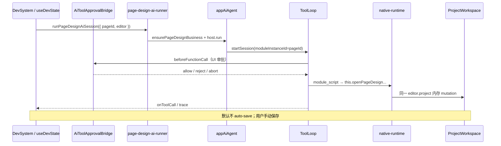

# pageDesign × DevSystem 消费方

> APP 层如何把 DevSystem 里的 `ProjectWorkspace` 接到 spark-ai Host。内核见 [`NATIVE-RUNTIME-AND-AGENT-FLOW.zh-CN.md`](NATIVE-RUNTIME-AND-AGENT-FLOW.zh-CN.md) §7、§11。

## 数据流



## Editor 策略

| 场景 | 实例来源 | 文件 |
|------|----------|------|
| DevSystem 面板 | 与手动编辑同一 `editor.project` | `page-design-ai-runner.ts` |
| Host Run / E2E | headless `ProjectWorkspace` registry | `page-design-host-run-provider.ts` |

AI 与手动编辑共用 DevSystem 的 `getAppProjectEditor()`，避免双份 project 状态。

## 注册与实例解析

```typescript
ensurePageDesignBusiness({
  host: appAiAgent,
  getPageDesignEditor: ({ moduleInstanceId }) => getAppProjectEditor(/* pageId = moduleInstanceId */),
})
```

- `moduleInstanceId` = `pageId`（会话级钉死，非 path 寻址）
- `resolvePageDesignProject` → `ProjectModel` 根实例
- metadata：`page-design-module-metadata.runtime.generated.json`

## 门禁（mutation）

`evaluatePageDesignMutationToolGate` 拦截：

- `module_script`
- `openPageDesign`（经 direct runner 或 script 内调用）
- `writePageFile`

检查项：`planningStatus`、`implGate`、`upstreamContractsSatisfied`。

**两层 beforeFunctionCall**（顺序）：

1. UI：`createAiToolApprovalBridge()`（`packages/spark-app/src/ai/tool-approval-bridge.ts`）
2. Registration：`page-design-gates.ts`

## DevSystem 接线

`src/views/app/dev-system/useDevState.ts`：

```text
aiToolApprovals = createAiToolApprovalBridge()
runPageDesignAi → beforeFunctionCall: aiToolApprovals.beforeFunctionCall
会话结束 → aiToolApprovals.cancelPending()
```

审批 UI：`AiToolApprovalPanel.vue`（spark-component）。

## 典型 AI 脚本（systemPrompt 模板）

```javascript
const page = await this.openPageDesign({ pageId: '<pageId>' })
await page.editDataSet(async (ds) => {
  ds.createTable({ tableName: 'Orders', columns: [...] })
})
return {
  ruleJson: page.getFileText('rule.json'),
  pageDataJson: page.getFileText('pagedata.json'),
}
```

脚本只改内存；`ProjectWorkspace.save*` 由用户或 E2E 显式触发。

## 排错

| 现象 | 检查 |
|------|------|
| AI 改的不是当前页 | `moduleInstanceId` 是否等于面板 `pageId` |
| 审批一直 pending | `cancelPending()` 是否在 session 结束调用 |
| 改完 UI 不刷新 | 是否未 save；DevSystem 是否监听 project 变更 |
| implGate 拒绝 | `page-design-gates` + planning 投影 |
| 脚本 hint 无效 | recovery enricher §17 常见错误表 |

## 关键文件

| 路径 | 职责 |
|------|------|
| `src/services/page-design-business.ts` | 注册、resolve、systemPrompt |
| `src/services/page-design-ai-runner.ts` | DevSystem session 启动 |
| `src/services/page-design-gates.ts` | mutation gate |
| `src/services/ai-host.ts` | `appAiAgent` |
| `src/services/ai-turn-bridge.ts` | transport（session-turn） |
| `src/views/app/dev-system/useDevState.ts` | UI 集成 |
| `packages/spark-app/src/ai/tool-approval-bridge.ts` | 审批 Promise 桥 |
