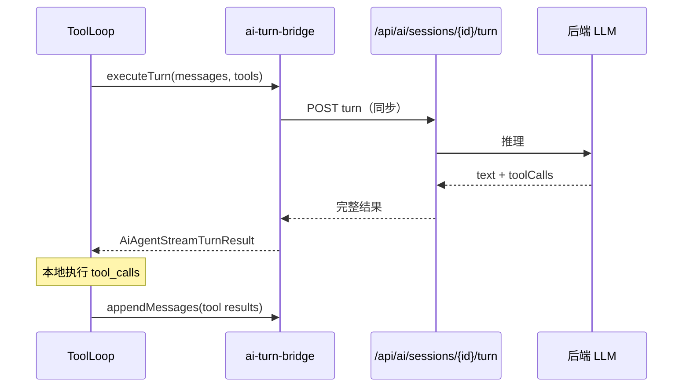
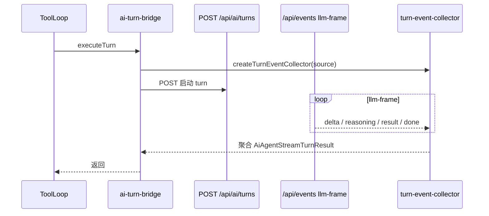

# 传输层与会话（V4）

> 状态：有效（2026-06）。展开 [`NATIVE-RUNTIME-AND-AGENT-FLOW.zh-CN.md`](NATIVE-RUNTIME-AND-AGENT-FLOW.zh-CN.md) §12；类型 SSOT 见 [`transport-types.ts`](../src/agent/transport/transport-types.ts)。

## 分层职责

```text
spark-ai（框架无关）
  transport-types.ts     — 消息 / tool spec / turn 输入输出 / AiAgentTurnCallbacks
  app-sse-events.ts      — llm-frame 等 SSE 事件名与结构
  turn-event-collector.ts — 聚合 llm-frame → AiAgentStreamTurnResult

APP（网络与持久化）
  src/services/ai-turn-bridge.ts — 实现 AiAgentTurnCallbacks（HTTP + SSE）
  src/services/sse-events.ts       — 订阅 /api/events
  src/services/ai-host.ts          — appAiAgent = Host + session-turn

后端
  POST /api/ai/sessions              — 创建/准备 session
  POST /api/ai/sessions/{id}/turn    — session-turn 同步回合
  POST /api/ai/sessions/{id}/turn/append — 追加 tool 结果
  POST /api/ai/turns                 — app-sse 启动 turn（异步帧）
  GET  /api/events                   — APP SSE（llm-frame）
```

**原则**：`spark-ai` 只调用 `AiAgentTurnCallbacks`，不发起 HTTP；会话历史由后端 + `AiAgentSessionStore` 管理。

---

## AiAgentTurnCallbacks 三钩子

| 钩子 | 何时调用 | APP 实现 |
|------|----------|----------|
| `prepareSession?` | ToolLoop 首轮前 | `POST /api/ai/sessions`（protocolVersion 4、tools、scope） |
| `executeTurn` | 每轮 LLM 推理 | 见下方两种 transport |
| `appendMessages` | 本地执行 tool 后 | `POST .../turn/append`（assistant tool_calls + tool results） |

`AiAgentStreamTurnResult.assistantMessagePersisted === true` 时，后端已写入 assistant；ToolLoop **只 append tool 消息**，避免重复 assistant。

---

## 两种 transport 模式

### session-turn（生产默认）

`src/services/ai-host.ts`：

```typescript
createAiAgentTurnCallbacks({ transport: 'session-turn' })
```



- 单请求返回完整 `text` / `reasoning` / `toolCalls`
- 内置安全重试（`AI_SESSION_TURN_SAFE_RETRIES = 2`，指数退避）
- 适合 DevSystem、E2E、无 SSE 依赖场景

### app-sse（异步帧）

`createAiAgentTurnCallbacks()` 默认 `transport: 'app-sse'`（未显式指定时）。



**llm-frame 帧类型**：`delta`（正文流）、`reasoning`、`result`（含 toolCalls）、`error`、`done`。

收集器约束：整轮超时默认 300s；可按 sessionId + turnId 过滤帧。

---

## 一轮 ToolLoop 与传输的交互

```text
runToolLoop
  ├─ prepareSession（可选，首轮）
  ├─ round N:
  │    ├─ executeTurn → LLM 返回 toolCalls
  │    ├─ ToolCallExecutor × tool（本地，不经传输）
  │    └─ appendMessages(assistant + tools) 或 仅 tools（assistantMessagePersisted）
  └─ agent_complete / 自然结束 → stopSession
```

Tool result 写入会话前经 `stringifyAiAgentPayload`（含 `checks`、失败时 `RECOVERY_HINT`）。UI 可通过 `onToolCall` / `onStreamEvent` 展示，与发回 LLM 的 payload 同源。

---

## 协议版本与 scope

| 字段 | 值 / 说明 |
|------|-----------|
| `protocolVersion` | `4`（`AI_TURN_PROTOCOL_VERSION`） |
| `scope` | `toAiAgentRuntimeScope`：registrationId、businessInstanceId 等 |
| `mode` | session 准备时 `'function'`（function calling） |
| `windowSize` | 可选，控制上下文窗口 |

---

## 诊断与排错

| 现象 | 可能原因 | 排查 |
|------|----------|------|
| turn 超时 | SSE 无 `done`/`result`、网络断开 | 查 `/api/events`、collector idle 超时 |
| 重复 assistant | `assistantMessagePersisted` 未设仍 append 全文 | 对照 session-turn 响应字段 |
| tool 结果未进历史 | `appendMessages` 失败 | 网络日志、`assertAppendMessages` |
| 伪 tool 调用 | 模型把 JSON 写在正文 | ToolLoop `PSEUDO_TOOL_CALL_NUDGE` 重试 |
| session 404 | 未 `prepareSession` | 首轮前 POST `/api/ai/sessions` |

---

## 关键文件

| 路径 | 职责 |
|------|------|
| `packages/spark-ai/src/agent/transport/transport-types.ts` | 类型契约 |
| `packages/spark-ai/src/agent/transport/app-sse-events.ts` | SSE 事件名 |
| `packages/spark-ai/src/agent/tool-loop/turn-event-collector.ts` | llm-frame 聚合 |
| `packages/spark-ai/src/agent/tool-loop/tool-loop-runner.ts` | 调用 executeTurn / appendMessages |
| `src/services/ai-turn-bridge.ts` | APP 桥接实现 |
| `src/services/ai-host.ts` | `appAiAgent` 生产 Host |
