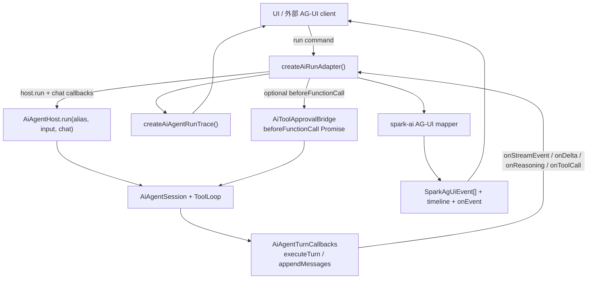
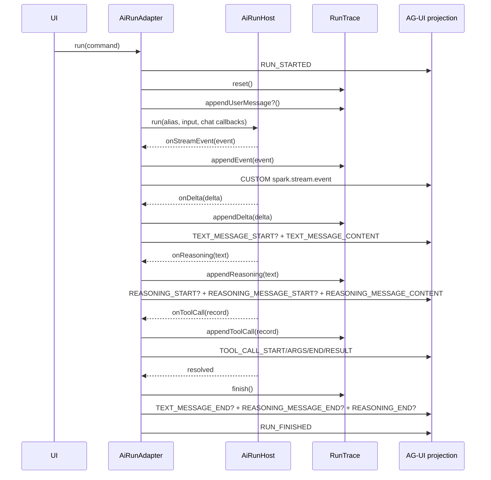

# AG-UI adapter 与 headless run

> 状态：有效（2026-06）。以当前仓库代码和本地安装的 `@ag-ui/core@0.0.57` 为准。  
> 代码真源：`packages/spark-ai/src/agent/ag-ui/**`、`packages/spark-app/src/ai/ai-run-adapter.ts`、`packages/spark-app/src/ai/tool-approval-bridge.ts`。

## 一句话定位

SPARK 当前的 AG-UI 接入分两层：

| 层 | 模块 | 职责 | 明确不做 |
|----|------|------|----------|
| 协议映射层 | `@spark-appworks/spark-ai/agent/ag-ui` | 把 SPARK tool spec、stream event、trace/tool call 记录投影为 AG-UI core 类型和事件 | 不启动 run、不保存状态、不调用 LLM、不渲染 UI |
| 运行编排层 | `@spark-appworks/spark-app/ai/ai-run-adapter` | 包装 `AiAgentHost.run()`，维护 headless trace snapshot，同时产出 AG-UI event timeline | 不实现底层 transport、不直接访问 HTTP/SSE、不引入 Vue 组件 |

所以这里的 AG-UI 不是一条新的模型 transport，而是 SPARK agent run 的旁路协议投影。底层模型调用仍走 `AiAgentTurnCallbacks`，详见 [`transport-and-session-zh-cn.md`](transport-and-session-zh-cn.md)。

## 分层数据流



关键边界：

- SPARK 的业务坐标仍是 `businessRegistrationId / businessInstanceId / sessionId / turnId`。
- AG-UI 的运行坐标是 `threadId / runId / parentRunId`。
- `SparkAgUiRunInput` 可以随 `RUN_STARTED.input` 透出，但当前 `AiRunAdapterCommand.input` 才是实际传给 `Host.run()` 的业务输入。

## 本地 AG-UI core 版本

依赖真源：

| 文件 | 内容 |
|------|------|
| `pnpm-workspace.yaml` | catalog 声明 `@ag-ui/core: ^0.0.57` |
| `pnpm-lock.yaml` / `node_modules/.pnpm` | 当前安装解析为 `@ag-ui/core@0.0.57` |

当前 adapter 用到的 core 类型：

| Core 类型 | SPARK 别名 | 用途 |
|-----------|------------|------|
| `RunAgentInput` | `SparkAgUiRunInput` | 标准 AG-UI run 输入，可随 `RUN_STARTED.input` 输出 |
| `AGUIEvent` | `SparkAgUiEvent` | 所有 AG-UI 事件联合类型 |
| `BaseEvent` | `SparkAgUiBaseEvent` | `type / timestamp / rawEvent` 基础事件字段 |
| `Tool` | `SparkAgUiTool` | 对外暴露的工具定义 |
| `Message` | `SparkAgUiMessage` | 后续消息投影扩展的类型别名 |

`RunAgentInput` 在 core 里包含的主字段是：

```text
threadId, runId, parentRunId?,
state,
messages,
tools,
context,
forwardedProps,
resume?
```

当前 `ai-run-adapter` 只读取 `threadId / runId / parentRunId` 来构造 run ref；完整 `runInput` 只作为 `RUN_STARTED.input` 透出，不会自动转成 SPARK 的 `input` 或 `historyMsgs`。

## spark-ai：AG-UI 协议映射层

### 公开出口

公共导出在 `@spark-appworks/spark-ai/agent` 和 `@spark-appworks/spark-ai/agent/ag-ui` 两处都可读到：

```typescript
import {
  createSparkAgUiRunStartedEvent,
  createSparkAgUiTextMessageContentEvent,
  createSparkAgUiToolCallEvents,
  toSparkAgUiTools,
  type SparkAgUiEvent,
} from '@spark-appworks/spark-ai/agent'
```

文件职责：

| 文件 | 职责 |
|------|------|
| `packages/spark-ai/src/agent/ag-ui/ag-ui-types.ts` | 只定义 AG-UI core 类型别名与 SPARK 扩展事件名 |
| `packages/spark-ai/src/agent/ag-ui/ag-ui-mapper.ts` | 纯 mapper：创建 run/text/reasoning/tool/custom 事件 |
| `packages/spark-ai/src/agent/ag-ui/index.ts` | 子域出口 |
| `packages/spark-ai/src/agent/index.ts` | agent 公共 barrel 出口 |

### 类型别名

| 类型 | 结构 / 值 |
|------|-----------|
| `SparkAgUiRunRef` | `{ threadId: string; runId: string; parentRunId?: string }` |
| `SparkAgUiEventMetadata` | `{ timestamp?: number; rawEvent?: unknown }` |
| `SparkAgUiTextMessageRole` | `'assistant' | 'user' | 'system' | 'developer'` |
| `SparkAgUiCustomEventName` | `'spark.toolApproval.requested' | 'spark.toolApproval.resolved' | 'spark.stream.event'` |

注意：`generated/dts-class-model/.../ag-ui-types.d.ts.json` 已能投影这些类型别名；`ag-ui-mapper.d.ts.json` 当前只有模块元信息，没有函数 symbols。查 mapper 函数 API 时以源码和 public barrel 测试为准。

### 工具定义映射

`toSparkAgUiTool(tool: AiAgentTransportToolSpec): SparkAgUiTool`

映射规则：

| SPARK transport tool | AG-UI tool |
|----------------------|------------|
| `tool.function.name` | `name` |
| `tool.function.description` | `description` |
| `tool.function.parameters` | `parameters` |
| `tool.type` | `metadata.type` |
| `tool.function.strict` | `metadata.strict`，仅在非 `undefined` 时写入 |
| 固定来源 | `metadata.source = 'spark-ai'` |

`toSparkAgUiTools()` 只是批量 `map(toSparkAgUiTool)`。

### Run 事件

| 函数 | 事件 | 字段 |
|------|------|------|
| `createSparkAgUiRunStartedEvent` | `RUN_STARTED` | `threadId`、`runId`、`parentRunId?`、`input?`、`timestamp?`、`rawEvent?` |
| `createSparkAgUiRunFinishedEvent` | `RUN_FINISHED` | `threadId`、`runId`、`result?`、`outcome: { type: 'success' }` |
| `createSparkAgUiRunErrorEvent` | `RUN_ERROR` | `message`、`code?`、`timestamp?`、`rawEvent?` |

当前 `RUN_ERROR` helper 不带 `threadId/runId`。需要关联 run 时，在消费侧用当前 active run 上下文、timeline 顺序或后续扩展字段承接。

### 文本消息事件

| 函数 | 事件 | 字段 |
|------|------|------|
| `createSparkAgUiTextMessageStartEvent` | `TEXT_MESSAGE_START` | `messageId`、`role`、`name?` |
| `createSparkAgUiTextMessageContentEvent` | `TEXT_MESSAGE_CONTENT` | `messageId`、`delta` |
| `createSparkAgUiTextMessageEndEvent` | `TEXT_MESSAGE_END` | `messageId` |

默认角色是 `assistant`。稳定 assistant message id 由 `toSparkAgUiAssistantMessageId(turnId)` 生成：

```text
spark-assistant:{turnId}
```

### Reasoning 事件

| 函数 | 事件 | 字段 |
|------|------|------|
| `createSparkAgUiReasoningStartEvent` | `REASONING_START` | `messageId` |
| `createSparkAgUiReasoningMessageStartEvent` | `REASONING_MESSAGE_START` | `messageId`、`role: 'reasoning'` |
| `createSparkAgUiReasoningMessageContentEvent` | `REASONING_MESSAGE_CONTENT` | `messageId`、`delta` |
| `createSparkAgUiReasoningMessageEndEvent` | `REASONING_MESSAGE_END` | `messageId` |
| `createSparkAgUiReasoningEndEvent` | `REASONING_END` | `messageId` |

稳定 reasoning message id 由 `toSparkAgUiReasoningMessageId(turnId)` 生成：

```text
spark-reasoning:{turnId}
```

### Tool call 事件

`createSparkAgUiToolCallEvents(record, metadata)` 把一次完整的 `AiAgentToolCallRecord` 展开为四个事件：

```text
TOOL_CALL_START
TOOL_CALL_ARGS
TOOL_CALL_END
TOOL_CALL_RESULT
```

字段规则：

| 事件 | 关键字段 |
|------|----------|
| `TOOL_CALL_START` | `toolCallId`、`toolCallName`、`parentMessageId = spark-assistant:{turnId}` |
| `TOOL_CALL_ARGS` | `toolCallId`、`delta = stringifySparkAgUiPayload(record.args)` |
| `TOOL_CALL_END` | `toolCallId` |
| `TOOL_CALL_RESULT` | `messageId = spark-tool-result:{toolCallId}`、`toolCallId`、`role: 'tool'`、`content = stringifySparkAgUiPayload(record.result)` |

`toolCallId` 优先取 `record.callId`。如果 `callId` 缺失或空白，回退为：

```text
spark-tool:{turnId}:{round}:{toolName}
```

`stringifySparkAgUiPayload()` 的序列化规则：

| 输入 | 输出 |
|------|------|
| `string` | 原样返回 |
| 可 JSON 序列化值 | `JSON.stringify(value)` |
| JSON 序列化失败 | `String(value)` |

这意味着 tool args 和 result 在 AG-UI 事件里都是字符串，不保留原始对象引用；原始记录会放入 `rawEvent`。

### Custom 事件

| 函数 | 事件名 | value |
|------|--------|-------|
| `createSparkAgUiCustomEvent(name, value)` | 调用方传入 | 调用方传入 |
| `createSparkAgUiStreamCustomEvent(event)` | `spark.stream.event` | `{ type, data, turnKey, streamKey, scope }` |

`spark.stream.event` 用于保留 SPARK 原始 stream event，适合调试或外部 timeline 侧路消费。

## spark-app：headless AiRunAdapter

### 公开出口

```typescript
import {
  createAiRunAdapter,
  createAiToolApprovalBridge,
  type AiRunAdapterState,
} from '@spark-appworks/spark-app'
```

核心文件：

| 文件 | 职责 |
|------|------|
| `packages/spark-app/src/ai/ai-run-adapter.ts` | 唯一 headless run adapter，产出 trace snapshot 与 AG-UI 事件 |
| `packages/spark-app/src/ai/tool-approval-bridge.ts` | UI 审批 Promise 桥 |
| `packages/spark-app/src/ai/index.ts` | app ai 子域出口 |
| `packages/spark-app/src/index.ts` | app 公共 barrel 出口 |

### 状态接口

`createAiRunAdapter(options?)` 返回 `AiRunAdapterState`：

| 方法 | 语义 |
|------|------|
| `isRunning()` | 当前是否有活跃 run |
| `abort(reason?)` | 中断当前 run；无活跃 run 时无副作用 |
| `snapshot()` | 获取 `{ trace, agUiEvents, timeline }` 只读快照 |
| `subscribe(listener)` | 订阅快照变化，返回取消订阅函数 |
| `run(command)` | 发起一次 run；同一时刻只允许一个活跃 run |

并发规则：如果已有 run 未结束，再次调用 `run()` 会抛出 `AI run is already in progress.`。

### Run 命令

`AiRunAdapterCommand<TInput>`：

| 字段 | 必填 | 说明 |
|------|------|------|
| `host` | 是 | 实现 `run(alias, input, chat)`，通常就是 `AiAgentHost` 的窄接口 |
| `alias` | 是 | Host 中已注册的业务 alias，如 `pageDesign` |
| `input` | 是 | SPARK 业务输入，会传给 `host.run(alias, input, chat)` |
| `runInput` | 否 | AG-UI `RunAgentInput`；只用于 run ref 和 `RUN_STARTED.input` |
| `threadId` | 否 | 覆盖 AG-UI thread id |
| `runId` | 否 | 覆盖 AG-UI run id |
| `trace` | 否 | 外部 trace sink；未传时使用 `noopTraceSink` |
| `beforeFunctionCall` | 否 | 请求级工具执行前裁决/审批 |
| `onAbort` | 否 | abort 时回调 |
| `onEvent` | 否 | 每个 AG-UI event 产出时同步回调 |
| `userMessage` | 否 | run 开始后追加到 trace，不影响 `Host.run` input |

run ref 解析优先级：

```text
threadId: command.threadId ?? command.runInput?.threadId ?? spark-thread:{alias}
runId:    command.runId    ?? command.runInput?.runId    ?? spark-run:{sequence}
parentRunId: command.runInput?.parentRunId
```

### Run 生命周期



成功时 `run()` 返回 `'completed'`，并发出：

```typescript
createSparkAgUiRunFinishedEvent({
  ...runRef,
  result: { status: 'completed' },
})
```

失败时：

- `formatError(error)` 把错误转成文本，默认 `error.message` 或 `String(error)`。
- trace 追加 error。
- 关闭 open text/reasoning message。
- 发出 `RUN_ERROR`。
- 原始 error 会继续抛给调用方。

abort 时：

- `AbortController.abort()` 触发传入 `host.run()` 的 `chat.signal`。
- trace 追加 system message，默认原因是 `本地已中断`。
- 调用 `onAbort(reason)`。
- 关闭 open text/reasoning message。
- `run()` 返回 `'aborted'`。
- 不发 `RUN_ERROR`，也不发 `RUN_FINISHED`。

### 快照结构

`AiRunSnapshot`：

| 字段 | 说明 |
|------|------|
| `trace` | `AiAgentRunTraceSnapshot`，包含 `entries`、`toolCalls`、`streamText`、`reasoningText` 等 |
| `agUiEvents` | 已产出的完整 `SparkAgUiEvent[]`，按时间顺序 |
| `timeline` | 轻量摘要列表，字段为 `sequence / type / timestamp / payloadPreview` |

`payloadPreview` 是事件 JSON 文本，默认最多 360 字符，超出后追加 `...`。

### 事件顺序示例

只有 Host run 成功、没有流式回调时：

```text
RUN_STARTED
RUN_FINISHED
```

有 stream、delta、reasoning、tool call 时，典型顺序：

```text
RUN_STARTED
CUSTOM(spark.stream.event)
TEXT_MESSAGE_START
TEXT_MESSAGE_CONTENT
REASONING_START
REASONING_MESSAGE_START
REASONING_MESSAGE_CONTENT
TOOL_CALL_START
TOOL_CALL_ARGS
TOOL_CALL_END
TOOL_CALL_RESULT
TEXT_MESSAGE_END
REASONING_MESSAGE_END
REASONING_END
RUN_FINISHED
```

`activeTurnId` 由 `onStreamEvent(event.scope.turnId)` 更新。如果底层 transport 先触发 `onDelta` 再触发 `onStreamEvent`，message id 会暂时回退到：

```text
spark-assistant:unknown
spark-reasoning:unknown
```

因此接线时应优先保证每个 turn 先有 stream event，再开始 delta/reasoning。

## 审批与 beforeFunctionCall

SPARK 有两层 `beforeFunctionCall`：

| 层 | 来源 | 顺序 | 作用 |
|----|------|------|------|
| 请求级 | `AiRunAdapterCommand.beforeFunctionCall` | 先执行 | UI 审批、单次 run 策略 |
| 注册级 | `AiAgentRegistration.beforeFunctionCall` | 请求级 allow 后执行 | 业务 gate，如 pageDesign mutation gate |

`AiRunAdapter` 只包住请求级 `beforeFunctionCall` 并发 AG-UI custom 事件：

```text
CUSTOM spark.toolApproval.requested
CUSTOM spark.toolApproval.resolved
```

`value` 结构来自 `toApprovalPayload(options)`：

```typescript
{
  moduleId,
  moduleInstanceId,
  instanceId,
  toolName,
  args,
}
```

`resolved` 事件会额外带上 `directive`。注册级 gate 的 reject/abort 会体现在 tool result、trace 或最终 run 行为里，但当前不会自动产生 `spark.toolApproval.*` custom event。

### AiToolApprovalBridge

`createAiToolApprovalBridge()` 提供一个 Promise 队列：

| 方法 / 字段 | 语义 |
|-------------|------|
| `beforeFunctionCall(options)` | 生成 pending request，返回等待 UI 决策的 Promise |
| `listPending()` | 获取待审批请求 |
| `decide(requestId, directive)` | 允许、拒绝或中断指定请求 |
| `cancelPending(reason?)` | 批量把 pending 请求 resolve 为 `{ status: 'abort', reason }` |
| `subscribe(listener)` | 订阅 pending 列表变化 |

典型组合：

```typescript
const adapter = createAiRunAdapter()
const approvals = createAiToolApprovalBridge()

adapter.subscribe((snapshot) => {
  renderTrace(snapshot.trace)
  renderTimeline(snapshot.timeline)
})

await adapter.run({
  host: appAiAgent,
  alias: 'pageDesign',
  input: {
    pageId: 'orders',
    description: '生成订单页面',
  },
  userMessage: '生成订单页面',
  beforeFunctionCall: approvals.beforeFunctionCall,
  onEvent: (event) => sendToAgUiClient(event),
})
```

UI 侧在会话结束或面板销毁时应调用 `approvals.cancelPending()`，避免审批 Promise 长时间悬挂。

## 与 transport / session 的关系

`AiRunAdapter` 传给 `host.run()` 的 `chat` 回调包括：

```text
signal,
onStreamEvent,
onDelta,
onReasoning,
onToolCall,
beforeFunctionCall?
```

这些回调最终来自 SPARK tool loop 和 transport：

- `onStreamEvent`：APP SSE 或 session-turn 聚合出的 `AiAgentStreamEvent`。
- `onDelta`：模型正文 token。
- `onReasoning`：模型 reasoning token。
- `onToolCall`：本地 tool call 完成后的 `AiAgentToolCallRecord`。
- `beforeFunctionCall`：工具执行前裁决。

AG-UI adapter 不参与：

- session 创建和历史持久化；
- `executeTurn` 的 HTTP/SSE 细节；
- tool 执行；
- delivery/save/rollback；
- UI 组件渲染。

## 当前已覆盖的 AG-UI 事件

| 类别 | 当前会发 |
|------|----------|
| Run | `RUN_STARTED`、`RUN_FINISHED`、`RUN_ERROR` |
| Text | `TEXT_MESSAGE_START`、`TEXT_MESSAGE_CONTENT`、`TEXT_MESSAGE_END` |
| Reasoning | `REASONING_START`、`REASONING_MESSAGE_START`、`REASONING_MESSAGE_CONTENT`、`REASONING_MESSAGE_END`、`REASONING_END` |
| Tool | `TOOL_CALL_START`、`TOOL_CALL_ARGS`、`TOOL_CALL_END`、`TOOL_CALL_RESULT` |
| Custom | `CUSTOM`：`spark.stream.event`、`spark.toolApproval.requested`、`spark.toolApproval.resolved` |

当前不会发：

- `TEXT_MESSAGE_CHUNK`、`TOOL_CALL_CHUNK`、`REASONING_MESSAGE_CHUNK`；
- `STATE_SNAPSHOT`、`STATE_DELTA`、`MESSAGES_SNAPSHOT`；
- `ACTIVITY_*`、`RAW`、`STEP_STARTED`、`STEP_FINISHED`；
- deprecated `THINKING_*` 事件；
- `REASONING_ENCRYPTED_VALUE`。

## 限制与扩展点

| 限制 | 现状 | 扩展建议 |
|------|------|----------|
| 没有 AG-UI server/connect 实现 | 只有事件投影和 headless adapter | 如果要对外提供 AG-UI HTTP/SSE endpoint，在 app 层包一层 transport，把 `onEvent` 写到响应流 |
| `runInput.messages` 不驱动 Host.run | 当前只是 metadata / `RUN_STARTED.input` | 若要从 AG-UI client 直接驱动 SPARK，需要新增 `RunAgentInput -> alias/input/chat` 的转换层 |
| Tool args 不是模型实时流 | tool event 来自完成后的 `AiAgentToolCallRecord` | 若底层能暴露 tool call partial，可新增 chunk 或增量 args 事件 |
| Abort 不发 RUN_ERROR | 设计上 abort 是用户主动中断 | UI 需要把 `'aborted'` 返回值和 trace system-message 当作终态 |
| `RUN_ERROR` 不带 run ref | mapper 当前只发 message/code | 需要强关联时可新增 SPARK helper，利用 AG-UI passthrough 字段加 `threadId/runId` |
| mapper JSON shard 缺函数 symbols | 当前 `.d.ts.json` 只投影类型别名 | 查函数走源码；后续可增强 d.ts 投影函数 symbol 支持 |

## 排错表

| 现象 | 直接检查 |
|------|----------|
| `agUiEvents` 只有 `RUN_STARTED/RUN_FINISHED` | Host 是否触发了 `chat.onStreamEvent/onDelta/onReasoning/onToolCall` |
| messageId 是 `spark-assistant:unknown` | 是否先收到 delta，后收到 stream event；检查 transport 回调顺序 |
| abort 后没有 `RUN_ERROR` | 这是当前契约；检查 `run()` 返回值是否为 `'aborted'` |
| 审批一直 pending | UI 是否调用 `decide()`；会话结束时是否调用 `cancelPending()` |
| 二次点击 run 报错 | adapter 是单活跃 run；先等待当前 run 完成或 abort |
| tool result 内容是字符串 | 这是 AG-UI content/delta 字段要求；原始 record 在 `rawEvent` |
| `runInput.messages` 没影响业务输入 | 当前不做转换；业务输入必须放在 `command.input` |
| 注册级 gate 拒绝但没有 approval custom event | custom event 只包请求级 `command.beforeFunctionCall` |

## 验证命令

```bash
pnpm --filter @spark-appworks/spark-ai test:run src/tests/ag-ui-mapper.test.ts src/tests/host-public-surface.test.ts
pnpm --filter @spark-appworks/spark-app test:run src/tests/ai/ai-run-adapter.test.ts src/tests/ai/tool-approval-bridge.test.ts
```

## 关键文件索引

| 路径 | 职责 |
|------|------|
| `packages/spark-ai/src/agent/ag-ui/ag-ui-types.ts` | AG-UI 类型别名 |
| `packages/spark-ai/src/agent/ag-ui/ag-ui-mapper.ts` | 纯事件 mapper |
| `packages/spark-ai/src/tests/ag-ui-mapper.test.ts` | mapper 行为测试 |
| `packages/spark-ai/src/tests/host-public-surface.test.ts` | agent barrel 出口测试 |
| `packages/spark-app/src/ai/ai-run-adapter.ts` | headless run adapter |
| `packages/spark-app/src/ai/tool-approval-bridge.ts` | UI 审批 Promise 桥 |
| `packages/spark-app/src/tests/ai/ai-run-adapter.test.ts` | run adapter 行为测试 |
| `packages/spark-app/src/tests/ai/tool-approval-bridge.test.ts` | approval bridge 行为测试 |
| `generated/dts-class-model/files/packages/spark-ai/src/agent/ag-ui/ag-ui-types.ts.json` | AG-UI 类型别名 JSON 投影 |
| `generated/dts-class-model/files/packages/spark-app/src/ai/ai-run-adapter.ts.json` | app run adapter 类型 JSON 投影 |
