# Agent Workflow 业务工厂权威说明

> 状态：2026-06-19。本文是 SPARK Agent Workflow / 业务工厂的唯一权威文件。其它同主题研究稿、计划稿、速查清单不再保留独立口径。
>
> 对齐选择：主口径对齐 Dify 的 Workflow、Node、Tool Node、Workflow as Tool。扣子只作为旁证，不形成第二套术语。
>
> 基本原则：只做适配，不造新概念。SPARK 只有一种顶层发布形态：`workflow definition`。不输出 App 概念，不建立注册体系，运行时负责承载和执行。

---

## 0. 全文导航

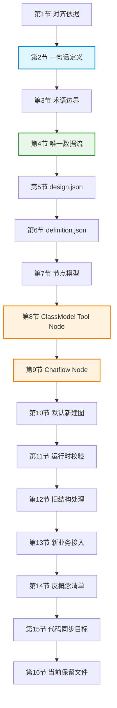

---

## 1. 对齐依据

本文采用下面这些 Dify 公开概念作为外部参照：

| Dify 概念 | 官方口径 | SPARK 适配 |
| --------- | -------- | ---------- |
| Workflow | 从输入到输出的可重复流程，用可视化节点编排模型、工具和逻辑 | `workflow.graph` + `definition.json` |
| Node | workflow 画布上的可执行或控制单元 | `workflow.graph.nodes[*]` |
| Tool Node | 调用外部工具、API、业务能力的节点 | `provider/toolName/toolParameters`，其中 `provider = "class-model"` 时由 ClassModel JSON 提供能力描述 |
| Start / User Input | workflow 的输入入口 | 工单输入、页面表单、Host Run 请求 |
| Output / End | workflow 的输出结果 | 运行结果、交付回执、`agent_complete` 摘要 |
| Workflow as Tool | 已发布 workflow 可被其它 workflow 调用 | `workflow` 节点或 `chatflow` 节点引用另一个 `definition.json` |

参考链接：

- Dify Workflow & Chatflow: https://docs.dify.ai/en/use-dify/build/workflow-chatflow
- Dify Tool Node: https://docs.dify.ai/en/use-dify/nodes/tools.md
- Dify node orchestration: https://docs.dify.ai/en/use-dify/build/orchestrate-node.md
- Dify Workflow API: https://docs.dify.ai/api-reference/workflows/run-workflow.md
- Dify Workflow as Tool: https://docs.dify.ai/en/develop-plugin/features-and-specs/advanced-development/reverse-invocation-tool.md

---

## 2. 一句话定义

**业务工厂就是一个可运行的 Agent Workflow definition。**

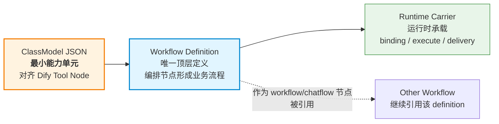

因此：

- 顶层只有 workflow definition，不输出 App。
- `definition.json` 全面替代业务工厂注册表达。
- 最小能力单元不是 Registration。
- 最小能力单元不是 `process-stage`。
- 最小能力单元不是 F0-F9。
- 最小能力单元是已经 JSON 化的 ClassModel，对齐 Dify Tool Node。
- Chatflow 不是顶层类型；Chatflow 是 workflow 图中的节点，引用另一个 workflow definition。
- Host / Registration / Binding 只能是运行时按 `definition.json` 派生出来的承载对象。

---

## 3. 术语边界

| 统一术语 | 禁止替代说法 | SPARK 实值 |
| -------- | ------------ | ---------- |
| Workflow Definition | App、Published App、能力成品、业务能力定义 | `definition.json` |
| Workflow | 工艺流程、注册体系、能力生产线 | `workflow.graph` |
| Node | 步、阶段、F0-F9 节点 | `workflow.graph.nodes[*]` |
| Tool Node | 工具包、Registration、函数节点 | `provider/toolName/toolParameters` |
| ClassModel Tool Node | class 实例、构造函数节点、源码绑定 | `provider = "class-model"` 的 Tool Node |
| Chatflow Node | 聊天模式、反问工具、小助手、独立 App | `type = "chatflow"`，引用另一个 workflow definition |
| Runtime Binding | 生产注册、Host adapter | definition 到当前 Host / ClassModel runtime / working copy 的绑定 |

"业务工厂"只作为产品/业务命名使用；技术含义必须等价于 workflow definition。不要再把"业务工厂注册体系"作为架构概念。

---

## 4. 唯一数据流

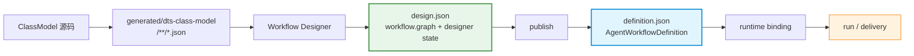

规则：

1. 设计器只编辑 `design.json`。
2. 发布器只从 `design.json` 生成 `definition.json`。
3. 运行时只读取 `definition.json`。
4. Host / Registration / Delivery 不能反向定义 workflow 结构。
5. `x_spark` 只能放设计器或运行时适配元数据，不能引入一套外部不可理解的新 workflow 概念。
6. F0-F9 不进入新结构；旧 F0-F9 文件视为旧结构，打开或校验失败。

---

## 5. `design.json`

`design.json` 是设计器草稿，不是运行时协议。它可以包含画布状态、编辑态字段和提示信息，但必须能发布成唯一的 `definition.json`。

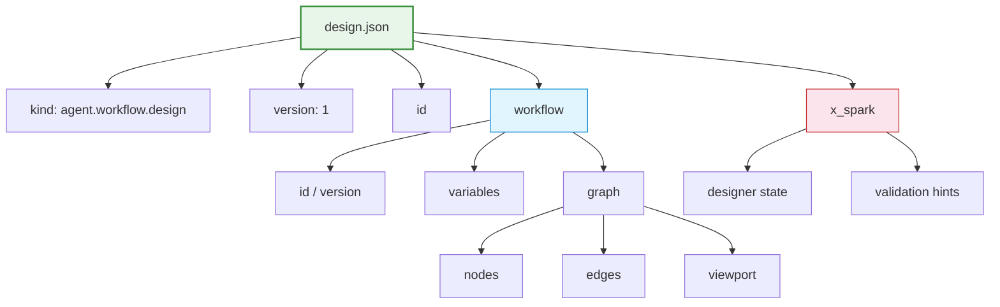

推荐结构：

```json
{
  "kind": "agent.workflow.design",
  "version": 1,
  "id": "pageDesign",
  "workflow": {
    "id": "pageDesign",
    "version": 1,
    "variables": [],
    "graph": {
      "nodes": [],
      "edges": [],
      "viewport": { "x": 0, "y": 0, "zoom": 1 }
    }
  },
  "x_spark": {
    "designer": {},
    "validation": {}
  }
}
```

字段约束：

| 字段 | 含义 | 约束 |
| ---- | ---- | ---- |
| `workflow.variables` | workflow 输入、节点输出、中间变量 | 只表达变量，不表达运行实例 |
| `workflow.graph.nodes` | 可执行节点或控制节点 | 只允许新节点模型 |
| `workflow.graph.edges` | 节点连线 | 表达控制流和数据依赖 |
| `x_spark.designer` | 画布、面板、编辑器状态 | 不参与运行时语义 |
| `x_spark.validation` | 发布前提示 | 可存 blocker / warning |

禁止字段：

- `app`
- `factory`
- `process-stage`
- `single_model_edit`
- `F0` 到 `F9`
- `x_spark.factory`

---

## 6. `definition.json`

`definition.json` 是唯一发布态。它描述 workflow 能否被运行时承载，不描述 App，也不描述注册。

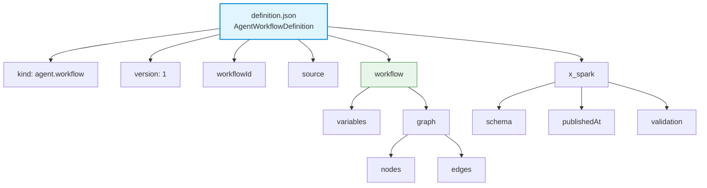

推荐结构：

```json
{
  "kind": "agent.workflow",
  "version": 1,
  "workflowId": "pageDesign",
  "source": {
    "designKind": "agent.workflow.design",
    "designId": "pageDesign",
    "designVersion": 1
  },
  "workflow": {
    "variables": [],
    "graph": {
      "nodes": [
        {
          "id": "start",
          "type": "start",
          "data": {
            "title": "Start"
          }
        },
        {
          "id": "tool.default",
          "type": "tool",
          "data": {
            "title": "ClassModel Tool",
            "provider": "class-model",
            "toolName": "spark.placeholder.tool",
            "toolParameters": {}
          }
        },
        {
          "id": "end",
          "type": "end",
          "data": {
            "title": "End"
          }
        }
      ],
      "edges": [
        { "id": "edge.start.tool", "source": "start", "target": "tool.default" },
        { "id": "edge.tool.end", "source": "tool.default", "target": "end" }
      ]
    }
  },
  "x_spark": {
    "schema": "spark.agent.workflow.definition.v1",
    "publishedAt": "2026-06-19T00:00:00.000Z",
    "validation": {}
  }
}
```

发布态禁止：

- 不允许 `app`。
- 不允许 `factory`。
- 不允许 F0-F9。
- 不允许 `process` / `process-stage`。
- 不允许 `single_model_edit`。
- 不允许保存 class 实例、函数、闭包、editor、DeliveryPort。

---

## 7. 节点模型

节点必须按通用 workflow 节点理解。

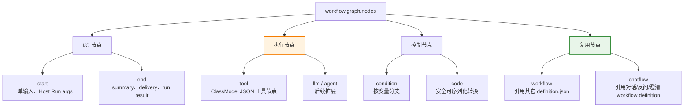

本轮代码必须支持的节点：

| Node 类型 | 用途 | 必需字段 |
| --------- | ---- | -------- |
| `start` | workflow 输入入口 | `id/type/data` |
| `tool` | 调用 ClassModel Tool | `provider/toolName/toolParameters` |
| `chatflow` | 调用另一个 workflow definition，语义上承担反问、澄清、确认 | `workflowRef/inputMapping/outputMapping` |
| `end` | workflow 输出 | `id/type/data` |

后续扩展节点：

| Node 类型 | 用途 |
| --------- | ---- |
| `workflow` | 调用普通子 workflow |
| `condition` | 变量分支 |
| `code` | 安全可序列化的局部转换 |
| `llm` / `agent` | 模型推理或 agent 执行 |

---

## 8. ClassModel Tool Node

ClassModel JSON 是 SPARK 的最小能力单元，但 workflow 节点形态必须对齐 Dify Tool Node。也就是节点保存工具调用配置，不直接暴露 class、构造函数、源码文件或函数对象。

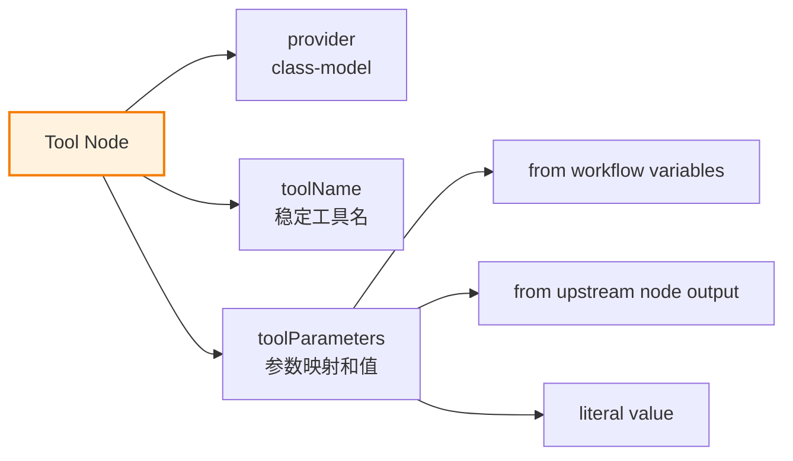

推荐形态：

```json
{
  "id": "tool.create-table",
  "type": "tool",
  "data": {
    "title": "Create Table",
    "provider": "class-model",
    "toolName": "spark.dataset.createTable",
    "toolParameters": {
      "tableName": "{{ start.tableName }}",
      "columns": "{{ tool.extract-columns.columns }}"
    }
  }
}
```

参数关联规则：

| 规则 | 说明 |
| ---- | ---- |
| 参数名 | 以 ClassModel JSON 暴露的 tool descriptor 为准 |
| 参数类型 | 以 ClassModel JSON 的参数 schema 为准 |
| 参数值 | 通过 `toolParameters` 绑定 workflow 变量、上游节点输出或字面量 |
| 构造参数 | 不在 definition 中暴露 constructor；由 `provider/toolName` 解析到 ClassModel tool descriptor 后统一校验 |
| 运行时实例 | working copy、Host、editor、DeliveryPort 等由 runtime binding 注入 |
| 缺失参数 | 发布或运行前校验失败，不进入执行 |

关键边界：

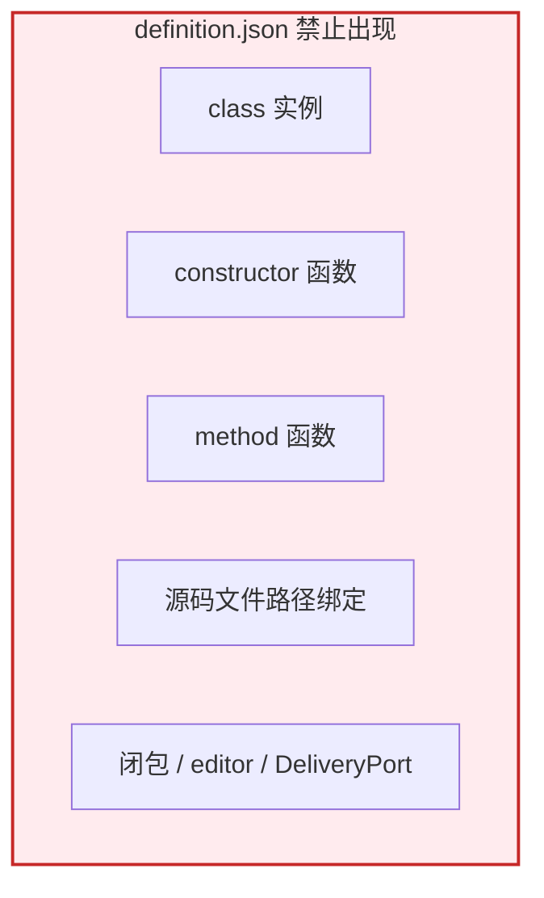

---

## 9. Chatflow Node

Chatflow 不再作为顶层 `app.mode`。在 SPARK 新结构里，Chatflow 是 workflow 图中的节点类型，引用另一个 workflow definition。它的语义是对话、反问、澄清、确认、补齐上下文。

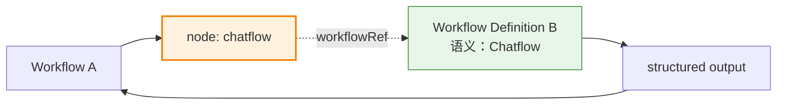

推荐形态：

```json
{
  "id": "chatflow.clarify-requirement",
  "type": "chatflow",
  "data": {
    "title": "Clarify Requirement",
    "workflowRef": {
      "workflowId": "spark.clarify-requirement",
      "version": 1,
      "definitionPath": "workflows/spark.clarify-requirement/definition.json"
    },
    "inputMapping": {
      "context": "{{ start.requirement }}",
      "missingFacts": "{{ tool.inspect-gaps.missingFacts }}"
    },
    "outputMapping": {
      "answers": "requirement.clarification.answers",
      "confirmedFacts": "requirement.clarification.confirmedFacts"
    }
  }
}
```

当前 `human_question` 只能视为运行时兼容能力。目标结构里，高频反问、澄清、确认流程应沉淀为 workflow definition，并通过 `chatflow` 节点引用。

---

## 10. 默认新建图

新建 workflow 必须生成最小可运行图：

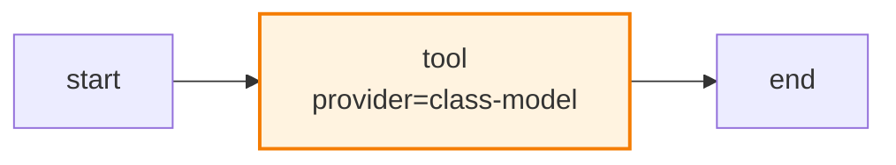

默认新建图约束：

- 只有 `start -> tool(class-model) -> end`。
- 不生成 F0-F9。
- 不生成 `process-stage`。
- 不生成 `single_model_edit`。
- 默认 tool 可以是占位 `toolName`，但发布或运行前必须被替换为真实 ClassModel tool。

---

## 11. 运行时校验

本轮只判断按 workflow 定义能否走通，不验收完整业务执行效果。但校验不能只停留在 JSON 粗检。

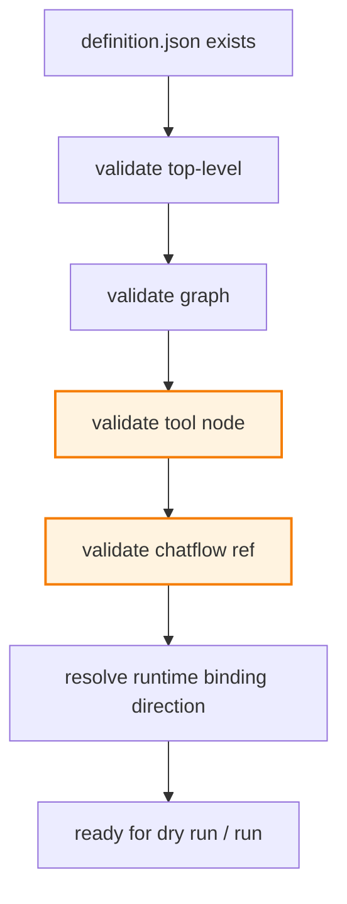

必须校验：

| 类别 | 校验项 |
| ---- | ------ |
| 顶层 | `kind/version/workflowId/source/workflow/x_spark` 存在且类型正确 |
| 图结构 | 至少一个 `start`、一个 `end`，边引用存在节点，`start` 可到达 `end` |
| Tool Node | `provider/toolName/toolParameters` 存在；`provider = "class-model"` 时能解析到 ClassModel tool descriptor |
| 构造参数 | 由 ClassModel tool descriptor 推导需要的构造或 binding 参数，确认 mapping 完整 |
| 函数参数 | 由 ClassModel tool descriptor 推导函数参数，确认 `toolParameters` 完整且可映射 |
| Chatflow Node | `workflowRef.definitionPath` 或等价引用存在，目标 `definition.json` 可加载并通过基础校验 |
| 禁止字段 | 出现 `factory/F0-F9/process-stage/single_model_edit/app` 即失败 |

不在本轮验收：

- LLM 输出质量。
- tool call 的详细重试策略。
- Delivery 是否真正保存。
- AG-UI timeline 细节。
- 全部 UI 表单字段体验。

---

## 12. 旧结构处理

本轮不做兼容，不做迁移，不做只读导入。

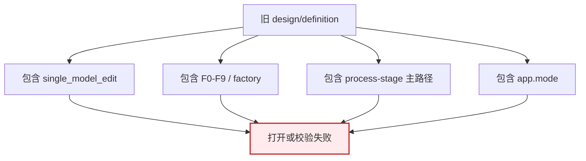

处理规则：

- 旧 `single_model_edit` 文件失败。
- 旧 F0-F9 / `factory` 文件失败。
- 旧 `process-stage` 主路径文件失败。
- 旧 `app.mode = workflow/chatflow` 文件失败。
- 不提供一次性迁移逻辑。
- 不保留旧解析器。

---

## 13. 新业务接入方式

接入新业务时，不再从 `ensureXxxBusiness()` 或注册函数开始。按 workflow 方式做：

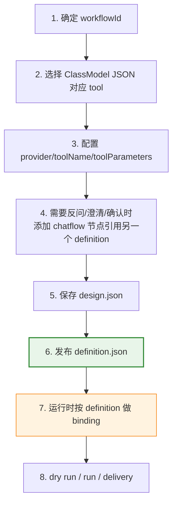

Checklist：

| 检查项 | 必须回答 |
| ------ | -------- |
| Workflow | `workflowId` 是什么 |
| Input | 输入字段如何进入 workflow variables |
| Tool Node | 使用哪个 `provider/toolName` |
| Tool Parameters | 每个参数从哪个变量、节点输出或字面量来 |
| Constructor / Binding | 哪些依赖由 runtime binding 注入 |
| Chatflow | 哪些反问、澄清、确认需要引用独立 workflow definition |
| Output | 结果如何进入 `end` 或 delivery |
| Runtime Binding | 哪些外部对象只在运行时提供 |

---

## 14. 反概念清单

这些说法以后不要再用作定义：

| 错误说法 | 为什么错 | 正确说法 |
| -------- | -------- | -------- |
| 能力成品 | 空泛，看不出是 JSON、运行对象还是交付物 | workflow definition |
| Published App / App | 本轮明确不输出 App | workflow definition |
| 业务工厂注册体系 | 把 registration 当定义源 | Agent Workflow 业务工厂 |
| Registration 表达业务工厂 | 运行对象反客为主 | `definition.json` 表达业务工厂 |
| Host adapter / legacy adapter | 混淆运行层和定义层 | Runtime binding |
| F0-F9 工作流 | 历史内部分组被包装成外部概念 | workflow graph nodes |
| process-stage 是最小单元 | 把视图节点当能力节点 | ClassModel JSON Tool Node |
| Chatflow 是顶层模式 | 本轮只有 workflow 顶层 | Chatflow Node |
| 反问只是 tool loop 细节 | 不能复用和编排 | 独立 workflow definition + `chatflow` 节点引用 |
| 生产注册 | 把发布和注册混成一件事 | Publish definition，再 runtime binding |

---

## 15. 代码同步目标

本轮代码必须按本文同步，不能继续保留旧主路径。

```mermaid
graph TD
    A["agent-workflow-definition.ts"] --> A1["删除 factory/F0-F9/process"]
    A --> A2["新增 workflow graph / nodes / edges"]

    B["agent-workflow-validation.ts"] --> B1["禁止旧字段"]
    B --> B2["校验 graph / tool mapping / chatflow ref"]

    C["workflow-designs.ts"] --> C1["默认 start -> class-model tool -> end"]
    C --> C2["发布 design graph 为 definition"]

    D["WorkflowDesigns.vue"] --> D1["节点类型只暴露新模型"]
    D --> D2["删除 single_model_edit/process-stage 展示"]

    E["WorkflowDesignService.java"] --> E1["scaffold 最小图"]
    E --> E2["校验新 definition"]

    F["tests"] --> F1["旧结构测试删除或改为失败"]
    F --> F2["新增新 workflow 测试"]

    style A fill:#e1f5ff,stroke:#0288d1
    style B fill:#e1f5ff,stroke:#0288d1
    style C fill:#e8f5e9,stroke:#388e3c
    style D fill:#e8f5e9,stroke:#388e3c
    style E fill:#fff3e0,stroke:#f57c00
```

验收点：

1. `definition.json` 顶层只有 workflow definition。
2. `design.json` 不再有 `app`、`factory`、F0-F9。
3. 默认图为 `start -> tool(class-model) -> end`。
4. Tool Node 使用 `provider/toolName/toolParameters`。
5. Chatflow 是节点，引用另一个 workflow definition。
6. 运行时校验覆盖 ClassModel tool 参数 mapping 和 Chatflow definition 加载。
7. 旧 `single_model_edit` / F0-F9 / `process-stage` 主路径文件失败。

---

## 16. 当前保留文件

同主题只保留本文。其它文档只能链接本文，不能再复制一套 Agent Workflow / 业务工厂概念。

| 文件 | 角色 |
| ---- | ---- |
| `packages/spark-ai/docs/business-factory-workflow-zh-cn.md` | 唯一权威文件 |
| `packages/spark-ai/docs/README.md` | 文档索引，只能链接本文 |
| `knowledge/README.md` | 知识库索引，只能链接本文 |
| `packages/spark-ai/docs/spark-ai-platform.md` | 平台总览，不再独立定义业务工厂 |
