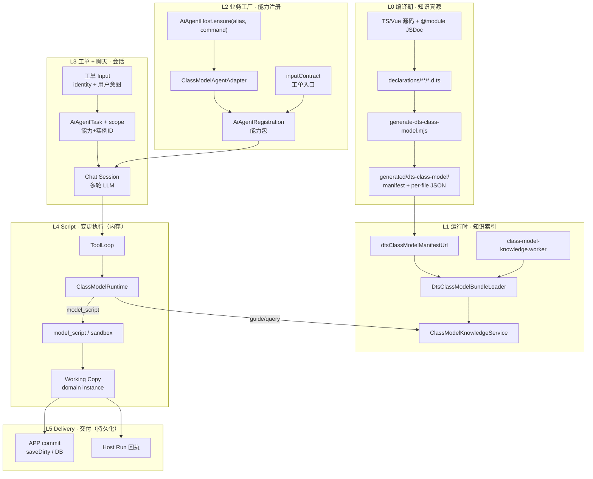

# SPARK AI 端到端平台方案

> **声明即知识、工厂注册能力、工单驱动会话、Script 改工作副本、交付才落盘。**
>
> 状态：2026-06，以 **main** 已落地代码为准；执行入口收敛为 ClassModel 7 工具闭集。
> **全仓 AI 主文档（SSOT）**。整合 `end-to-end-platform.md`、`business-capability-onboarding.md`、`native-runtime-and-agent-flow-zh-cn.md`，并对照 `packages/spark-ai` 与 `src/services/**` 源码校正偏差。  
> 专题深潜仍见：`transport-and-session-zh-cn.md`、`pagedesign-devsystem-zh-cn.md`。

---

## 0. 三篇源文档对比（读哪篇、为何整合）

| 文档 | 最擅长 | 主要短板 | 与代码贴合 |
| ---- | ------ | -------- | ---------- |
| **END-TO-END-PLATFORM** | **业务抽象最完整**：五概念、三轴、L0–L5 分层、Script≠Delivery、Phase 审核与 DeliveryPort | 偏「方案/路线图」，native-runtime 执行细节较薄；部分 `createRegistration` 示例与当前三层 API 不完全一致 | 高（架构与 APP 接线）；注册 API 以本文 §5 代码真值为准 |
| **BUSINESS-CAPABILITY-ONBOARDING** | **接入 checklist 最实用**：五层必答题、阶段 A–F、常见误接表，适合打印执行 | 不含编译/运行时深潜，依赖外链上下文 | 高（与 `ensurePageDesignBusiness` 等一一对应） |
| **native-runtime-and-agent-flow** | **执行链最贴代码**：关键文件表、ToolLoop、`model_script` 链路、排错表 | 缺 L0–L2 知识与 L5 交付；业务抽象（工单/实例/能力）未展开 | **最高**（文件路径与调用栈可直接对照源码） |

**结论（哪篇讲得好）：**

- 想理解 **平台是什么、怎么扩展业务** → 原 END-TO-END 最好；本文 §1–§2、§12 吸收其精华。
- 想 **接一个新 alias** → 原 ONBOARDING 最好；本文 §12 保留完整 checklist + 代码模板。
- 想 **查 model_script / sandbox / 7 工具怎么跑** → 原 native-runtime 最好；本文 §7 按源码展开并补上 recovery / nudge。
- **日常只读一篇** → 本文；三篇源文档降为速查附录，顶部已加跳转说明。

---

## 1. 核心认知：五个概念 + 三轴坐标

### 1.1 五个概念

平台里最容易混的是 **业务能力**、**业务实例**、**工单**、**聊天**。用抽象名对照代码：

| 抽象 | 是什么 | 代码/类型 | 生命周期 |
| ---- | ------ | --------- | -------- |
| **业务能力** | 一类 AI 可操作的领域能力（「页面设计」「项目规划」） | `AiAgentRegistration`、`moduleId`、`Host.ensure(alias, command)` | 应用启动时注册，长期存在 |
| **领域实例** | 内存里的业务根对象，Script 的 `this` | `instance` 或 `resolveInstance(ctx)` 返回的领域对象（如 `ProjectModel`） | 跟编辑器/Workspace 同生共死 |
| **业务实例 ID** | 在同能力下区分「正在改哪一份」 | `scope.businessInstanceId`（来自 `inputContract.identityField`） | 一次 run 内固定 |
| **工单（作业请求）** | 用户这次要做什么（描述、模式、约束） | `normalizedInput` + `orchestration.userMessage` | 一次 `Host.run` 一份 |
| **聊天会话** | 完成该工单的多轮 LLM 对话 | `AiAgentSession` + 后端 sessionId | run 开始到 `agent_complete` |

```text
业务能力 (pageDesign)          ← 业务工厂 ensure 注册，与具体 pageId 无关
    │
    ├── 领域实例 ProjectModel   ← APP 注入的 editor.project（工作副本容器）
    │
    └── 某次 run：
            工单 input { pageId:'orders', description:'…' }
                 │
                 ├─ businessInstanceId = 'orders'   ← 只是 ID，不是新业务
                 ├─ userMessage = description      ← 工单意图进聊天
                 └─ Session 多轮 tool_call …
```

### 1.2 Script ≠ 交付

Script 只在内存里改领域对象；交付是持久化 + 回执。两阶段提交：

```text
┌─────────────────────────────────────────────────────────────┐
│ 阶段 A · 变更执行（Script Runtime）                          │
│   model_script → executeDtsNativeScript → this.openXxx()…   │
│   改动的对象：registration.instance（内存 Working Copy）       │
│   特点：可多次 script、可 gate 拦截、会话内可撤销（未 save）   │
└─────────────────────────────────────────────────────────────┘
                              │
                              │  业务/App 显式 commit
                              ▼
┌─────────────────────────────────────────────────────────────┐
│ 阶段 B · 交付（Delivery）                                    │
│   ① 持久化：saveDirtyPageFiles() → 磁盘四文件 / DB           │
│   ② 回执：Host Run POST result（trace、status、instanceId）  │
│   特点：对外可见、不可由 spark-ai 单独完成（需 APP 策略）    │
└─────────────────────────────────────────────────────────────┘
```

| 维度 | Script Runtime | Delivery |
| ---- | -------------- | -------- |
| **触发** | LLM `model_script` tool_call | APP 在 run 结束或用户点保存 |
| **操作对象** | 领域实例 public API | 持久化层 / HTTP 回执 |
| **是否 durable** | 否（内存） | 是 |
| **spark-ai 边界** | sandbox + gates | 不内置；由 APP 接 Workspace |

### 1.3 三轴坐标

定位一次 AI 运行，需要三个独立坐标：

```text
轴 1 · 能力轴   businessRegistrationId / alias   （哪种业务：pageDesign）
轴 2 · 实例轴   businessInstanceId / identityField （哪一份：pageId=orders）
轴 3 · 会话轴   sessionId / runId                  （哪一轮聊天完成这个工单）
```

`createSimpleInputContract` 只做 **轴 1 + 轴 2** 的绑定；**轴 3** 由 `AiAgentSession.start()` 创建。

### 1.4 业务工厂（`Host.ensure`）

工厂不生产「订单」，生产 **业务能力包** `AiAgentRegistration`：

```text
Host.ensure('pageDesign', { moduleId, create })
        │
        ▼
AiAgentRegistration = {
  moduleId, name, description,           // 能力身份（给 LLM 的系统提示）
  inputContract,                         // 工单 → scope + 首条 userMessage
  runtime: ClassModelAgentAdapter,       // 7 工具 + knowledge + scriptExecutor
  sessionStore, gates, nudge, lifecycle, // 会话存储与治理
}
```

| 组装件 | 职责 |
| ------ | ---- |
| `inputContract` | 工单入口：`identityField` → `businessInstanceId`，`messageField` → 聊天首条 |
| `resolveInstance` / `instance` | Working Copy 根：Script 的 `this` |
| `knowledge` + manifest | LLM 查 API 的说明书（与哪张 orders 无关） |
| `beforeFunctionCall` | mutation 门禁 |
| `sessionStore` | 多轮 history 持久化 |

`pageDesign` = 业务能力；`orders` = 工单上的 `pageId` → `businessInstanceId`。换 `dashboard` 仍是同一能力，**无需新工厂**。

---

## 2. 总览架构：L0–L5 六层



### 分层职责表

| 层 | 名称 | 输入 | 输出 | 核心模块 |
| -- | ---- | ---- | ---- | -------- |
| **L0** | 声明投影 | `.ts` 源码 | `manifest.json` + per-file JSON | `project-from-declarations.ts`, `build-dts-class-model-bundle.ts` |
| **L1** | 知识索引 | manifest URL + rootClassName | query / guide 文本 | `DtsClassModelBundleLoader`, `ClassModelKnowledgeService`, Worker |
| **L2** | 业务工厂 | APP 上下文（editor、manifest） | **业务能力包** Registration | `AiAgentHost.ensure`, `ClassModelAgentAdapter` |
| **L3** | 工单 + 聊天 | 工单 Input | Task + Session | `createAiAgentTask`, `AiAgentSession` |
| **L4** | Script 变更执行 | tool_call | **Working Copy 变更** | `ClassModelRuntime`, `native-runtime` |
| **L5** | 交付 | Working Copy dirty 状态 | 持久化 + 回执 | APP `saveDirty`*, `ai-host-run-bridge` |

---

## 3. L0：`.d.ts` → JSON

### 3.1 流水线

```text
pnpm run generate:declarations          # vue-tsc → declarations/**
pnpm run generate:class-model-surface     # AST 投影 → generated/dts-class-model/
```

| 步骤 | 说明 |
| ---- | ---- |
| **JSDoc 真源** | 模块级 `@module`（职责/边界/AI用途）、成员 JSDoc、`@param`/`@returns` |
| **AST 投影** | `project-from-declarations.ts`：class/interface/enum、attributes、methods、TypeDoc 式 type 树 |
| **Bundle 落盘** | 每 DTS 文件 → 一个 JSON shard；`classIndex[className]` → shard 路径 |
| **语义审计** | `semantic-gaps.json`：弱 JSDoc、断链 relation（不阻断生成） |

### 3.2 JSON shard 契约（MethodMeta SSOT）

```json
{
  "name": "get",
  "jsdoc": "...",
  "parameterStyle": "positional",
  "parameters": [{ "name": "moduleId", "type": { "type": "intrinsic", "name": "string" } }],
  "type": { "type": "optional", "elementType": { "type": "reference", "name": "AiAgentRegistration" } }
}
```

- `type`：返回类型 SSOT（对齐 TypeDoc `SignatureReflection.type`）
- `signatureText`：读侧从 type 树派生，bundle 内可不持久化
- `reflection`：mutator 回调 `(tool: DataSetCrudTool) => void` 的结构化签名

### 3.3 编译期命令速查

| 命令 | 用途 |
| ---- | ---- |
| `generate:class-model-surface` | 日常重建 bundle |
| `generate:class-model-surface:delete-dts` | 生成后删除临时 declarations |
| `verify:class-model:full` | rebuild + lint + typecheck + 关键测试 |

---

## 4. L1：JSON → LLM 知识体系

### 4.1 加载策略

主线程 **不** 加载全量 shard。浏览器 **Worker** 内：

1. `fetch(manifestUrl)` → `DtsClassModelBundleManifest`
2. `ensureReachableClosure(rootClassName)` → 按 type 树 ref **按需 BFS 加载** shard
3. `buildLoadedSurface()` → 内存 `DtsClassModelSurfaceDocument`

`rootClassName` 由业务注册决定：

| 业务 | rootClassName |
| ---- | ------------- |
| pageDesign | `ProjectModel` |
| projectPlanning | `ProjectModel`（按注册） |

### 4.2 知识加载链路（四层）

```text
Worker (Comlink)
  → WorkerKnowledgeHandler
    → DtsBundleClassModelKnowledgeService
      → DtsClassModelBundleLoader（BFS 按需加载 shard）
      → ClassModelKnowledgeService（surface 模式渲染 guide）
```

`DtsClassModelBundleLoader` 核心机制：

- `init()` → `loadManifest()` 获取 `classIndex` + `files` 索引
- `ensureReachableClosure(rootClassName)` → BFS 遍历，对每个 class 调用 `listLinkedClassNames()` 提取关联类名（来自 attribute schema、method 签名、参数类型、返回类型）
- `ensureSourcePath()` → 按 `manifest.files[sourcePath].file` 拼接 URL，fetch 单个 JSON shard
- 已加载 shard 缓存在 `loadedModels` Map 中，避免重复网络请求

`ClassModelKnowledgeService` 有两种后端：

| 模式 | 知识源 | 签名渲染 |
| ---- | ------ | -------- |
| `document` | `ClassModelDocument`（老路径） | `renderMethodSignature` |
| `surface` | `DtsClassModelSurfaceDocument` | `renderMethodSignatureFromMeta` ← SSOT |

Node 端（E2E / 测试）可跳过 Worker，直接用 `DtsClassModelBundleLoader` + `DtsBundleClassModelKnowledgeService`，注入 `dtsClassModelFetchJson` 走 `fs.readFile`。

### 4.3 七工具 → 知识投影

| 工具 | 知识来源 | LLM 看到什么 |
| ---- | -------- | ------------ |
| `model_query` | `ClassModelKnowledgeService.query()` | kind 列表 + member 摘要 JSON |
| `model_class_guide` | `modelGuide()` | 类级 guide（JSDoc + 成员签名） |
| `model_attribute_guide` | `attributeGuide()` | 属性类型 + 嵌套 kind 提示 |
| `model_action_guide` | `methodGuide()` | 方法 JSDoc + 从 type 树渲染的签名 |
| `model_script` | — | 执行 sandbox script（见 §7 L4） |
| `human_question` | — | 结构化追问用户 |
| `agent_complete` | — | 结束回合 |

### 4.4 知识闭包规则

`ensureReachableClosure` 做 BFS：对每个已加载 class，`listLinkedClassNames` 从 attribute schema（`collectFromSchema`）、method 签名（`collectFromDtsType` + `visitDtsTypeMeta`）和类型文本（`collectFromTypeText` 正则）中提取 `manifest.classIndex` 命中的关联类名入队。

示例：`ConfigPage.editDataSet(run: (tool: DataSetCrudTool) => …)` → 闭包自动加载 `DataSetCrudTool` shard。

---

## 5. L2：业务工厂

### 5.1 工厂模式 = `Host.ensure`

```typescript
// ⚠️ moduleId 是必填字段，不可省略
host.ensure('pageDesign', {
  moduleId: 'pageDesign',       // ← 必填
  create: () => ClassModelAgentAdapter.createRegistration({
    moduleClass: ProjectModel,   // ← 必填：领域根 class
    options: {                   // ← 所有业务配置在此子对象内
      moduleId: 'pageDesign',
      rootClassName: 'ProjectModel',
      dtsClassModelManifestUrl,
      knowledge: createPageDesignClassModelKnowledgeProvider(),
      inputContract: createSimpleInputContract<PageDesignRunInput>({
        businessId: 'pageDesign',
        identityField: 'pageId',
        messageField: 'description',
        paramsSchema: { /* 工单 schema */ },
        systemPrompt: createPageDesignSystemPrompt,
      }),
      resolveInstance: ctx => resolvePageDesignProject(options, ctx),
      beforeFunctionCall: (instance, hookOptions) =>
        evaluatePageDesignBeforeFunctionCall(instance, hookOptions),
      executionToolNames: PAGE_DESIGN_EXECUTION_TOOL_NAMES,
      planWithoutToolMarkers: PAGE_DESIGN_PLAN_WITHOUT_TOOL_MARKERS,
      toolLoopNudge: createPageDesignToolLoopNudge,
    },
  }),
})
```

**`createRegistration` 签名（代码真值）**：

```typescript
ClassModelAgentAdapter.createRegistration<T>(
  command: ClassModelAgentAdapterRegistrationCommand<T>
): AiAgentRegistration

// command 结构（三层，非扁平）：
type ClassModelAgentAdapterRegistrationCommand<T> = Readonly<{
  moduleClass: ClassModelAgentAdapterConstructor<T>  // 必填：领域根 class
  metadata?: AiRuntimeApiMetadataJson                 // 可选：预构建元数据（走 executeAiNativeScript 路径）
  options: ClassModelAgentAdapterRegisterOptions<T>   // 必填：业务配置子对象
}>
```

**`options` 完整字段（代码真值）**：

| 字段 | 类型 | 必填 | 说明 |
| ---- | ---- | ---- | ---- |
| `moduleId` | `string` | 否（默认取 alias） | 能力 ID |
| `instance` | `T` | 与 `resolveInstance` 二选一 | 静态领域实例 |
| `resolveInstance` | `(ctx) => T` | 与 `instance` 二选一 | 动态解析领域实例（pageDesign 用此） |
| `rootClassName` | `string` | DTS 路径必填 | 根 class 名 |
| `dtsClassModelManifestUrl` | `string` | DTS 路径必填 | manifest URL |
| `dtsClassModelFetchJson` | `(url) => Promise<unknown>` | 否 | 自定义 JSON 加载（Node 端走 fs） |
| `knowledge` | `ClassModelKnowledgeProvider` | 否 | 知识提供者（浏览器默认 Worker，Node 端直连） |
| `inputContract` | `AiAgentInputContract` | 否 | 工单入口 |
| `sessionStore` | `AiAgentSessionStore` | 否 | 会话持久化 |
| `systemPrompt` | `(instance, ctx) => string \| undefined` | 否 | 动态系统提示 |
| `beforeFunctionCall` | `(instance, options) => Directive` | 否 | 变更门禁 |
| `afterFunctionCall` | `(instance, options) => Directive` | 否 | 执行后钩子 |
| `onStartSession` | `(instance, ctx) => void` | 否 | 会话开始钩子 |
| `onEndBusinessInstance` | `(instance, ctx, directive) => void` | 否 | 会话结束钩子 |
| `releaseModuleInstance` | `(instance, id) => void` | 否 | 实例释放钩子 |
| `executionToolNames` | `ReadonlySet<string>` | 否 | 标记哪些工具名属于"执行"类 |
| `planWithoutToolMarkers` | `readonly string[]` | 否 | 哪些 marker 不要求工具调用 |
| `toolLoopNudge` | `(ctx) => string \| undefined` | 否 | ToolLoop 提示词生成 |
| `enrichRecoveryHints` | `(command) => string[]` | 否 | 自定义恢复提示 |
| `jsonSchemaDefs` | `Record<string, AiJsonSchemaObject>` | 否 | 额外 JSON Schema 定义（metadata 路径） |

**工厂组装件与抽象对照**：

| 工厂组装件 | 抽象职责 |
| ---------- | -------- |
| `inputContract` | **工单入口**：paramsSchema、`identityField` → `businessInstanceId`、`messageField` → 首条聊天内容 |
| `instance` / `resolveInstance` | **工作副本根**：Script 执行时 `this` 指向谁 |
| `knowledge` + manifest | **能力说明书**：LLM 如何查 API（与哪张 orders 无关） |
| `beforeFunctionCall` | **变更门禁**：哪些 mutation 允许执行 |
| `sessionStore` | **聊天持久化**：多轮 history 存哪 |

**`createSimpleInputContract` 签名（代码真值）**：

```typescript
createSimpleInputContract<TInput>(options: {
  businessId: string
  paramsSchema: AiJsonSchemaObject
  identityField: keyof TInput & string
  messageField: keyof TInput & string    // 消费于 toOrchestration()，不出现在产出类型上
  normalize?: (input: AiJsonParams) => TInput
  systemPrompt: string | ((input: TInput) => string)
  title?: string | ((input: TInput) => string | undefined)
  readonlySteps?: readonly string[] | ((input: TInput) => readonly string[] | undefined)
}): AiAgentInputContract<TInput>

// 产出类型 AiAgentInputContract（无 messageField 字段）：
type AiAgentInputContract<TInput> = Readonly<{
  paramsSchema: AiJsonSchemaObject
  identityField: keyof TInput & string
  normalize(input: AiJsonParams): TInput
  toScope(normalizedInput: TInput): AiAgentScope
  toOrchestration(normalizedInput: TInput): AiAgentOrchestrationPlan
}>
```

### 5.2 已注册生产业务

| alias | moduleId | rootClass | identityField | 操作域 | Delivery | APP 入口 |
| ----- | -------- | --------- | ------------- | ------ | -------- | -------- |
| `pageDesign` | `pageDesign` | `ProjectModel` | `pageId` | 默认四文件 | 全部 dirty 四文件 | `ensurePageDesignBusiness()` |
| `pageDataDesign` | 调度 preset → `pageDesign` | `ProjectModel` | `pageId` | `allowedOperations.dataSet` only | 仅 `pagedata.json` | `page-data-design-host-run-provider.ts` |
| `projectPlanning` | `projectPlanning` | `ProjectModel` | `projectScopeKey` | navigation | navigation `saveAll()` | `ensureProjectPlanningBusiness()` |

**pageDataDesign 不是独立 Registration**：它调用 `ensurePageDesignBusiness` 后包装代理，拦截 `run('pageDataDesign', ...)` 调用，归一化为 pageDesign 工单并绑定 `allowedOperations` 上下文。无独立 `host.ensure()` 调用。

### 5.3 工厂幂等性

`Host.ensure` 幂等逻辑：
- alias 已绑定相同 `moduleId` → 返回当前 host（跳过）
- alias 已绑定不同 `moduleId` → 抛异常
- `moduleId` 已注册到不同 alias → 抛异常

---

## 6. L3：工单 + 聊天

### 6.1 工单 vs 聊天 vs 能力

| 抽象 | 一次 run 里是什么 | 谁创建 |
| ---- | ----------------- | ------ |
| **工单** | `normalizedInput`：identity + 用户意图 | 用户 / 调度方调用 `Host.run(alias, input)` |
| **scope** | `(businessRegistrationId, businessInstanceId)` 双坐标 | `inputContract.toScope(normalizedInput)` |
| **聊天** | 围绕该 scope 的多轮 LLM + tool 历史 | `AiAgentSession` + 后端 session API |

**没有独立的「订单业务模块」。** 电商「订单页」只是 pageDesign 能力下 `pageId='orders'` 的一个实例 ID。

```typescript
host.run('pageDesign', {
  pageId: 'orders',              // → businessInstanceId（实例轴）
  description: '做列表+详情…',   // → orchestration.userMessage（工单意图）
  effectiveDescription: '…',
  mode: 'create',
}, chatHistory)
```

### 6.2 从工单到聊天

```text
inputContract.normalize(input)
  → normalizedInput
  → toScope()     → { businessRegistrationId: pageDesign, businessInstanceId: orders }
  → toOrchestration() → { userMessage, systemPrompt, readonlySteps? }
  → AiAgentTask.toChatRequest() → 首条 user 消息 + 多层 systemPrompt
  → Session.start(scope) → 后端按 moduleId+instanceId 建 session
```

聊天负责 **怎么对话**；工单负责 **这次要干什么、作用在哪个实例上**。

### 6.3 会话生命周期

```text
Host.run(alias, input, chat?)
  → createAiAgentTask(input, registration)
  → task.toChatRequest()        # systemPrompt = 注册信息 + 业务 prompt + nudge
  → AiAgentSession.start()      # onStartSession → sessionStore.startSession
  → session.send(userMessage)   # 多轮 LLM ↔ tool_call
  → agent_complete → lifecycle.onComplete → onEndBusinessInstance
```

### 6.4 ToolLoop 流程

```text
AiAgentToolLoopRunner.runToolLoop()
  → 构建 systemPrompt（注册 prompt + nudge + 工具 prompt）
  → 获取初始 tools（registration.runtime.getTools()）
  → 回合循环（0 .. maxToolRounds）：
      → callbacks.executeTurn() 发 LLM 请求
      → 提取 tool_calls（若纯文本则尝试伪工具调用恢复）
      → nudge 机制（4 类）：
          1. pseudo-tool-call nudge（≤2 次）
          2. plan-without-tool nudge（≤3 次）
          3. execution-phase nudge
          4. model_script_retry nudge
      → 逐个执行 tool_call：
          → beforeFunctionCall 门禁
          → registration.runtime.executeTool()
          → 失败恢复提示（enrichRecoveryHints）
          → afterFunctionCall 钩子
      → lifecycle directive 为 'continue' 则继续；否则 completeLifecycleDirective
```

### 6.5 传输层

| 模式 | 实现 | 典型场景 |
| ---- | ---- | -------- |
| **app-sse** | `ai-turn-bridge` + `GET /api/events` | `appAiAgent` 默认（`createAiAgentTurnCallbacks` 未指定时） |
| **session-turn** | `POST /api/ai/sessions/{id}/turn` 同步回合 | Host Run 隔离 runner、E2E 脚本 |

spark-ai **不发 HTTP**；传输由 APP `src/services/ai-turn-bridge.ts` 注入。细节见 [`transport-and-session-zh-cn.md`](transport-and-session-zh-cn.md)。

---

## 7. L4：Script 变更执行（≠ 交付）

Script 层只做 **Working Copy 变更**；不负责落盘（见 §8）。

### 7.1 执行链（代码真值）

```text
LLM tool_call
  → AiAgentToolCallExecutor
    → registration.runtime.executeTool()
      → ClassModelRuntime.executeTool()
        ├─ model_query / model_*_guide → knowledge provider
        └─ model_script
            → scriptExecutor({ script, host })
              → ClassModelAgentToolRuntime.scriptExecutor
                → resolveInstance() 获取领域实例
                → 按 metadata 来源分两路：
                   ├─ DTS 主线（生产）：executeDtsNativeScript({ instance, manifestUrl, rootClassName, host, fetchJson?, script })
                   │     → createDtsNativeRuntimeApiMetadata()  // 从 DTS bundle 动态加载
                   │     → createAiApiScriptContext()           // 构建 Proxy API surface
                   │     → executeNativeScriptInSandbox()       // sandbox 执行
                   │
                   └─ Runtime API 路径（内部/单测）：executeAiNativeScript({ instance, metadata, host, schemaDefs?, script })
                         → createAiNativeScriptContext()
                         → createAiApiScriptContext()
                         → executeNativeScriptInSandbox()
```

pageDesign / projectPlanning 均走 **DTS 主线**（`ClassModelAgentAdapter.createRegistration` 不传 `metadata`）。

典型 `model_script`（pageDesign）：

```javascript
const page = await this.openPageDesign('orders')
await page.editDataSet(async (ds) => {
  ds.createTable({ tableName: 'Orders', columns: [] })
})
```

### 7.2 关键文件

| 文件 | 职责 |
| ---- | ---- |
| `agent/native-runtime/dts-native-script-runner.ts` | DTS 主线：从 manifest URL 动态加载 metadata，创建上下文，委托 sandbox |
| `agent/native-runtime/native-script-runner.ts` | Runtime API 路径：接收预构建 `AiRuntimeApiMetadataJson`，创建上下文，委托 sandbox |
| `agent/native-runtime/native-script-context.ts` | 创建 Proxy API surface：attribute read/write + action call，参数校验 |
| `agent/native-runtime/native-script-sandbox.ts` | `new Function` 沙箱执行，错误三分类处理 |
| `class-model/runtime/class-model-runtime.ts` | 7 工具路由 + 参数校验 + `rejectUnknownArgs` |
| `agent/business/class-model-agent-adapter.ts` | 业务注册入口，连接 metadata、ClassModel、Runtime、Host |
| `agent/tool-loop/function-call-recovery-enricher.ts` | FC 失败时旧参数名映射与 ClassModel 恢复提示 |

### 7.3 native-script-context：Proxy API surface

`createAiApiScriptContext()` 根据业务实例把公开 API 包装成脚本 API：

- **Action 调用**：Proxy `get` trap 拦截属性访问，匹配 `api.actions` 中的方法名 → 校验 `paramsSchema` → `Reflect.apply` 调用实例方法 → 处理 mutator 回调模式
- **Attribute 读写**：Proxy `get` trap 匹配 `api.attributes` → 读取属性值或返回嵌套 Proxy surface（链式 `this.openPageDesign().editDataSet()`）
- **结果导航**：action 返回值若有 `resultApis`，自动创建后续 Proxy surface

脚本中的 `this` 是 root API surface。业务对象仍是原始 class 实例；LLM 通过 guide 看到的是 DTS 投影签名。

### 7.4 native-script-sandbox：`this` 绑定与执行

```javascript
// sandbox 实际执行逻辑（简化）
const contextWithSelf = { ...context, ctx: context }
const source = `
  return (async function () {
    try { with (this) { <用户脚本> } }
    catch (__error) { throw __error }
  }).call(__ctx)
`
new Function('__ctx', source)(contextWithSelf)
```

- `.call(__ctx)` 使 `this` 指向 context 对象
- `with(this)` 将 context 属性注入脚本作用域
- 脚本中 `this.someAction(...)` 和裸调用均合法；`ctx` 是 `this` 别名

### 7.5 Script 边界与 Gates

| 允许 | 禁止 |
| ---- | ---- |
| `this.openPageDesign(...)` 等 **公开方法** | 私有字段、path 字符串直调 |
| 链式 mutator + 回调 `(tool) => { … }` | 绕过 gates 的 silent mutation |
| DTS 签名约束参数形状 | 外部回调边表字段 |

`beforeFunctionCall`（pageDesign）：`evaluatePageDesignMutationToolGate` 在 `model_script` 执行前校验 nodeTree/dataSet/script/style/navigation；`pageDataDesign` preset 通过 `allowedOperations` 硬拦截。

### 7.6 错误三分类

| 失败类型 | 错误码 | 触发条件 |
| -------- | ------ | -------- |
| 返回值非 JSON | `SCRIPT_RESULT_NOT_JSON` | `coerceJsonValue(result)` 失败 |
| Action 执行失败 | `SCRIPT_ACTION_FAILED` + `SCRIPT_EXECUTION_FAILED` | action 返回 `ok: false` |
| 其他异常 | `SCRIPT_EXECUTION_FAILED` | 语法/运行时异常（含 stack 行号） |

### 7.7 7 工具闭集参数表（代码真值）

| 工具 | 参数（必填标 ★） | 运行时白名单 |
| ---- | ----------------- | ------------ |
| `model_query` | `kind?`, `keyword?`, `includeMembers?` | `['kind', 'keyword', 'includeMembers']` |
| `model_class_guide` | `kind★` | `['kind']` |
| `model_attribute_guide` | `kind★`, `attributeName★` | `['kind', 'attributeName']` |
| `model_action_guide` | `kind★`, `actionName★` | `['kind', 'actionName']` |
| `model_script` | `script★` | `['script']` |
| `human_question` | `context★`, `reason★`, `missingFacts?`, `candidateOptions?` | `['context', 'reason', 'missingFacts', 'candidateOptions']` |
| `agent_complete` | `summary★` | `['summary']` |

**双重防护**：JSON Schema `additionalProperties: false` + 运行时 `rejectUnknownArgs()`。未知工具名 → `UNKNOWN_CLASS_MODEL_TOOL`。

### 7.8 旧参数恢复提示

`function-call-recovery-enricher` 对旧字段名附加映射（源码 `LEGACY_CLASS_MODEL_TOOL_ARG_HINTS`）：

| 工具 | 旧字段 → 正确字段 |
| ---- | ----------------- |
| `model_query` | `member/select/query` → `keyword` / `includeMembers` |
| `model_attribute_guide` | `member/name/propertyName` → `attributeName`；`className/modelName` → `kind` |
| `model_action_guide` | `member/name/methodName/action` → `actionName`；`className/modelName` → `kind` |
| `model_script` | `code/body` → `script` |

---

## 8. L5：交付

交付 = **把 Working Copy 提交到外部世界** + **（可选）运行回执**。spark-ai 定义 Script；**Delivery 策略在 APP**。

### 8.1 DeliveryPort 接口（代码真值）

```typescript
export type AiDeliveryMode = 'manual' | 'auto'

export type AiDeliveryArtifact = Readonly<{
  kind: 'page-file' | 'navigation'
  name: string
  status: 'dirty' | 'saved' | 'skipped' | 'rolledBack'
}>

export type AiDeliveryResult = Readonly<{
  mode: AiDeliveryMode
  status: 'saved' | 'skipped' | 'rolledBack' | 'failed'
  artifacts: readonly AiDeliveryArtifact[]
  message?: string
}>

export interface AiDeliveryPort<TContext> {
  readonly mode: AiDeliveryMode
  save(context: TContext): Promise<AiDeliveryResult>
  trace(context: TContext, result: AiDeliveryResult): Promise<void>
  rollback(context: TContext, error: Error): Promise<AiDeliveryResult>
}
```

### 8.2 已落地 adapter

| Adapter | 场景 | `save` | `rollback` | `trace` |
| ------- | ---- | ------ | ----------- | ------- |
| `PageDesignInlineDeliveryPort` | DevSystem | 默认 `skipped`，autoSave 可开启 | 不自动回滚，保留 dirty | no-op |
| `PageDesignHostRunDeliveryPort` | pageDesign Host Run | `editor.savePageFile()` 按 saveFileNames | 丢弃 headless editor，记录 dirty | no-op |
| `ProjectPlanningInlineDeliveryPort` | DevSystem | 默认 `skipped` | 不自动回滚，保留 dirty | no-op |
| `ProjectPlanningHostRunDeliveryPort` | projectPlanning Host Run | `editor.saveAll()` 保存 navigation | 丢弃 headless editor | no-op |
| `pageDataDesign` | pageDataDesign Host Run | **复用** `PageDesignHostRunDeliveryPort`，`saveFileNames: ['pagedata.json']` | 同 pageDesign | no-op |
| `noopDeliveryPort` | 测试 / dry-run | `skipped` | `skipped` | no-op |

> **注意**：`pageDataDesign` 不是独立 DeliveryPort 实现，而是通过 `wrapPageDesignHostRunWithDelivery` 复用 pageDesign 的 delivery 逻辑，仅限制 `saveFileNames` 白名单。

### 8.3 交付生命周期

```text
prepareRun()
  → create editor / snapshot
  → host.run(alias, args)
  → 成功：delivery.save(context)
  → 失败/取消/超时：delivery.rollback(context, error)
  → delivery.trace(context, deliveryResult)
  → Host Run bridge POST result
```

### 8.4 失败规则

| 场景 | 处理 |
| ---- | ---- |
| `host.run` 成功但 `save` 失败 | Host Run 不报 `completed`；转为 `failed`，错误写入 delivery trace |
| `host.run` 失败 / timeout / cancelled | 不保存；执行 `rollback`；仍提交失败回执 |
| `rollback` 失败 | 原始错误保留，rollback 错误附加到 trace |
| DevSystem 内联 run 成功 | 默认只留下 dirty 状态，由用户点击保存；不要偷偷落盘 |
| Host Run 隔离 run 成功 | 默认自动保存；保存结果必须进入 `resultExtras.delivery` |

### 8.5 Host Run 桥

```text
createAiHostRunBridge()
  → onAiHostRunRequest() 订阅 SSE 事件
  → prepareRun(event, host)         // 业务特定设置
  → runHost.dryRun(alias, args)     // 前置校验
  → runHost.run(alias, args, chat)  // 实际执行
  → POST /api/ai/host-run/result    // 结果回执
```

回执 payload 包含：`requestId, alias, status, durationMs, sessionId, businessRegistrationId, businessInstanceId, text, reasoning, toolCalls, sseEvents, aiTurnDiagnostics, resultExtras`。

并行限制：默认 ≤4 并发 run；结果缓存 50 条；超时默认 300s。

---

## 9. pageDesign 端到端示例

| 步骤 | 抽象 | pageDesign 实例 |
| ---- | ---- | --------------- |
| 0 | 应用启动注册 **能力** | `ensurePageDesignBusiness()` |
| 1 | 用户提交 **工单** | `{ pageId:'orders', description:'做订单页' }` |
| 2 | 绑定 **实例轴** | `scope.businessInstanceId = 'orders'` |
| 3 | 开启 **聊天** | Session + 多轮 guide / script |
| 4 | **Script** 改 Working Copy | `ProjectModel.openPageDesign({ pageId:'orders' }).edit…` |
| 5 | **Delivery** | 用户保存 或 Host Run `saveDirtyPageFiles()` |

```text
[能力] pageDesign 已注册（工厂 ensure，与 orders 无关）
    ↓
[工单] run('pageDesign', { pageId:'orders', description })
    ↓ scope.instanceId = orders
[聊天] model_class_guide → model_action_guide → model_script × N
    ↓ 仅内存
[Script] ProjectModel 上 orders 页的 nodeTree/dataSet/… 已 dirty
    ↓ APP 策略
[交付] saveDirty → 四文件落盘；或 Host Run 回执 trace
```

---

## 10. 数据契约边界（集成检查清单）

| 边界 | 上游 | 下游 | 必检字段 |
| ---- | ---- | ---- | -------- |
| 源码 → DTS | `.ts` | `.d.ts` | `@module` 三行、公开 API 完整 |
| DTS → JSON | AST | shard | `type` 树、parameters、jsdoc |
| JSON → Surface | manifest | Worker | `rootClassName` ∈ classIndex |
| Surface → Guide | ClassModel | LLM | 签名与 type 树一致 |
| Input → Task | APP args | AiAgentTask | pageId / effectiveDescription |
| Task → Session | contract | scope | businessInstanceId |
| Script → Instance | model_script | ProjectModel | gates 通过 |
| Instance → 磁盘 | workspace | 四文件 | dirty 标记正确 |

---

## 11. 排错手册

| 现象 | 原因 | 处理 |
| ---- | ---- | ---- |
| LLM 传 `methodName` 给 `model_action_guide` | 旧参数名 | 改用 `model_action_guide({ kind, actionName })` |
| LLM 传 `code` 给 `model_script` | 旧参数名 | 改用 `model_script({ script })` |
| LLM 传 `member` 给 `model_query` | 旧参数名 | 改用 `model_query({ keyword, includeMembers: true })` |
| LLM 传 `path` 给 `model_script` | 误用路径协议 | `model_script` 只接受 `{ script }`，重新查 `model_class_guide` |
| 未知参数被拒绝 | `rejectUnknownArgs` 白名单 | 查 §7.7 参数表，按当前 schema 重写 |
| action 参数不对 | 未查 action 签名 | 先读 `model_action_guide`，按签名重写脚本 |
| pageDesign 被门禁拒绝 | gate 检查失败 | 检查 effectiveDescription / implGate / upstreamContractsSatisfied / allowedOperations |
| 脚本执行失败含行号 | sandbox 错误 | 检查行号（stack 偏移 6 行），对照 ClassModel 契约修正 |
| pageDataDesign 调用 `editNodeTree` | 操作域越界 | pageDataDesign `allowedOperations.dataSet = true`，其余为 false |
| Script 完成但文件未落盘 | Script ≠ 交付 | 需 APP 显式 save 或 Host Run delivery.save() |

---

## 12. 新业务能力接入清单

接入一个新的 **业务能力**（新 alias），需要五层各答一道题；**换实例 ID 或换工单描述不算新业务**。

| 层 | 必答题 | 产出物 |
| -- | ------ | ------ |
| **领域** | 根 class 是谁？公开 mutator 有哪些？ | `spark-*/src` 源码 + JSDoc |
| **知识** | LLM 从哪份 manifest 学 API？rootClassName？ | `generated/dts-class-model` shard 可达 |
| **能力包** | Registration 怎么组装？工单字段是什么？ | `ensureXxxBusiness()` |
| **运行** | 谁调用 `Host.run`？聊天从哪进？ | UI / Runner / Host Run prepare |
| **交付** | Working Copy 何时 commit？要不要回执？ | save 策略 + optional Host Run result |

### 阶段 A · 领域建模（`spark-*` 包）

```text
□ 定义根领域 class（AI 的 this 类型）
□ @module 写清：职责 / 边界 / AI用途
□ 只暴露 public 方法与 public 属性；子 model 经属性链可达
□ mutator 用链式 API + reflection 回调参数（.d.ts 可投影）
□ 决定 identity 语义：businessInstanceId 对应哪个字段（pageId、draftId、tenantId…）
```

验收：`classIndex[RootClass]` 存在；method `type` 树无 mutator 失真。

### 阶段 B · 编译期知识

```text
□ pnpm run generate:class-model-surface
□ 检查 semantic-gaps.json
□ ensureReachableClosure(rootClassName) 含 mutator 依赖 class
□ pnpm run verify:class-model
```

### 阶段 C · 业务能力包（APP `ensure*`）

```typescript
export function ensureXxxBusiness(options: {
  host: AiAgentHost
  getInstance: (ctx: AiAgentRuntimeContext) => RootDomainModel
}): AiAgentHost {
  return options.host.ensure('xxxAlias', {
    moduleId: 'xxxModuleId',                   // ← 必填
    create: () => ClassModelAgentAdapter.createRegistration({
      moduleClass: RootDomainModel,             // ← 必填：领域根 class
      options: {                                // ← 业务配置子对象
        moduleId: 'xxxModuleId',
        rootClassName: 'RootDomainModel',
        dtsClassModelManifestUrl,
        knowledge: createXxxKnowledgeProvider(),
        inputContract: createSimpleInputContract<XxxRunInput>({
          businessId: 'xxxModuleId',
          paramsSchema: { /* 工单 schema */ },
          identityField: 'instanceId',
          messageField: 'description',
          systemPrompt: '…',
        }),
        resolveInstance: ctx => options.getInstance(ctx),
        beforeFunctionCall: (instance, hookOptions) => evaluateXxxGate(instance, hookOptions),
        executionToolNames: XXX_EXECUTION_TOOL_NAMES,
        planWithoutToolMarkers: XXX_PLAN_WITHOUT_TOOL_MARKERS,
        toolLoopNudge: createXxxToolLoopNudge,
      },
    }),
  })
}
```

验收：`host.dryRun('xxxAlias', sampleInput)` → `ok: true`。

### 阶段 D · 运行

```text
□ host.run(alias, input, chat?) 入口
□ 工单 DTO 与 paramsSchema 一致
□ turnCallbacks 已在 Host 构造时注入
```

### 阶段 E · 交付（APP，非 spark-ai）

```text
□ Commit 时机：手动 save / Host Run auto-save
□ 可选 Receipt：ai-host-run-bridge
□ DeliveryPort adapter 选择：Inline / HostRun / Noop
□ 明确：Script ≠ Delivery
```

### 阶段 F · 验收

```text
□ dryRun + guide/script 手工链路
□ loader 闭包测试
□ DevSystem 或 staging Host Run
□ 模型收敛回归：pnpm run verify:model-convergence
```

### 与现有能力对照

| 抽象项 | pageDesign | pageDataDesign (preset) | projectPlanning |
| ------ | ---------- | ---------------------- | --------------- |
| alias | `pageDesign` | 调度 `pageDataDesign` → run `pageDesign` | `projectPlanning` |
| rootClassName | `ProjectModel` | `ProjectModel` | `ProjectModel` |
| identityField | `pageId` | `pageId` | `projectScopeKey` |
| 操作域 | 默认四文件 | `allowedOperations.dataSet` only | navigation |
| Delivery | 全部 dirty 四文件 | 仅 `pagedata.json` | navigation `saveAll()` |
| 独立 Registration | 是 | 否（复用 pageDesign） | 是 |

### 常见误接

| 误区 | 正确理解 |
| ---- | -------- |
| 每个 pageId 一个工厂 | 一个 **能力** 一个 ensure |
| Script 完 = 交付 | 内存变更 ≠ 落盘 |
| orders 是新 alias | orders 是 **instanceId** |
| pageDataDesign 有独立 Registration | pageDataDesign 是 pageDesign 的 preset 包装 |
| `createRegistration` 参数扁平传入 | 三层结构：`{ moduleClass, metadata?, options }` |

---

## 13. Phase 审核与现状

### 13.1 已落地

| Phase | 内容 | 状态 |
| ----- | ---- | ---- |
| Phase 0 | DTS ClassModel + TypeDoc type 树 + bundle regen | ✅ |
| Phase 1 | pageDesign / projectPlanning 生产注册 + Host Run；DevSystem 内联仅 pageDesign | ✅ |
| Phase 2 | 统一 DeliveryPort（save / trace / rollback / resultExtras.delivery） | ✅ |
| Phase 3 | pageDataDesign preset → pageDesign + allowedOperations gate + selective save + data-only prompt | ✅ |

### 13.2 当前缺口

| 项 | 现状 | 建议 |
| -- | ---- | ---- |
| 统一 Delivery 抽象 | 已有 APP `DeliveryPort` | 后续新增业务复用同一端口 |
| rollback 语义 | Host Run 失败写 rollback；DevSystem 保留 dirty | 后续可加 UI 侧手动恢复 |
| trace 语义 | save / rollback 已进入 `resultExtras.delivery` | Host Run 回执固定读取 delivery |
| projectPlanning DevSystem UI | ❌ 无顶栏入口 | headless runner + Host Run provider 为唯一运行入口 |
| 项目模型收敛 | ✅ domain-model 删除；sub-page → nested page | 见 `MODEL-HIERARCHY.md` |
| semantic-gaps | `gapCount = 0` | 保持生成门禁，不允许回退 |
| Worker 依赖 | 浏览器 Worker 必须 | Node 侧可直载 loader（测试已覆盖） |

### 13.3 后续路线

```text
Phase 4 🔲  CI：signature 派生 golden + semantic-gaps 归零门禁
Phase 5 🔲  多租户 Host Run 规模化 + session 诊断面板
```

---

## 14. 验证命令

```bash
pnpm run typecheck
pnpm --filter @spark-appworks/spark-ai test:run
pnpm run test
```

---

## 15. 文档与代码索引

| 主题 | 路径 |
| ---- | ---- |
| **本文（全仓 AI SSOT）** | `packages/spark-ai/docs/spark-ai-platform.md` |
| 接入 checklist 附录 | `packages/spark-ai/docs/business-capability-onboarding.md` |
| 端到端方案稿 + Phase 细节 | `packages/spark-ai/docs/end-to-end-platform.md` |
| native-runtime 速查 | `packages/spark-ai/docs/native-runtime-and-agent-flow-zh-cn.md` |
| 传输专题 | `packages/spark-ai/docs/transport-and-session-zh-cn.md` |
| pageDesign × DevSystem | `packages/spark-ai/docs/pagedesign-devsystem-zh-cn.md` |
| 包架构薄版 | `packages/spark-ai/ARCHITECTURE.md` |
| TypeDoc 签名对齐 | `packages/spark-ai/src/class-model/docs/typedoc-signature-alignment.md` |
| 业务注册 | `packages/spark-ai/src/agent/business/README.md` |
| APP pageDesign | `src/services/page-design/page-design-business.ts` |
| APP pageDataDesign preset | `src/services/page-data-design/page-data-design-host-run-provider.ts` |
| APP projectPlanning | `src/services/project-planning/project-planning-business.ts` |
| DeliveryPort | `src/services/ai/ai-delivery-port.ts` |
| Host Run 桥 | `src/services/ai/ai-host-run-bridge.ts` |
| 7 工具定义 | `packages/spark-ai/src/class-model/tools/class-model-tool-specs.ts` |
| 7 工具运行时 | `packages/spark-ai/src/class-model/runtime/class-model-runtime.ts` |
| DTS script runner | `packages/spark-ai/src/agent/native-runtime/dts-native-script-runner.ts` |
| sandbox | `packages/spark-ai/src/agent/native-runtime/native-script-sandbox.ts` |
| 知识 Worker | `src/services/class-model-knowledge.worker.ts` |
| 模型收敛验收 | `docs/guides/model-convergence-acceptance.md` |
