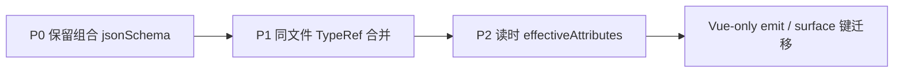

# Class Model 投影改进路线图

> 状态：**已落盘，暂未实施**（2026-06-15）  
> 背景：对 `scope-types.d.ts.json` 与编译链路的深度分析；以及「一次性消除 `.d.ts` 中间层」失败后的复盘。

---

## 1. 现状

### 1.1 编译链路（三阶段）

```text
.ts / .vue (SSOT)
  → 内存 emit → class-model-emit/.../*.d.ts
  → project-from-declarations → files/packages|src/.../*.ts.json
  → manifest / classIndex / semantic-gaps
```

入口：`scripts/generate-dts-class-model.mjs` · 投影核心：`project-from-declarations.ts` · 写盘：`build-dts-class-model-bundle.ts`

### 1.2 Shard 结构

| 字段 | 职责 |
|------|------|
| `module` | 文件级 JSDoc、`sourceFile`（.ts）、`sourcePath`（源码 repo 相对路径，与 manifest 键一致） |
| `models` | 类型级 members + `declarationRelations` |
| `$defs` | 写盘 JSON Schema（compact bundle） |

**设计原则**（见 `project-from-declarations.ts` 注释）：`.d.ts` 保留**直接声明边**（`declarationRelations`）；`attributes` / `methods` 是**语法派生缓存**，允许不完整。

### 1.3 已识别问题（以 `scope-types` / `AiAgentAppendMessageOptions` 为例）

| 编号 | 问题 | 表现 |
|------|------|------|
| **P0** | `typeAlias` 有非空 `attributes` 时丢弃 `model.jsonSchema` | `$defs` 只剩 flat `properties`，丢失 `allOf` |
| **P1** | `typeNodeAttributes` 不解析同文件 `TypeReference` | intersection 左侧命名类型成员未合并进 `members` |
| **P2** | 消费者不沿 `declarationRelations` 走图 | knowledge 等只读直接 members |
| **P3** | manifest 键为 emit 路径，非 SSOT 源路径 | 认知与增量 mtime 映射成本高 |

### 1.4 失败复盘：一次性消除 `.d.ts`

曾尝试将 manifest 键改为 `packages/.../*.ts`、TS 直投影、仅 Vue emit，与 P0–P3 同批改动。

| 冲击 | 数据 |
|------|------|
| 产物 diff | ~703 文件（672 shard 删 + 672 新增） |
| 全量 generate | ~90s emit + ~15s 投影 |
| IDE | 索引/ diff 导致 Cursor 卡顿 |

**结论**：pipeline 迁移与投影语义修复必须拆 PR，禁止同批落地。

---

## 2. 总体原则

1. **SSOT** 始终是 `.ts` / `.vue` 源码；JSDoc 只补源码。
2. **先修投影语义**，晚Eliminate `.d.ts` 中间层。
3. **每步只改一个平面**：投影 / 读时 API / 路径约定 / 生成脚本。
4. **验收优先单测 + targeted compile**；全量 `generate:class-model-surface` 仅作 merge 前门禁。
5. bundle 生成保持 **`exportedOnly: true`**，与 emit 仅含 export API 的行为对齐。

---

## 3. 分阶段方案



### 阶段 A — P0：保留组合型 `jsonSchema`

**目标**：intersection / union 的 `typeAlias` 在 `$defs` 保留 `allOf` / `anyOf` / `oneOf`。

**改动**：`project-from-declarations.ts` → `projectTypeAliasDeclaration` 的 `jsonSchema` 附着条件。

**策略**（须精确，避免副作用）：

- 原：`attributes.length === 0 && methods.length === 0` 才附着。
- 新：上述条件 **或** `objectSchema` 含 `allOf` / `anyOf` / `oneOf` 时附着。
- **禁止**对所有有 attributes 的 typeAlias 一律附着——会破坏纯 type literal 的跨文件 `$ref`（如 `TreeNode.edges: TreeEdge[]` 递归用例）。

**验收**：

- 单测：intersection typeAlias → schema 含 `allOf`。
- 回归：`read-dts-class-model-bundle-json.test.ts` 递归 `$ref` 用例。
- 可选：`pnpm run generate:class-model-surface -- --source packages/spark-ai/src/agent/business/scope-types.ts`，检查 `AiAgentAppendMessageOptions.$defs.allOf`。

**不触碰**：manifest 键、generate 脚本主流程、全量 shard。

---

### 阶段 B — P1：同文件 `TypeReference` 成员合并

**目标**：投影 `typeAlias` 时，intersection 中同文件已注册类型的 members 进入 `members.attributes`。

**改动**：`typeNodeAttributes` / `methodsFromTypeNode` + 从 `context.models[refName]` 读取 members 的 helper。

**边界**：

- 仅同文件、同次投影已 `registerModel` 的类型。
- 跨文件 import 仍靠 `declarationRelations` + bundle `$ref`。
- **class** 的 constructor 参数属性不在 `members.attributes` → `AiAgentRuntimeContext & {...}` 的 class 侧字段仍需 P2 或 P1.5。

**验收**：

- 单测：`RuntimeCtx & Readonly<{ role, content }>` → attributes 含 `moduleId` + `role` + `content`。
- `pnpm exec vitest run packages/spark-ai/src/class-model/tests/` 相关子集。

---

### 阶段 C — P2：读时 `effectiveAttributes`（可选）

**目标**：knowledge / runtime API 读 model 时沿 `declarationRelations` 合并 members；**不改 shard 写盘格式**。

**改动面**：`class-model-knowledge-service.ts` 或 `dts-type-meta-ops.ts`。

**优点**：无 bundle 协议变更、无全量 regenerate。

---

### 阶段 D — 消除 TS 的 `.d.ts` 中间层（远期独立项）

**前置**：A/B（建议含 C）稳定。

**推荐：Vue-only emit**

| 源 | 投影输入 | manifest 键 |
|----|----------|-------------|
| `.ts` / `.tsx` | 源码 AST | `packages/.../foo.ts` |
| `.vue` | 内存 `*.vue.d.ts` | `packages/.../Foo.vue` |

**配套**：manifest 双轨或 major bump、增量 mtime 改 surface 路径、`dtsModuleSourcePathCandidates` 优先 `.ts`、测试 fixture 迁移、专门 regenerate 窗口。

**预估**：~700 文件 diff · 禁止与 P0/P1 同 PR。

---

## 4. 阶段 A+B 完成后对 `scope-types` 的期望

| 维度 | 当前 | A 后 | A+B 后 |
|------|------|------|--------|
| `$defs.allOf` | 丢失 | 保留 | 保留 |
| `members`（AppendMessage） | 仅 literal 侧 | 同左 | + 同文件 **interface** 字段 |
| `AiAgentRuntimeContext`（class） | 不在 members | 同左 | 仍可能缺 constructor 字段 → P2 / P1.5 |

---

## 5. PR 切分建议

| PR | 内容 | 全量 regenerate |
|----|------|-------------------|
| PR-1 | P0 + 单测 + targeted scope-types 说明 | 否 |
| PR-2 | P1 + 单测 | 否 |
| PR-3 | P2（可选） | 否 |
| PR-4 | Vue-only emit + surface manifest | **是**（独立窗口） |

---

## 6. 通用验收清单

1. `pnpm exec vitest run packages/spark-ai/src/class-model/tests/…`
2. `pnpm --filter @spark-appworks/spark-ai run lint && typecheck`
3. 需更新产物时：`generate:class-model-surface -- --source …` 或 `--model …`
4. merge 前：`pnpm run verify:class-model:full`
5. `semantic-gaps.json`：`module` / `model` / `constructor` 缺口必须为 0

---

## 7. 相关文件索引

| 用途 | 路径 |
|------|------|
| AST 投影 | `packages/spark-ai/src/class-model/class-model/project-from-declarations.ts` |
| JSON Schema 映射 | `packages/spark-ai/src/class-model/class-model/class-model-to-json-schema.ts` |
| Bundle 写盘 | `packages/spark-ai/src/class-model/class-model/build-dts-class-model-bundle.ts` |
| 生成脚本 | `scripts/generate-dts-class-model.mjs` |
| 增量 | `scripts/lib/class-model-incremental-build.mjs` |
| emit 路径约定 | `packages/spark-ai/src/class-model/class-model/class-model-emit-path.ts` |
| 示例 shard | `generated/dts-class-model/files/packages/spark-ai/src/agent/business/scope-types.ts.json` |
