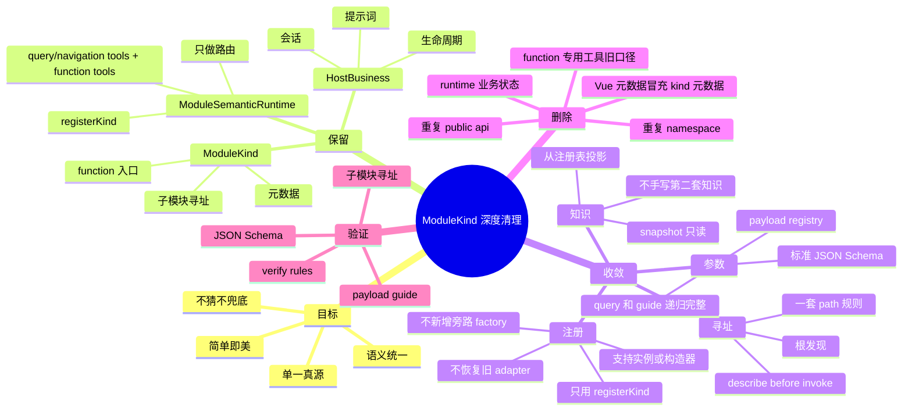

# ModuleKind Registration

> schema: 1 · ver: 1.0.0 · st: active · dt: 2026-05-23

梳理 ModuleKind 从协议声明、运行时注册、Host 业务注册、参数荷载注册到 LLM 可见知识投影的完整注册面。


## Cleanup Mind Map



## Structured Registration

```dm
dm ModuleKindRegistration {
  schema: 1
  ver: "1.0.0"
  st: active
  dt: 2026-05-23
  locale: zh-CN
  owner_package: "@spark-view/spark-ai/module-semantic"
  scope: [
    "packages/spark-ai/src/module-semantic",
    "packages/spark-ai/src/host",
    "packages/spark-page-config/src/ai"
  ]

  purpose:
    "梳理 ModuleKind 从协议声明、运行时注册、Host 业务注册、参数荷载注册到 LLM 可见知识投影的完整注册面。"

  non_goal: [
    "不定义新的 LLM 工具协议",
    "不恢复旧 core/protocol/adapter 注册体系",
    "不把业务 live state 放入 spark-ai runtime 或 Host session",
    "不把 Vue component metadata 等同为 ModuleKind 元数据"
  ]
}

diagram RegistrationFlow {
  BusinessService -> ModuleKind
  ModuleKind -> ModuleSemanticRuntime.registerKind
  ModuleSemanticRuntime -> AiHostBusinessRegistration.runtime
  AiHostBusinessRegistration -> "AiHost.reg / ensureReg"
  AiHost -> AiHostToolLoopRunner
  AiHostToolLoopRunner -> "OpenAI function tools"
  "OpenAI function tools" -> LLM
}

section SourceFiles {
  protocol_core:
    "packages/spark-ai/src/module-semantic/protocol/module-kind.ts"

  protocol_metadata:
    "packages/spark-ai/src/module-semantic/protocol/module-metadata.ts"

  module_registry:
    "packages/spark-ai/src/module-semantic/internal/module-kind-registry.ts"

  runtime_root:
    "packages/spark-ai/src/module-semantic/runtime/module-semantic-runtime.ts"

  navigation_and_describe:
    "packages/spark-ai/src/module-semantic/internal/navigator.ts"

  llm_tool_generation:
    "packages/spark-ai/src/module-semantic/internal/protocol-tool-generator.ts"

  result_projection:
    "packages/spark-ai/src/module-semantic/runtime/protocol-result-projector.ts"

  knowledge_projection:
    "packages/spark-ai/src/module-semantic/knowledge/module-semantic-knowledge.ts"

  parameter_payload_registry:
    "packages/spark-ai/src/module-semantic/payloads/module-parameter-payload-registry.ts"

  host_business_registration:
    "packages/spark-ai/src/host/business/registration-types.ts"

  host_business_registry:
    "packages/spark-ai/src/host/business/business-registry.ts"

  page_design_registration:
    "packages/spark-page-config/src/ai/page-design-module.ts"

  page_design_kind_ids:
    "packages/spark-page-config/src/ai/page-design-kind-ids.ts"

  page_design_payload_catalog:
    "packages/spark-page-config/src/ai/payload-catalog-tool-catalog.ts"

  manual_leave_registration:
    "packages/spark-page-config/src/ai/leave-request.ts"
}

section ProtocolRegistrationSurface {
  entity ModuleKindOptions {
    kind: "必填。全局 ModuleKind 唯一 key。"
    name: "必填。LLM 和 UI 可读名称。"
    description: "必填。LLM 可读模块能力说明。"
    parentKind: "可选。声明父 kind；根 kind 不设置。"
    attributes: "可选。ModuleAttributeMetadata[]，通过 getAttribute/setAttribute 访问。"
    functions: "可选。ModuleFunctionMetadata[]，通过标准 function tool 访问。"
    payloads: "可选。ModuleParameterPayloadMetadata[]，声明本 kind 依赖的参数荷载 provider。"
    children: "可选。允许的子 kind 列表，用于路径导航和子实例发现。"
    runner: "可选。ModuleKindRunner，执行业务 function。"
    list: "可选。ModuleChildrenLister，列出当前实例下子实例。"
    find: "可选。ModuleInstanceFinder，按条件查询实例或子实例。"
  }

  entity ModuleKind {
    owns_metadata: [
      "kind",
      "name",
      "description",
      "parentKind",
      "attributes",
      "functions",
      "payloads",
      "children"
    ]

        owns_runtime_delegates: [
          "functionRunner",
          "childLister",
          "instanceFinder"
        ]

    default_behaviors: [
      "runner 缺失时返回 FUNCTION_NOT_IMPLEMENTED",
      "list 缺失时返回空数组",
      "find 缺失时仅在根级查询自身 kind 时返回当前实例引用",
      "getAttribute/setAttribute 按 attributes 元数据和 JSON Schema 调用独立 attributeAccessor",
      "resolveChild 先 find 精确查询，再 list 全量扫描"
    ]

    normalization_rules: [
      "parentKind 不允许空字符串",
      "parentKind 不允许指向自身",
      "children 不允许空 kind",
      "children 不允许重复 kind",
      "children 不允许指向自身",
      "functions 不允许重复 name",
      "attributes 不允许重复 name",
      "payloads 不允许空 payloadRef",
      "payloads 不允许重复 payloadRef",
      "payloads.description 不允许为空",
      "payloads.requiredForFunctions 不允许空 functionName 或重复 functionName"
    ]
  }

  entity ModuleFunctionMetadata {
    name: "函数名，同一 kind 内唯一。"
    description: "函数语义说明。"
    paramsSchema: "标准 JSON Schema object root。"
    resultSchema: "可选，描述返回值。"
    usageRules: "可选，LLM 调用前必须遵守的规则。"
    failureModes: "可选，稳定错误码、触发条件和修复建议。"
    example: "可选，JSON 兼容示例。"
  }

  entity ModuleAttributeMetadata {
    name: "属性名，同一 kind 内唯一。"
    description: "属性语义说明。"
    schema: "标准 JSON Schema。"
    readable: "是否允许 getAttribute。"
    writable: "是否允许 setAttribute。"
    example: "可选，JSON 兼容示例。"
  }

  entity ModuleParameterPayloadMetadata {
    payloadRef: "参数 provider 命名空间，例如 spark.component。"
    description: "payload 与当前 kind 的关系说明。"
    requiredForFunctions: "可选，需要该参数指南的 function 名列表。"
  }
}

section RuntimeRegistrationSurface {
  entity ModuleKindRegistry {
    visibility: "module-semantic internal"
    storage: "Map<kind, ModuleKind>"
    lifecycle: "启动期注册，运行期只读"

    methods: [
      "register(moduleKind | ModuleKindCtor, ...args): 构造并注册实例，kind 冲突抛 ModuleKindConflictError",
      "get(kind): 未注册返回 undefined",
      "require(kind): 未注册抛 ModuleKindNotFoundError",
      "has(kind): boolean",
      "list(): 按注册顺序返回不可变副本"
    ]
  }

  entity ModuleSemanticRuntime {
    registration_method:
      "registerKind(moduleKind | ModuleKindCtor, ...args)"

    llm_tools:
      "getLlmTools() 生成固定知识/导航工具，并按已注册业务函数派生执行工具。"

    tool_execution:
      "executeTool(toolName, rawArgs, host?) 由 ProtocolToolRouter 分派。"

    direct_programmatic_api: [
      "getAttribute(path, attrName, host?)",
      "setAttribute(path, attrName, value, host?)",
      "invokeFunction(path, functionName, args, host?)",
      "listChildren(path, childKind?, host?)",
      "findInstance(path, childKind, query, host?)",
      "describeKind(kind)"
    ]

    knowledge_api: [
      "projectKnowledge()",
      "queryKnowledgeModules(filter?)",
      "queryKnowledgeFunctions(filter?)",
      "guideKnowledgeFunction(input)"
    ]

    invariant: [
      "ModuleSemanticRuntime 不持有业务 live state",
      "ModuleSemanticRuntime 不依据 function 返回值做下一步业务编排",
      "业务状态只能在业务 service、attributeAccessor 或外部 host 中"
    ]
  }
}

section NavigationAndDiscoverySurface {
  root_discovery {
    listChildren_root:
      "listChildren('/') 只返回 parentKind 未设置的根 kind。"

    findInstance_root:
      "findInstance('/', kind, query) 只允许查询 parentKind 未设置的根 kind；子 kind 必须先定位父实例。"
  }

  path_navigation {
    path_format:
      "/<kind>[<id>]/<childKind>[<childId>]"

    validation_steps: [
      "根路径不能用于 getAttribute/setAttribute/业务函数调用",
      "每个 path segment 的 kind 必须已注册",
      "第一段必须是 parentKind 未设置的根 kind",
      "第二段起必须先匹配 child kind 的 parentKind",
      "parentKind 匹配后再通过父 ModuleKind.resolveChild 验证 child id",
      "尾段 kind 定位为实际执行 getAttribute/setAttribute/标准 function tool 的 ModuleKind"
    ]
  }

  describe_kind {
    source:
      "Navigator.describeKind(kind)"

    output_fields: [
      "kind",
      "name",
      "description",
      "parentKind",
      "attributes",
      "functions",
      "payloads",
      "children"
    ]

    rule:
      "describeKind 不调用业务 runner；只投影注册时的 ModuleKind 元数据。"
  }
}

section LlmVisibleProtocolSurface {
  fixed_tools: [
    "queryModules",
    "queryFunctions",
    "guideFunction",
    "guideHumanQuestion",
    "getAttribute",
    "setAttribute",
    "listChildren",
    "findInstance",
    "describeKind"
  ]

  business_function_tools:
    "按已注册 ModuleKind.functions 动态生成，格式 <kindPath>_<functionName>，如 pageDesign_lifecycle_describeProgress。"

  tool_generation_source:
    "ProtocolToolGenerator 从 ModuleKindRegistry 的注册表摘要生成知识/导航工具和业务函数工具说明。"

  kind_summary_in_tool_description:
    "attrs=[...] functions=[...] payloads=[...] children=[...]"

  function_call_contract {
    function_lookup:
      "标准 function tool 由 ProtocolToolRouter 从 toolName 解析 kindPath + functionName，再用 Navigator 定位尾段 kind，最后调用 ModuleKind.invokeFunction(ctx, functionName, args)。"

    params_validation:
      "FunctionInvoker 使用 function.paramsSchema 通过 LlmSchemaValidator 校验 businessArgs。"

    execution:
      "参数校验通过后调用 tailKind.invokeFunction(ctx, functionName, businessArgs)。"
  }

  projection_rule:
    "ProtocolResultProjector 将 ModuleOperationResult<T> 投影为 LlmJsonValue，describeKind 会保留 payloads。"
}

section HostBusinessRegistrationSurface {
  entity AiHostBusinessRegistration {
    moduleId: "业务注册 ID，不一定等于 ModuleKind.kind，但 pageDesign 当前相等。"
    name: "业务名称。"
    description: "业务描述。"
    runtime: "承载该业务的 ModuleSemanticRuntime。"
    sessionStore: "可选；未提供时由 AiHost 内部注册表补 DefaultAiHostSessionStore。"
    systemPrompt: "可选；Host 每轮拼接业务提示词。"
    afterFunctionCall: "可选；工具调用后生命周期指令。"
    onStartSession: "可选；会话启动回调。"
    onEndBusinessInstance: "可选；业务实例结束回调。"
    releaseModuleInstance: "可选；释放业务 live state。"
  }

  entity AiHostInternalBusinessRegistry {
    storage: "Map<moduleId, AiHostBusinessRegistration>"
    register_rule: "moduleId 重复直接抛错。"
    default_session_rule: "registration.sessionStore 缺失时注入 DefaultAiHostSessionStore。"
  }

  business_scope_mapping {
    AiHostBusinessRuntimeContext.moduleId:
      "对应 AiHostBusinessRegistration.moduleId。"

    AiHostBusinessRuntimeContext.moduleInstanceId:
      "业务实例 ID；pageDesign 中是 pageId，manualLeave 中是 leaveDraftId。"

    AiHostBusinessRuntimeContext.instanceId:
      "顶层业务实例 ID；后端 sessionId 由 kind + instanceId 派生。"
  }
}

section ParameterPayloadRegistrationSurface {
  entity ModuleParameterPayloadRegistry {
    storage:
      "Map<moduleKind + payloadRef, ModuleParameterPayloadProvider>"

    methods: [
      "register(provider): moduleKind/payloadRef 重复抛错",
      "requireProvider(moduleKind, payloadRef): 未注册抛错",
      "queryPayloads(filter?)",
      "guidePayload(moduleKind, payloadRef, key)"
    ]

    fail_fast_rules: [
      "moduleKind 为空时报错",
      "payloadRef 为空时报错",
      "指定 moduleKind/payloadRef 未注册时报错",
      "指定 moduleKind 没有任何 provider 时报错",
      "指定 payloadRef 没有任何 provider 时报错"
    ]
  }

  entity ModuleParameterPayloadProvider {
    moduleKind: "绑定的 ModuleKind.kind。"
    payloadRef: "provider 命名空间。"
    description: "provider 能力说明。"
    queryPayloads: "按过滤条件返回 ModuleParameterPayloadSummary[]。"
    guidePayload: "按 key 返回 ModuleParameterPayloadGuide；未知 key 返回 null。"
  }

  relation PayloadMetadataToProvider {
    from:
      "ModuleKind.payloads[].payloadRef"
    to:
      "ModuleParameterPayloadRegistry provider.payloadRef"

    rule:
      "payload metadata 声明模块需要什么参数目录；payload registry 注册可查询和可指南化的实际 provider。两者必须语义一致。"
  }

  current_provider pageDesign_nodeTree_sparkComponent {
    moduleKind: "node-tree"
    payloadRef: "spark.component"
    registry_factory:
      "createPageDesignPayloadRegistry"
    provider_scope:
      "component provider 是 registry 内部实现，不作为 page-config/ai 公共导出。"
    routed_by:
      "PageDesignPayloadCatalogModuleKind"
    source_catalog:
      "packages/spark-page-config/src/ai/payloads/component-catalog.json"
    purpose:
      "SparkNode 组件 props 参数目录；服务 node-tree 的 addNode/addNodes/replaceNode/replaceNodes/setProps/setPropsBatch。"
  }
}

section CurrentBusinessRegistrationInventory {
  business pageDesign {
    moduleId: "pageDesign"
    registration_factory:
      "createPageDesignBusinessRegistration"
    runtime:
      "new ModuleSemanticRuntime()"
    session_store:
      "DefaultAiHostSessionStore"
    system_prompt:
      "createPageDesignSystemPrompt"
    release:
      "PageDesignService.releasePage(moduleInstanceId)"

    kinds: [
      {
        kind: "pageDesign"
        name: "Page Design"
        parentKind: null
        functions: 0
        payloads: []
        children: ["lifecycle", "text-model", "payload-catalog", "node-tree", "dataset"]
      },
      {
        kind: "lifecycle"
        name: "Page Design Lifecycle"
        parentKind: "pageDesign"
        functions: 3
        payloads: []
        children: []
      },
      {
        kind: "text-model"
        name: "Page Design Text Model"
        parentKind: "pageDesign"
        functions: 4
        payloads: []
        children: []
      },
      {
        kind: "payload-catalog"
        name: "Page Design Payload Catalog"
        parentKind: "pageDesign"
        functions: 2
        function_names: ["queryPayloads", "guidePayload"]
        payloads: []
        children: []
      },
      {
        kind: "node-tree"
        name: "Page Design Node Tree"
        parentKind: "pageDesign"
        functions: 19
        payloads: [
          {
            payloadRef: "spark.component"
            requiredForFunctions: ["addNode", "addNodes", "replaceNode", "replaceNodes", "setProps", "setPropsBatch"]
          }
        ]
        children: []
      },
      {
        kind: "dataset"
        name: "Page Design DataSet"
        parentKind: "pageDesign"
        functions: 50
        payloads: []
        children: []
      }
    ]

    discovery_path:
      "listChildren('/') -> findInstance('/', 'pageDesign', {}) -> listChildren('/pageDesign[pageId]') -> findInstance('/pageDesign[pageId]', childKind, {}) -> describeKind(childKind) -> pageDesign_<childKind>_<functionName>({ $paths: [pageId, childId], ...args })"
  }

  business manualLeave {
    moduleId: "manualLeave"
    registration_factory:
      "createLeaveRequestBusinessRegistration"
    runtime:
      "new ModuleSemanticRuntime()"
    session_store:
      "DefaultAiHostSessionStore"
    system_prompt:
      "createLeaveRequestSystemPrompt(currentDate)"
    release:
      "LeaveRequestService.releaseDraft(moduleInstanceId)"

    kinds: [
      {
        kind: "manual-leave"
        name: "人工请假"
        parentKind: null
        functions: 4
        function_names: ["describeDraft", "setDraftFields", "submitDraft", "cancelDraft"]
        payloads: []
        children: []
      }
    ]

    discovery_path:
      "listChildren('/') -> findInstance('/', 'manual-leave', {}) -> describeKind('manual-leave') -> manual-leave_<functionName>({ $paths: [leaveDraftId], ...args })"
  }
}

section KnowledgeProjectionSurface {
  projector:
    "ModuleSemanticKnowledgeProjector"

  module_summary_fields: [
    "kind",
    "name",
    "description",
    "parentKind",
    "attributeCount",
    "functionCount",
    "payloadCount",
    "payloadRefs",
    "childKindCount",
    "children"
  ]

  function_summary_fields: [
    "toolName",
    "kind",
    "functionName",
    "description",
    "paramNames",
    "requiredParamNames",
    "failureCodes",
    "usageRuleCount",
    "failureModeCount"
  ]

  function_guide_fields: [
    "functionName",
    "description",
    "paramsSchema",
    "resultSchema",
    "usageRules",
    "failureModes",
    "example"
  ]

  prompt_snapshot_rules: [
    "不使用审阅型大标题，只保留工具、Kind、流程短标签",
    "每轮只给根 kind 索引，不内嵌完整函数目录",
    "函数、属性和复杂参数按 queryModules/queryFunctions/guideFunction/describeKind/payloadLookupSteps 查询",
    "模块行按需标记 payload=payloadLookupSteps"
  ]
}

section RegisterSurfaceRules {
  rule R01_single_runtime_registration:
    "运行时只允许通过 ModuleSemanticRuntime.registerKind 注册 ModuleKind。"

  rule R02_no_duplicate_kind:
    "同一 ModuleSemanticRuntime 内 kind 不允许重复。"

  rule R03_no_duplicate_business_module:
    "同一 AiHost 内 moduleId 不允许重复。"

  rule R04_root_visibility:
    "listChildren('/') 和 findInstance('/', kind, query) 只暴露/查询 parentKind 未设置的根 kind。"

  rule R05_child_topology:
    "非根 findInstance(path, childKind, query) 的 childKind 必须在尾段 kind.children 中声明，且目标 kind.parentKind 必须匹配尾段 kind。"

  rule R06_path_validation:
    "路径第一段必须是根 kind；第二段起必须通过 parentKind 匹配和父 ModuleKind.resolveChild 验证存在性。"

  rule R07_describe_before_invoke:
    "LLM 调用业务 function 前必须先通过 guideFunction 或 describeKind 获得 paramsSchema；缺少用户事实时先 guideHumanQuestion。"

  rule R08_standard_json_schema:
    "function.paramsSchema 和 payload guide paramsSchema 必须是标准 JSON Schema object root。"

  rule R09_payload_binding:
    "复杂参数目录必须通过 ModuleKind.payloads 声明归属；声明 payloads 时必须注册带 queryPayloads/guidePayload 函数的 payload catalog ModuleKind。"

  rule R10_payload_provider_fail_fast:
    "未知 moduleKind/payloadRef 或缺失 payload catalog 不允许静默回退到默认 provider 或想象中的工具名。"

  rule R11_business_state_ownership:
    "业务 live state 归业务 service 或 host，不归 ModuleSemanticRuntime。"

  rule R12_no_business_import_in_spark_ai:
    "spark-ai 不导入 spark-page-config 或其他业务包。"

  rule R13_no_old_protocol_recovery:
    "不得恢复旧 core/protocol 公共 subpath 或旧 adapter 注册层。"

  rule R14_vcm_target:
    "手写 ModuleKind class 是迁移期形态；目标由 VCM 从领域能力 class 生成 ModuleKind constructor 或 factory，再调用同一个 registerKind。"
}

section ValidationMatrix {
  static_checks: [
    "ModuleKind constructor normalization tests",
    "ModuleParameterPayloadRegistry duplicate and missing provider tests",
    "describeKind payloads projection tests",
    "knowledge prompt snapshot payload refs tests",
    "pageDesign child module addressing tests",
    "payload-catalog queryPayloads / guidePayload tests",
    "component metadata standard JSON Schema tests"
  ]

  commands: [
    "pnpm run typecheck",
    "pnpm run lint",
    "pnpm run test:run",
    "pnpm run build"
  ]

  current_verified_baseline {
    verified_dt: "2026-05-23"
    typecheck: "PASS"
    lint: "PASS"
    test_run: "119 files / 1054 tests PASS"
    build: "PASS; component metadata uploaded; componentCount=106"
  }
}

section ChangeChecklist {
  when_adding_new_business {
    steps: [
      "创建业务 service 并明确 live state 生命周期",
      "创建 ModuleSemanticRuntime",
      "创建一个或多个 ModuleKind",
      "为根 kind 保持 parentKind 未设置",
      "为子 kind 设置 parentKind 并在父 kind.children 中声明",
      "为每个 function 提供标准 paramsSchema",
      "如 function 需要外部复杂参数指南，在目标 kind.payloads 声明 payloadRef",
      "如声明 payloadRef，注册对应 ModuleParameterPayloadProvider",
      "用 AiHostBusinessRegistration 包装 runtime",
      "通过 host.ensureReg(alias, { moduleId, create }) 注册业务入口",
      "补 describeKind、路径寻址、function 调用和 payload provider 测试"
    ]
  }

  when_adding_new_payload_provider {
    steps: [
      "选择真实归属 ModuleKind.kind",
      "选择稳定 payloadRef",
      "在目标 ModuleKind.payloads 中声明 payloadRef、description、requiredForFunctions",
      "实现 ModuleParameterPayloadProvider",
      "注册到 ModuleParameterPayloadRegistry",
      "通过 payload-catalog 或业务 function 暴露 query/guide 路由",
      "测试 queryPayloads 摘要字段",
      "测试 guidePayload paramsSchema 是标准 JSON Schema",
      "测试未知 provider 和未知 key 的 fail-fast 行为"
    ]
  }
}
```
