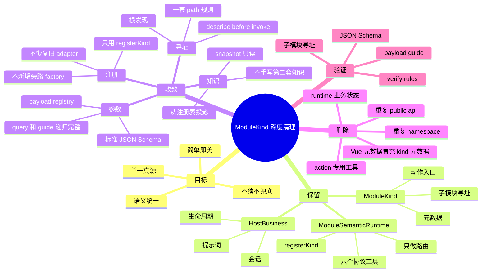

# ModuleKind Registration

> schema: 1 · ver: 1.0.0 · st: active · dt: 2026-05-23

梳理 ModuleKind 从协议声明、运行时注册、Host 业务注册、参数荷载注册到 LLM 可见知识投影的完整注册面。

```mermaid
flowchart LR
  BusinessService["BusinessService"] --> ModuleKind["ModuleKind"]
  ModuleKind --> RegisterKind["ModuleSemanticRuntime.registerKind"]
  RegisterKind --> BusinessRuntime["AiHostBusinessRegistration.runtime"]
  BusinessRuntime --> BusinessRegistry["AiHostBusinessRegistry.register"]
  BusinessRegistry --> ToolLoop["AiHostToolLoopRunner"]
  ToolLoop --> ProtocolTools["6 protocol tools"]
  ProtocolTools --> LLM["LLM"]
```



## Cleanup Mind Map



## Structured Registration

```dm
dm ModuleKindRegistration {
  schema: 1
  ver: "1.0.0"
  st: active
  dt: 2026-05-23
  locale: zh-CN
  owner_package: "@spark-view/spark-ai/module-semantic"
  scope: [
    "packages/spark-ai/src/module-semantic",
    "packages/spark-ai/src/host",
    "packages/spark-page-config/src/ai"
  ]

  purpose:
    "梳理 ModuleKind 从协议声明、运行时注册、Host 业务注册、参数荷载注册到 LLM 可见知识投影的完整注册面。"

  non_goal: [
    "不定义新的 LLM 工具协议",
    "不恢复旧 core/protocol/adapter 注册体系",
    "不把业务 live state 放入 spark-ai runtime 或 Host session",
    "不把 Vue component metadata 等同为 ModuleKind 元数据"
  ]
}

diagram RegistrationFlow {
  BusinessService -> ModuleKind
  ModuleKind -> ModuleSemanticRuntime.registerKind
  ModuleSemanticRuntime -> AiHostBusinessRegistration.runtime
  AiHostBusinessRegistration -> AiHostBusinessRegistry.register
  AiHostBusinessRegistry -> AiHostToolLoopRunner
  AiHostToolLoopRunner -> "6 protocol tools"
  "6 protocol tools" -> LLM
}

section SourceFiles {
  protocol_core:
    "packages/spark-ai/src/module-semantic/protocol/module-kind.ts"

  protocol_metadata_api:
    "packages/spark-ai/src/module-semantic/protocol-metadata-api.ts"

  module_registry:
    "packages/spark-ai/src/module-semantic/internal/module-kind-registry.ts"

  runtime_root:
    "packages/spark-ai/src/module-semantic/runtime/module-semantic-runtime.ts"

  navigation_and_describe:
    "packages/spark-ai/src/module-semantic/internal/navigator.ts"

  llm_tool_generation:
    "packages/spark-ai/src/module-semantic/internal/protocol-tool-generator.ts"

  result_projection:
    "packages/spark-ai/src/module-semantic/runtime/protocol-result-projector.ts"

  knowledge_projection:
    "packages/spark-ai/src/module-semantic/knowledge/module-semantic-knowledge.ts"

  parameter_payload_registry:
    "packages/spark-ai/src/module-semantic/payloads/module-parameter-payload-registry.ts"

  host_business_registration:
    "packages/spark-ai/src/host/business/registration-types.ts"

  host_business_registry:
    "packages/spark-ai/src/host/business/business-registry.ts"

  page_design_registration:
    "packages/spark-page-config/src/ai/page-design-module.ts"

  page_design_kind_ids:
    "packages/spark-page-config/src/ai/page-design-kind-ids.ts"

  page_design_payload_catalog:
    "packages/spark-page-config/src/ai/payload-catalog-tool-catalog.ts"

  manual_leave_registration:
    "packages/spark-page-config/src/ai/leave-request.ts"
}

section ProtocolRegistrationSurface {
  entity ModuleKindOptions {
    kind: "必填。全局 ModuleKind 唯一 key。"
    name: "必填。LLM 和 UI 可读名称。"
    description: "必填。LLM 可读模块能力说明。"
    parentKind: "可选。声明父 kind；根 kind 不设置。"
    attributes: "可选。ModuleAttributeMetadata[]，通过 getAttribute/setAttribute 访问。"
    actions: "可选。ModuleActionMetadata[]，通过 invokeAction 访问。"
    payloads: "可选。ModuleParameterPayloadMetadata[]，声明本 kind 依赖的参数荷载 provider。"
    children: "可选。允许的子 kind 列表，用于路径导航和子实例发现。"
    runner: "可选。ModuleKindRunner，执行业务动作。"
    list: "可选。ModuleChildrenLister，列出当前实例下子实例。"
    find: "可选。ModuleInstanceFinder，按条件查询实例或子实例。"
  }

  entity ModuleKind {
    owns_metadata: [
      "kind",
      "name",
      "description",
      "parentKind",
      "attributes",
      "actions",
      "payloads",
      "children"
    ]

        owns_runtime_delegates: [
          "actionRunner",
          "childLister",
          "instanceFinder"
        ]

    default_behaviors: [
      "runner 缺失时返回 ACTION_NOT_IMPLEMENTED",
      "list 缺失时返回空数组",
      "find 缺失时仅在根级查询自身 kind 时返回当前实例引用",
      "getAttribute/setAttribute 按 attributes 元数据和 JSON Schema 调用独立 attributeAccessor",
      "resolveChild 先 find 精确查询，再 list 全量扫描"
    ]

    normalization_rules: [
      "parentKind 不允许空字符串",
      "parentKind 不允许指向自身",
      "children 不允许空 kind",
      "children 不允许重复 kind",
      "children 不允许指向自身",
      "actions 不允许重复 name",
      "attributes 不允许重复 name",
      "payloads 不允许空 payloadRef",
      "payloads 不允许重复 payloadRef",
      "payloads.description 不允许为空",
      "payloads.requiredForActions 不允许空 actionName 或重复 actionName"
    ]
  }

  entity ModuleActionMetadata {
    name: "动作名，同一 kind 内唯一。"
    description: "动作语义说明。"
    paramsSchema: "标准 JSON Schema object root。"
    resultSchema: "可选，描述返回值。"
    usageRules: "可选，LLM 调用前必须遵守的规则。"
    failureModes: "可选，稳定错误码、触发条件和修复建议。"
    example: "可选，JSON 兼容示例。"
  }

  entity ModuleAttributeMetadata {
    name: "属性名，同一 kind 内唯一。"
    description: "属性语义说明。"
    schema: "标准 JSON Schema。"
    readable: "是否允许 getAttribute。"
    writable: "是否允许 setAttribute。"
    example: "可选，JSON 兼容示例。"
  }

  entity ModuleParameterPayloadMetadata {
    payloadRef: "参数 provider 命名空间，例如 spark.component。"
    description: "payload 与当前 kind 的关系说明。"
    requiredForActions: "可选，通常需要该参数指南的 action 名列表。"
  }
}

section RuntimeRegistrationSurface {
  entity ModuleKindRegistry {
    visibility: "module-semantic internal"
    storage: "Map<kind, ModuleKind>"
    lifecycle: "启动期注册，运行期只读"

    methods: [
      "register(moduleKind): kind 冲突抛 ModuleKindConflictError",
      "get(kind): 未注册返回 undefined",
      "require(kind): 未注册抛 ModuleKindNotFoundError",
      "has(kind): boolean",
      "list(): 按注册顺序返回不可变副本"
    ]
  }

  entity ModuleSemanticRuntime {
    registration_method:
      "registerKind(moduleKind)"

    llm_tools:
      "getLlmTools() 固定生成 6 个协议工具，不随业务 action 数量增加。"

    tool_execution:
      "executeTool(toolName, rawArgs, host?) 由 ProtocolToolRouter 分派。"

    direct_programmatic_api: [
      "getAttribute(path, attrName, host?)",
      "setAttribute(path, attrName, value, host?)",
      "invokeAction(path, actionName, args, host?)",
      "listChildren(path, childKind?, host?)",
      "findInstance(path, childKind, query, host?)",
      "describeKind(kind)"
    ]

    knowledge_api: [
      "projectKnowledge()",
      "queryKnowledgeModules()",
      "queryKnowledgeFunctions(filter?)",
      "guideKnowledgeFunction(input)"
    ]

    invariant: [
      "ModuleSemanticRuntime 不持有业务 live state",
      "ModuleSemanticRuntime 不依据 action 返回值做下一步业务编排",
      "业务状态只能在业务 service、attributeAccessor 或外部 host 中"
    ]
  }
}

section NavigationAndDiscoverySurface {
  root_discovery {
    listChildren_root:
      "listChildren('/') 只返回 parentKind 未设置的根 kind。"

    findInstance_root:
      "findInstance('/', kind, query) 使用目标 kind 的 find 委托查询根级实例。"
  }

  path_navigation {
    path_format:
      "/<kind>[<id>]/<childKind>[<childId>]"

    validation_steps: [
      "根路径不能用于 getAttribute/setAttribute/invokeAction",
      "每个 path segment 的 kind 必须已注册",
      "第一段不验证父子关系",
      "第二段起通过父 ModuleKind.resolveChild 验证 child kind 和 child id",
      "尾段 kind 定位为实际执行 getAttribute/setAttribute/invokeAction 的 ModuleKind"
    ]
  }

  describe_kind {
    source:
      "Navigator.describeKind(kind)"

    output_fields: [
      "kind",
      "name",
      "description",
      "parentKind",
      "attributes",
      "actions",
      "payloads",
      "children"
    ]

    rule:
      "describeKind 不调用业务 runner；只投影注册时的 ModuleKind 元数据。"
  }
}

section LlmVisibleProtocolSurface {
  fixed_tools: [
    "getAttribute",
    "setAttribute",
    "invokeAction",
    "listChildren",
    "findInstance",
    "describeKind"
  ]

  tool_generation_source:
    "ProtocolToolGenerator 从 ModuleKindRegistry 的注册表摘要生成固定工具说明。"

  kind_summary_in_tool_description:
    "attrs=[...] actions=[...] payloads=[...] children=[...]"

  action_call_contract {
    action_lookup:
      "invokeAction 先由 Navigator 定位尾段 kind，再用 tailKind.findAction(actionName) 检查声明。"

    params_validation:
      "ActionInvoker 使用 action.paramsSchema 通过 LlmSchemaValidator 校验 args。"

    execution:
      "参数校验通过后调用 tailKind.invokeAction(ctx, actionName, args)。"
  }

  projection_rule:
    "ProtocolResultProjector 将 ModuleOperationResult<T> 投影为 LlmJsonValue，describeKind 会保留 payloads。"
}

section HostBusinessRegistrationSurface {
  entity AiHostBusinessRegistration {
    moduleId: "业务注册 ID，不一定等于 ModuleKind.kind，但 pageDesign 当前相等。"
    name: "业务名称。"
    description: "业务描述。"
    runtime: "承载该业务的 ModuleSemanticRuntime。"
    sessionStore: "可选；未提供时由 AiHostBusinessRegistry 补 DefaultAiHostSessionStore。"
    systemPrompt: "可选；Host 每轮拼接业务提示词。"
    afterFunctionCall: "可选；工具调用后生命周期指令。"
    onStartSession: "可选；会话启动回调。"
    onEndBusinessInstance: "可选；业务实例结束回调。"
    releaseModuleInstance: "可选；释放业务 live state。"
  }

  entity AiHostBusinessRegistry {
    storage: "Map<moduleId, AiHostBusinessRegistration>"
    register_rule: "moduleId 重复直接抛错。"
    default_session_rule: "registration.sessionStore 缺失时注入 DefaultAiHostSessionStore。"
  }

  business_scope_mapping {
    AiHostBusinessRuntimeContext.moduleId:
      "对应 AiHostBusinessRegistration.moduleId。"

    AiHostBusinessRuntimeContext.moduleInstanceId:
      "业务实例 ID；pageDesign 中是 pageId，manualLeave 中是 leaveDraftId。"

    AiHostBusinessRuntimeContext.instanceId:
      "顶层业务实例 ID；后端 sessionId 由 kind + instanceId 派生。"
  }
}

section ParameterPayloadRegistrationSurface {
  entity ModuleParameterPayloadRegistry {
    storage:
      "Map<moduleKind + payloadRef, ModuleParameterPayloadProvider>"

    methods: [
      "register(provider): moduleKind/payloadRef 重复抛错",
      "getProvider(moduleKind, payloadRef)",
      "requireProvider(moduleKind, payloadRef): 未注册抛错",
      "listProviders(filter?)",
      "queryPayloads(filter?)",
      "guidePayload(moduleKind, payloadRef, key)"
    ]

    fail_fast_rules: [
      "moduleKind 为空时报错",
      "payloadRef 为空时报错",
      "指定 moduleKind/payloadRef 未注册时报错",
      "指定 moduleKind 没有任何 provider 时报错",
      "指定 payloadRef 没有任何 provider 时报错"
    ]
  }

  entity ModuleParameterPayloadProvider {
    moduleKind: "绑定的 ModuleKind.kind。"
    payloadRef: "provider 命名空间。"
    description: "provider 能力说明。"
    queryPayloads: "按过滤条件返回 ModuleParameterPayloadSummary[]。"
    guidePayload: "按 key 返回 ModuleParameterPayloadGuide；未知 key 返回 null。"
  }

  relation PayloadMetadataToProvider {
    from:
      "ModuleKind.payloads[].payloadRef"
    to:
      "ModuleParameterPayloadRegistry provider.payloadRef"

    rule:
      "payload metadata 声明模块需要什么参数目录；payload registry 注册可查询和可指南化的实际 provider。两者必须语义一致。"
  }

  current_provider pageDesign_nodeTree_sparkComponent {
    moduleKind: "node-tree"
    payloadRef: "spark.component"
    registry_factory:
      "createPageDesignPayloadRegistry"
    provider_scope:
      "component provider 是 registry 内部实现，不作为 page-config/ai 公共导出。"
    routed_by:
      "PageDesignPayloadCatalogModuleKind"
    source_catalog:
      "packages/spark-page-config/src/ai/payloads/component-catalog.json"
    purpose:
      "SparkNode 组件 props 参数目录；服务 node-tree 的 addNode/addNodes/replaceNode/replaceNodes/setProps/setPropsBatch。"
  }
}

section CurrentBusinessRegistrationInventory {
  business pageDesign {
    moduleId: "pageDesign"
    registration_factory:
      "createPageDesignBusinessRegistration"
    runtime:
      "new ModuleSemanticRuntime()"
    session_store:
      "DefaultAiHostSessionStore"
    system_prompt:
      "createPageDesignSystemPrompt"
    release:
      "PageDesignService.releasePage(moduleInstanceId)"

    kinds: [
      {
        kind: "pageDesign"
        name: "Page Design"
        parentKind: null
        actions: 0
        payloads: []
        children: ["lifecycle", "text-model", "payload-catalog", "node-tree", "dataset"]
      },
      {
        kind: "lifecycle"
        name: "Page Design Lifecycle"
        parentKind: "pageDesign"
        actions: 3
        payloads: []
        children: []
      },
      {
        kind: "text-model"
        name: "Page Design Text Model"
        parentKind: "pageDesign"
        actions: 4
        payloads: []
        children: []
      },
      {
        kind: "payload-catalog"
        name: "Page Design Payload Catalog"
        parentKind: "pageDesign"
        actions: 2
        action_names: ["queryPayloads", "guidePayload"]
        payloads: []
        children: []
      },
      {
        kind: "node-tree"
        name: "Page Design Node Tree"
        parentKind: "pageDesign"
        actions: 19
        payloads: [
          {
            payloadRef: "spark.component"
            requiredForActions: ["addNode", "addNodes", "replaceNode", "replaceNodes", "setProps", "setPropsBatch"]
          }
        ]
        children: []
      },
      {
        kind: "dataset"
        name: "Page Design DataSet"
        parentKind: "pageDesign"
        actions: 50
        payloads: []
        children: []
      }
    ]

    discovery_path:
      "listChildren('/') -> findInstance('/', 'pageDesign', {}) -> listChildren('/pageDesign[pageId]') -> describeKind(childKind) -> invokeAction('/pageDesign[pageId]/childKind[pageId]', actionName, args)"
  }

  business manualLeave {
    moduleId: "manualLeave"
    registration_factory:
      "createLeaveRequestBusinessRegistration"
    runtime:
      "new ModuleSemanticRuntime()"
    session_store:
      "DefaultAiHostSessionStore"
    system_prompt:
      "createLeaveRequestSystemPrompt(currentDate)"
    release:
      "LeaveRequestService.releaseDraft(moduleInstanceId)"

    kinds: [
      {
        kind: "manual-leave"
        name: "人工请假"
        parentKind: null
        actions: 4
        action_names: ["describeDraft", "setDraftFields", "submitDraft", "cancelDraft"]
        payloads: []
        children: []
      }
    ]

    discovery_path:
      "listChildren('/') -> findInstance('/', 'manual-leave', {}) -> describeKind('manual-leave') -> invokeAction('/manual-leave[leaveDraftId]', actionName, args)"
  }
}

section KnowledgeProjectionSurface {
  projector:
    "ModuleSemanticKnowledgeProjector"

  module_summary_fields: [
    "kind",
    "name",
    "description",
    "parentKind",
    "attributeCount",
    "actionCount",
    "payloadCount",
    "payloadRefs",
    "childKindCount",
    "children"
  ]

  function_summary_fields: [
    "action",
    "kind",
    "actionName",
    "description",
    "paramNames",
    "requiredParamNames",
    "failureCodes",
    "usageRuleCount",
    "failureModeCount"
  ]

  function_guide_fields: [
    "action",
    "kind",
    "actionName",
    "description",
    "paramsSchema",
    "resultSchema",
    "usageRules",
    "failureModes",
    "example"
  ]

  prompt_snapshot_rules: [
    "必须包含 AI Knowledge Snapshot 标题",
    "必须强调不假设、不猜测、不脑补 kind/path/actionName/args",
    "必须列出发现流程",
    "模块行必须包含 payloads=[...]"
  ]
}

section RegisterSurfaceRules {
  rule R01_single_runtime_registration:
    "运行时只允许通过 ModuleSemanticRuntime.registerKind 注册 ModuleKind。"

  rule R02_no_duplicate_kind:
    "同一 ModuleSemanticRuntime 内 kind 不允许重复。"

  rule R03_no_duplicate_business_module:
    "同一 AiHostBusinessRegistry 内 moduleId 不允许重复。"

  rule R04_root_visibility:
    "listChildren('/') 只暴露 parentKind 未设置的根 kind。"

  rule R05_child_topology:
    "非根 findInstance(path, childKind, query) 的 childKind 必须在尾段 kind.children 中声明。"

  rule R06_path_validation:
    "第二段起必须通过父 ModuleKind.resolveChild 验证存在性。"

  rule R07_describe_before_invoke:
    "LLM 调用业务 action 前必须先通过 describeKind 或 knowledge guide 获得 paramsSchema。"

  rule R08_standard_json_schema:
    "action.paramsSchema 和 payload guide paramsSchema 必须是标准 JSON Schema object root。"

  rule R09_payload_binding:
    "复杂参数目录必须通过 ModuleKind.payloads 声明归属，并通过 ModuleParameterPayloadRegistry 注册 provider。"

  rule R10_payload_provider_fail_fast:
    "未知 moduleKind/payloadRef 不允许静默回退到默认 provider。"

  rule R11_business_state_ownership:
    "业务 live state 归业务 service 或 host，不归 ModuleSemanticRuntime。"

  rule R12_no_business_import_in_spark_ai:
    "spark-ai 不导入 spark-page-config 或其他业务包。"

  rule R13_no_old_protocol_recovery:
    "不得恢复旧 core/protocol 公共 subpath 或旧 adapter 注册层。"

  rule R14_vcm_target:
    "手写 ModuleKind class 是迁移期形态；目标由 VCM 从领域能力 class 生成 ModuleKind factory，再调用 registerKind。"
}

section ValidationMatrix {
  static_checks: [
    "ModuleKind constructor normalization tests",
    "ModuleParameterPayloadRegistry duplicate and missing provider tests",
    "describeKind payloads projection tests",
    "knowledge prompt snapshot payload refs tests",
    "pageDesign child module addressing tests",
    "payload-catalog queryPayloads / guidePayload tests",
    "component metadata standard JSON Schema tests"
  ]

  commands: [
    "pnpm run typecheck",
    "pnpm run lint",
    "pnpm run test:run",
    "pnpm run build"
  ]

  current_verified_baseline {
    verified_dt: "2026-05-23"
    typecheck: "PASS"
    lint: "PASS"
    test_run: "119 files / 1054 tests PASS"
    build: "PASS; component metadata uploaded; componentCount=106"
  }
}

section ChangeChecklist {
  when_adding_new_business {
    steps: [
      "创建业务 service 并明确 live state 生命周期",
      "创建 ModuleSemanticRuntime",
      "创建一个或多个 ModuleKind",
      "为根 kind 保持 parentKind 未设置",
      "为子 kind 设置 parentKind 并在父 kind.children 中声明",
      "为每个 action 提供标准 paramsSchema",
      "如 action 需要外部复杂参数指南，在目标 kind.payloads 声明 payloadRef",
      "如声明 payloadRef，注册对应 ModuleParameterPayloadProvider",
      "用 AiHostBusinessRegistration 包装 runtime",
      "通过 AiHostBusinessRegistry.register 注册业务",
      "补 describeKind、路径寻址、action 调用和 payload provider 测试"
    ]
  }

  when_adding_new_payload_provider {
    steps: [
      "选择真实归属 ModuleKind.kind",
      "选择稳定 payloadRef",
      "在目标 ModuleKind.payloads 中声明 payloadRef、description、requiredForActions",
      "实现 ModuleParameterPayloadProvider",
      "注册到 ModuleParameterPayloadRegistry",
      "通过 payload-catalog 或业务 action 暴露 query/guide 路由",
      "测试 queryPayloads 摘要字段",
      "测试 guidePayload paramsSchema 是标准 JSON Schema",
      "测试未知 provider 和未知 key 的 fail-fast 行为"
    ]
  }
}
```
