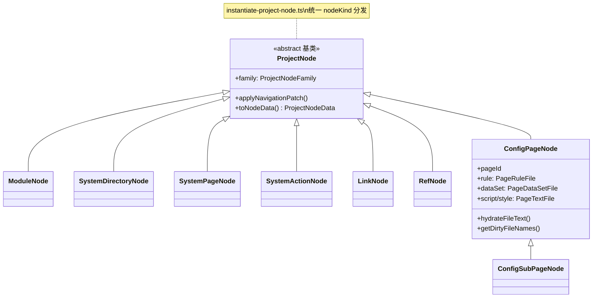
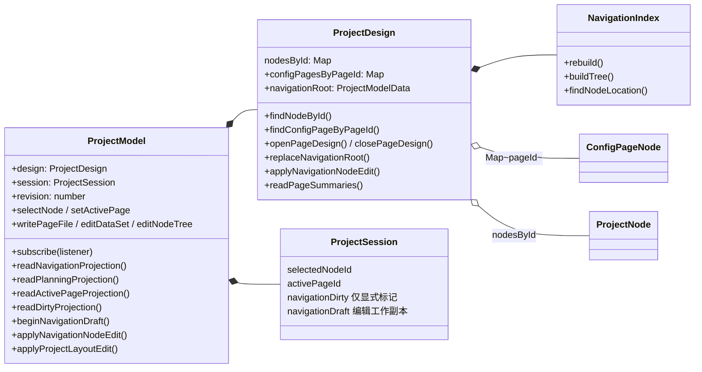
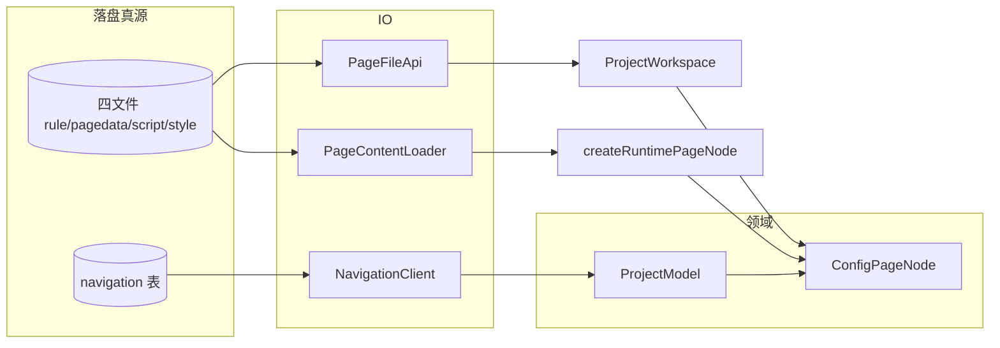
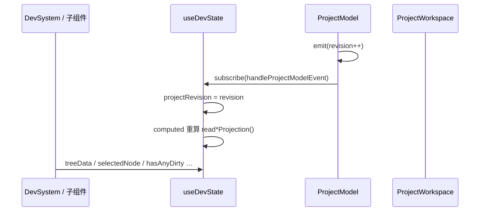
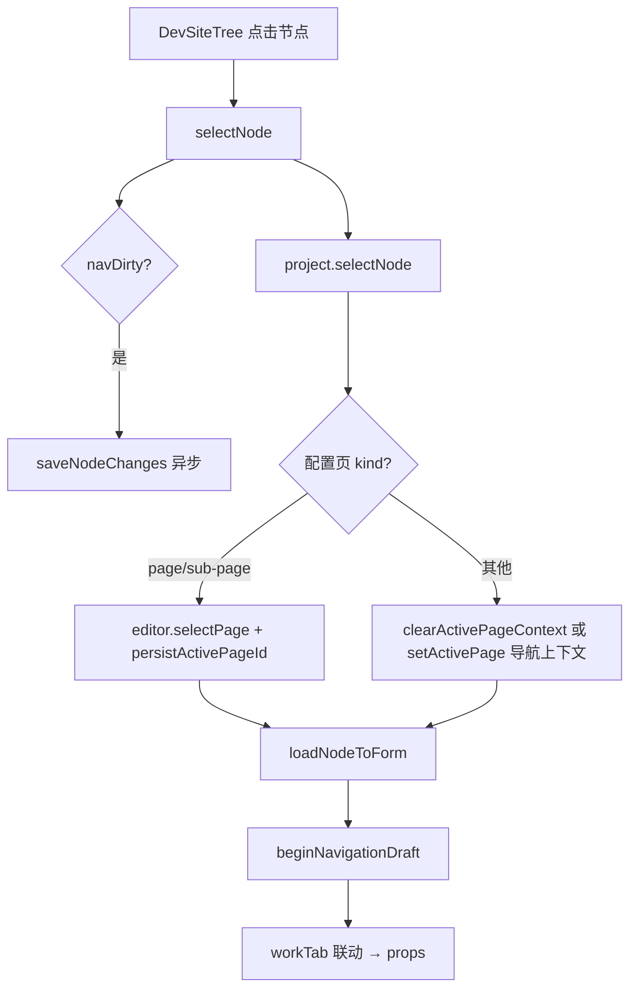

# 模型层级与类图

**设计即编辑** · **模型 = class + API（事件）** · 谁 `new` 谁负责生命周期。

`ProjectNodeData` / `ProjectModelData` 等 type 仅用于 API 载荷与落盘映射，**不是**第二套模型。

---

## 0. 心智模型：五层口诀与三轴

### 五层口诀

```text
项目 → 模块 → 页面 → 子页面 → 四文件
              └──── 节点树（承载轴）承载 ────┘
```

| 层级 | 领域语义 | 主要 nodeKind / 载体 |
|---|---|---|
| 项目 | `ProjectModel` 根；L0 元数据 | `ProjectModelData`（`childPlacement`、`homeNodeId` …） |
| 模块 | 策划轴结构单元 | `module`、`system-directory` |
| 页面 | 策划轴入口 | `page`、`system-page`、`link`、`ref` … |
| 子页面 | 页面下嵌套入口 | `sub-page` |
| 四文件 | 实现轴编辑真源 | `ConfigPageNode` → rule / pagedata / script / style |

**节点树（后端 API 仍称 navigation）≠ 主策划。** 节点树承载模块结构、页面入口、路由派生、权限与引用等；**不要**用「导航」一词替代模块 / 页面 / 子页面策划层级。

### 三轴

| 轴 | 职责 | 主要 API / 字段 |
|---|---|---|
| **策划轴** | 项目 → 模块 → 页面 → 子页面；功能描述与 AI 策划输入 | `description`、`descriptionContext`、`readPlanningProjection()` |
| **承载轴** | DB navigation 平铺 + 树投影；含 toolbar / system-page 等 | `ProjectDesign.nodesById`、`NavigationIndex`、`readNavigationProjection()` |
| **实现轴** | 页面运行时与编辑真源 | `openPageDesign(pageId)` → `ConfigPageNode` 四文件 |

**定稿结构（勿再拆第二套领域）：**

- 唯一领域根：`ProjectModel`
- 唯一设计聚合：`ProjectDesign`（`nodesById` + `configPagesByPageId` + `navigationRoot`）
- `navigation/` 目录 = **节点工具包**（type、tree 纯函数、edit）；不是第二套 PlanningModel。未来可 rename 为 `nodes/`，含义不变。

平台策划口径对齐：[PLATFORM_TENANT_ROUTING.md](../../../docs/architecture/PLATFORM_TENANT_ROUTING.md)。

### L0 项目设置

根模块 `childPlacement`（header / sidebar）与 `homeNodeId` 属于**项目级设置**，在 **app-list**（`AppProjectSettingsDialog`）编辑：

- 内存：`applyProjectLayoutEdit()`、`replaceProjectInfo({ homeNodeId })`
- 落盘：`ProjectWorkspace.saveProjectLayout()`

DevSystem 左侧树不展示隐式 homepage 壳节点；项目首页与模块栏布局在租户应用列表维护。

### AI / VCM 入口

```text
ProjectModel（pageDesign.project）
  → readProjectPlanningInput()   // 项目策划输入：根 description + planningAttachmentRef
  → readPlanningProjection()     // 页面策划现状：pageFeatures + descriptionContext
  → openPageDesign(pageId)       // 实现编辑：ConfigPageNode 四文件（后置）
```

#### 项目策划输入（先于页面设计）

| 字段 | 来源 | 用途 |
|---|---|---|
| `requirement` | navigation 根节点 `description`；为空时回退 `project.description` | 项目级短需求 |
| `planningAttachmentRef` | 根节点 `planningAttachmentRef`；为空时回退 `ProjectInfo.planningAttachmentRef` | 项目级详细说明附件 |
| 节点 `description` | 每个 `ProjectNodeData.description` | 节点短需求 |
| 节点 `planningAttachmentRef` | 每个 `ProjectNodeData.planningAttachmentRef` | 节点详细说明附件 |

`readNavigationPlanningInputs()` / `readNavigationNodePlanningInput(nodeId)` 读取全部或单个节点策划输入。

```text
readProjectPlanningInput()
  → { requirement, planningAttachmentRef? }
  → runner 解析附件正文
  → LLM 输出子模块/页面概要（title + description）
  → 写入 navigation 节点 description
  → planning_confirmed 后再进入 openPageDesign
```

勿恢复独立 `NavigationDesign` 或 `PlanningModel`。

AI/VCM 只消费这里暴露的项目模型入口，不在本包维护独立运行态路线图。

---

## 1. 总览：三层入口

```text
┌─────────────────────────────────────────────────────────────────┐
│  消费层                                                          │
│  DevSystem / AI  →  new ProjectWorkspace({ projectId, http })   │
│  spark-app 运行态 →  PageContentLoader + createRuntimePageNode   │
│  纯内存 / 单测    →  new ProjectModel({ projectId })             │
└────────────────────────────┬────────────────────────────────────┘
                             │
┌────────────────────────────▼────────────────────────────────────┐
│  ProjectWorkspace（IO 编排，非领域根）                           │
│  .project : ProjectModel                                         │
│  NavigationClient / PageFileApi / PageContentLoader / RefClient  │
└────────────────────────────┬────────────────────────────────────┘
                             │
┌────────────────────────────▼────────────────────────────────────┐
│  ProjectModel（领域根）                                          │
│  .design  : ProjectDesign    节点树 + 配置页 Map                  │
│  .session : ProjectSession   选中 / activePage / dirty（不落盘）   │
│  subscribe / read*Projection / writePageFile / editDataSet …     │
└─────────────────────────────────────────────────────────────────┘
```

---

## 2. 类继承（nodeKind → class）



| nodeKind | class | family | designSurface |
|---|---|---|---|
| `module` | ModuleNode | module | none |
| `system-directory` | SystemDirectoryNode | module | none |
| `system-page` | SystemPageNode | system-page | system-page |
| `system-action` | SystemActionNode | system-action | none |
| `link` | LinkNode | link | link |
| `ref` | RefNode | ref | ref |
| `page` | ConfigPageNode | config-page | config-files |
| `sub-page` | ConfigSubPageNode | config-page | config-files |

配置页 kind 由 `page/instantiate-project-node.ts` 实例化；其余 kind 由 `navigation/navigation-kinds.ts` 实例化。**navigation 不 import page**。

---

## 3. ProjectModel 组合



---

## 4. 配置页四文件子模型

```text
ConfigPageNode
├── rule.json      → PageRuleFile      SparkNodeTree + undo/redo
├── pagedata.json  → PageDataSetFile   DataSet + DataSetCrudTool + undo/redo
├── script.js      → PageTextFile
└── style.css      → PageTextFile

page/compile-files.ts          运行态编译（compileRule / parsePageData …）
page/canonicalize-page-data.ts 落盘规范化
page/page-file.ts              路径常量 + parse/serialize 入口
```



---

## 5. 事件与投影（Vue / DevSystem 接线）

**原则：** 领域 class 内部可变；UI 只读 `read*Projection()` + 监听 `subscribe`。

| 事件 type | 触发时机 | UI 典型响应 |
|---|---|---|
| `navigation.changed` | 导航树 / draft / dirty 变化 | 刷新树、节点表单 |
| `selection.changed` | selectNode / setActivePage | 切换右栏上下文 |
| `page.file.changed` | 四文件读写 / undo / editDataSet | 刷新编辑器、dirty 点 |
| `runtime.changed` | 页面 load/unload | 预览刷新 |

| 投影 API | 内容 |
|---|---|
| `readNavigationProjection()` | treeData、selectedNode、navigationDraft（承载轴 UI） |
| `readPlanningProjection()` | 策划轴：`pageId`、`path`、`description`、`descriptionContext`、`effectiveDescription` |
| `readActivePageProjection()` | 四文件文本、parseErrors、isLoaded |
| `readDirtyProjection()` | dirtyFiles、navigationDirty、hasAnyDirty |

`readNavigationProjection().pageFeatures` 与 `readPlanningProjection()` 同源（`ProjectDesign.readPageSummaries()`）。DevSystem / AI 读策划时用 `readPlanningProjection()`，勿从菜单节点自行拼接需求。

**dirty 语义（勿混用）：**

- `navigationDirty`：导航属性**相对落盘有真实修改**（`markNavigationDirty` 显式设置；**有 draft ≠ dirty**）
- `dirtyFiles`：四文件子模型 `isDirty`（内容相对上次 load/save 变化）
- `hasAnyDirty = hasAnyFileDirty || navigationDirty`

---

## 6. 包内依赖方向

```text
navigation          （纯领域：project-node、kinds、tree、edit）
page                → navigation, spark-data
project             → navigation, page
io                  → navigation, page
ProjectWorkspace    → project, navigation, page, io

禁止：navigation → page / io
禁止：page → io
禁止：project / navigation / page → io
```

目录地图见 [STRUCTURE.md](./STRUCTURE.md)。

---

## 7. 运行态 vs 设计态（同一 ConfigPageNode）

| 场景 | 四文件加载 | 导航落盘 |
|---|---|---|
| **设计态** DevSystem | `ProjectWorkspace.ensureActivePageFilesLoaded` → `PageFileApi` | `NavigationClient.updateNode` |
| **运行态** spark-app | `createRuntimePageNode` → `PageContentLoader` | 只读 navigation |

两者共用 `ConfigPageNode` + `compile-files` 解析，**不共用** Workspace 实例。

---

## 8. 快速定位

| 要改什么 | 看哪里 |
|---|---|
| 项目 L0 布局 / 首页 | `applyProjectLayoutEdit`、`saveProjectLayout`；app-list `AppProjectSettingsDialog` |
| 节点 kind 行为 / family | `navigation/project-node.ts`、`navigation-kinds.ts` |
| 树纯函数 / pageId 解析 | `navigation/navigation-tree.ts` |
| nodesById 内存索引 | `navigation/navigation-index.ts` |
| 节点属性表单 / patch | `navigation/navigation-edit.ts` |
| 导航 nodesById CRUD | `project/project-design.ts` |
| 项目元数据 + 设计聚合 | `project/project-design.ts` |
| 四文件内存模型 | `page/content/*`、`page/config-page.ts` |
| 选中 / dirty / draft | `project/project-session.ts` |
| 领域 API 与投影 | `project/project-model.ts` |
| 落盘编排 | `project/project-workspace.ts` |
| HTTP 加载 | `io/*` |

---

## 9. DevSystem 接线图（APP 壳 ↔ ProjectModel）

DevSystem 在 **APP 层**（`src/views/app/dev-system/`），不在 `spark-project-model` 包内；本节描述消费方如何接领域模型。

### 9.1 组件与 composable 分层

```text
DevSystem.vue
└── useDevSystem()                    Tab 编排、SSE、顶栏保存/预览/AI
    └── useDevState()                 领域状态编排（Vue ref + 投影）
        ├── editor  → ProjectWorkspace   IO / 落盘（proxy → currentEditor）
        └── project → ProjectModel       领域 API / 事件 / 投影（proxy）

子组件
├── DevSiteTree.vue       state.selectNode / 树 CRUD → editor.*
├── DevNodeProps.vue      v-model 绑定 state.navEditDto → project.applyNavigationNodeEdit
├── DevFileEditor.vue     useDevFileEditor → 四文件读写在 project，加载/保存在 editor
├── DevDataSetDesigner    project.editDataSet / undoPageFile（pagedata 可视化）
└── DevPreviewTab.vue     createRuntimePageNode 思路的预览（经 state.activePageId）
```

**Workspace 实例缓存**（`src/services/project-workspace.ts`）：

```text
getAppProjectWorkspace({ tenantId, projectId })
  → Map<"tenant:project", ProjectWorkspace>  // 按 scope 单例
  → useDevState 切换 scope 时换 currentEditor + bindProjectModelEvents()
```

### 9.2 响应式：revision 驱动投影



| Vue 侧 | 领域侧 | 说明 |
|---|---|---|
| `projectRevision` ref | `project.revision` | subscribe 回调里同步，作 computed 依赖 |
| `navigationProjection` | `readNavigationProjection()` | 树、选中节点、pageList |
| `activePageProjection` | `readActivePageProjection()` | 四文件文本、parseErrors |
| `dirtyProjection` | `readDirtyProjection()` | 顶栏「未保存」、tab 蓝点 |
| `navEditDto` reactive | `project.navigationDraft` | 表单 getter/setter 代理 |

**禁止**在 Vue 里缓存 `ProjectNodeData` 副本当编辑真源；读写走 `project.*` API。

### 9.3 读 / 写分工（内存 vs 落盘）

```text
                    ┌─────────────────────────────────────┐
  内存编辑           │  ProjectModel.project               │
                    │  selectNode / setActivePage         │
                    │  beginNavigationDraft               │
                    │  applyNavigationNodeEdit            │
                    │  writePageFile / editDataSet        │
                    │  editNodeTree / undoPageFile        │
                    └─────────────────────────────────────┘
                                      │
                    ┌─────────────────▼───────────────────┐
  落盘 IO            │  ProjectWorkspace (editor)          │
                    │  loadNavigation / saveSelected…     │
                    │  ensureActivePageFilesLoaded        │
                    │  savePageFile / saveAll             │
                    │  addNavigationNode / createMounted… │
                    └─────────────────────────────────────┘
                                      │
                    ┌─────────────────▼───────────────────┐
  后端               │  NavigationClient + PageFileApi     │
                    └─────────────────────────────────────┘
```

| 用户动作 | 内存（project） | 落盘（editor） |
|---|---|---|
| 左侧选节点 | `selectNode` → `loadNodeToForm` → `beginNavigationDraft` | 配置页：`selectPage` → 懒加载四文件 |
| 改节点属性 | `navEditDto` setter → `applyNavigationNodeEdit` | autoSave → `saveSelectedNavigationNode` |
| 改 rule.json | `writePageFile` / `editNodeTree` | `savePageFile` |
| 改 pagedata | `editDataSet` | `savePageFile` |
| 顶栏「全部保存」 | — | `saveAll` → dirty 导航 + dirty 四文件 |
| 打开另一项目 | 检查 `hasAnyDirty` | `openEditingProject` → 换 scope Workspace |

### 9.4 选中节点主流程



### 9.5 四文件编辑器接线（useDevFileEditor）

```text
DevFileEditor.vue
  watch activePageId → editor.ensureActivePageFilesLoaded()   // 首次进 tab 拉远端
  text      ← project.readPageFileText(file)
  isDirty   ← readDirtyProjection().dirtyFiles.has(file)
  save()    → editor.savePageFile(file)

rule.json     JsonTreeEditor @update → project.writePageFile
pagedata.json DevDataSetDesigner   → project.editDataSet(mutator)
script/style  只读 SparkCodeEditor（写入口在其他路径）
```

### 9.6 外部事件：SSE 与运行态导航同步

```text
useDevSystem.onPageConfigChange(SSE)
  → editor.notifyPageFileChanged(pageId, file)   // 他人改四文件时 bump revision

saveNodeChanges 成功后（默认 scope）
  → reloadAndSyncNavigation()
  → syncAppProjectWorkspaceFromNav(navRoot)
  → 运行中 spark-app 侧栏与 DevSystem 对齐
```

### 9.7 dirty 在 UI 的展示位

| UI 位置 | 数据源 |
|---|---|
| 顶栏 tag「未保存」 | `hasAnyDirty` |
| 底栏「属性已修改」 | `navDirty`（= `navigationDirty`） |
| 底栏「文件已修改」 | `hasAnyFileDirty` |
| 四文件 tab 蓝点 | `dirtyFiles.has(fname)` |
| 单文件保存按钮 disabled | `!fileEditor.isDirty` |

### 9.8 相关 APP 文件索引

| 文件 | 职责 |
|---|---|
| `src/views/tenant/AppList.vue` | 应用卡片入口 |
| `src/views/tenant/AppProjectSettingsDialog.vue` | 项目布局 + homeNodeId |
| `src/services/project-settings.ts` | 加载 / 保存项目 L0 设置 |
| `src/services/project-workspace.ts` | scope 级 Workspace 缓存与创建 |
| `src/views/app/dev-system/useDevState.ts` | 投影、navEditDto、select/save 编排 |
| `src/views/app/dev-system/useDevSystem.ts` | Tab、SSE、顶栏动作 |
| `src/views/app/dev-system/composables/useDevFileEditor.ts` | 单文件 tab 绑定 |
| `src/services/page-design-ai-runner.ts` | AI 改页（独立 runner，不污染 Dev session） |
| `src/services/navigation-sync.ts` | 保存后同步运行态导航 |
